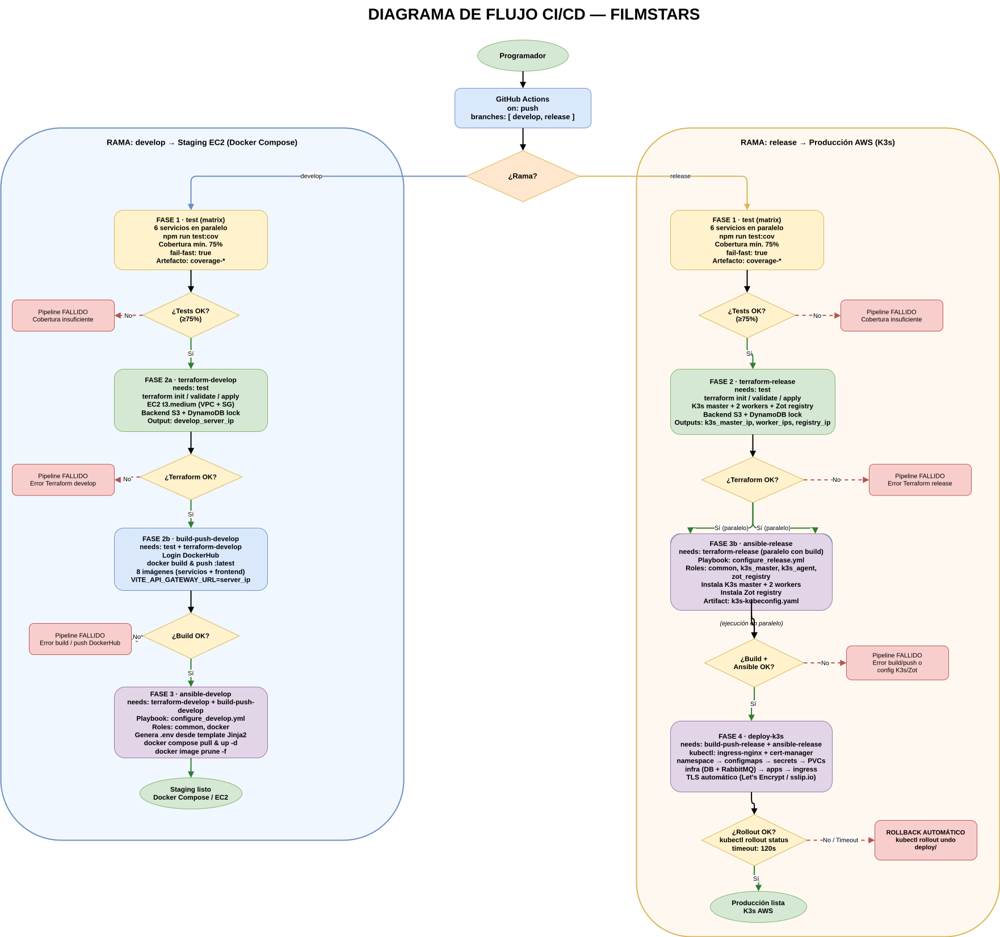
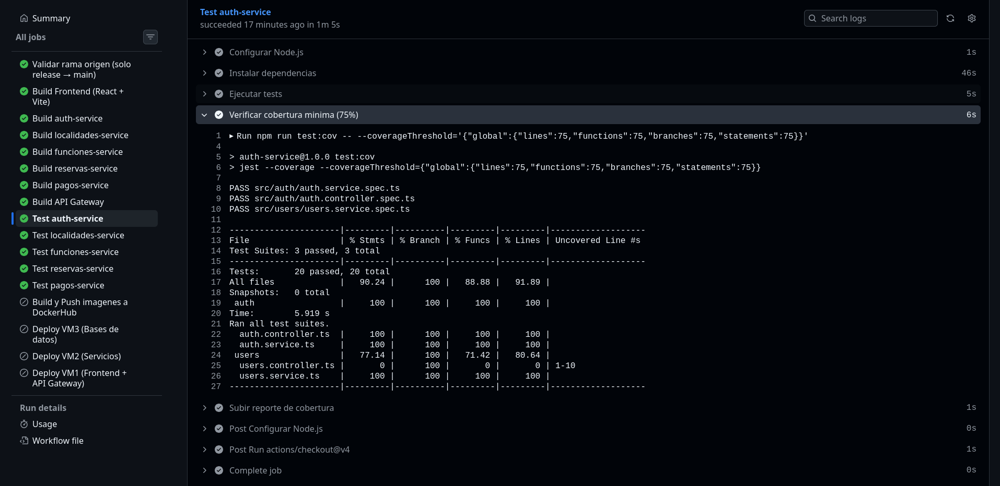
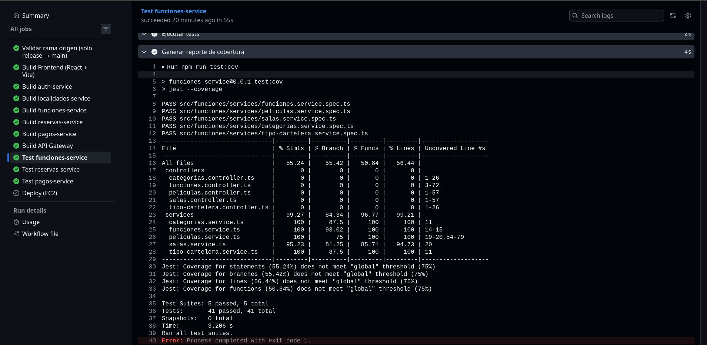
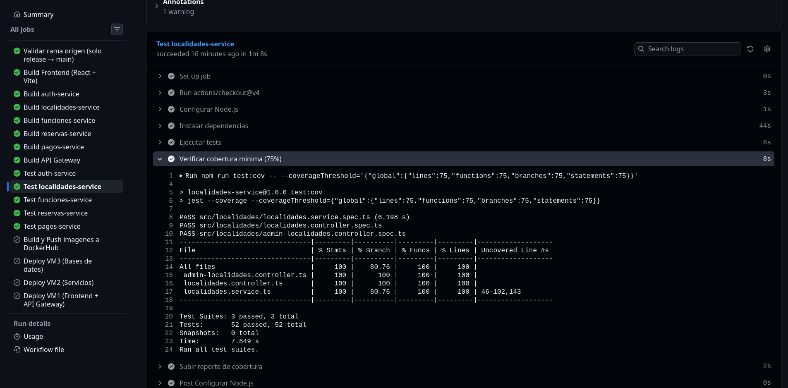
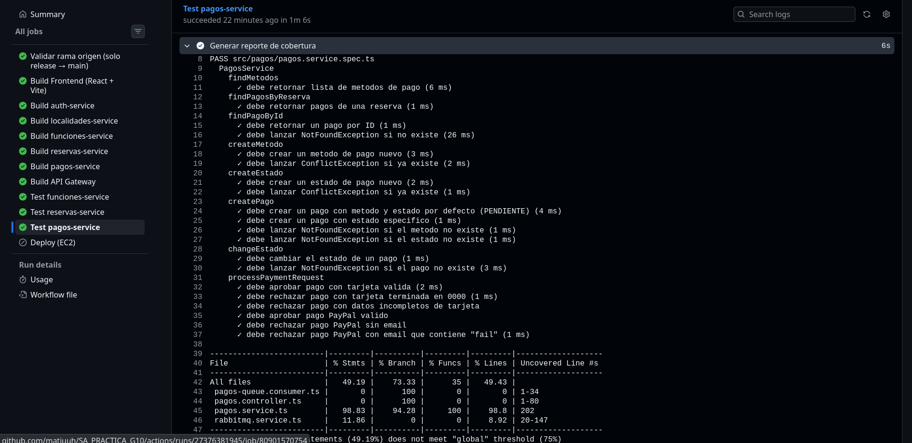
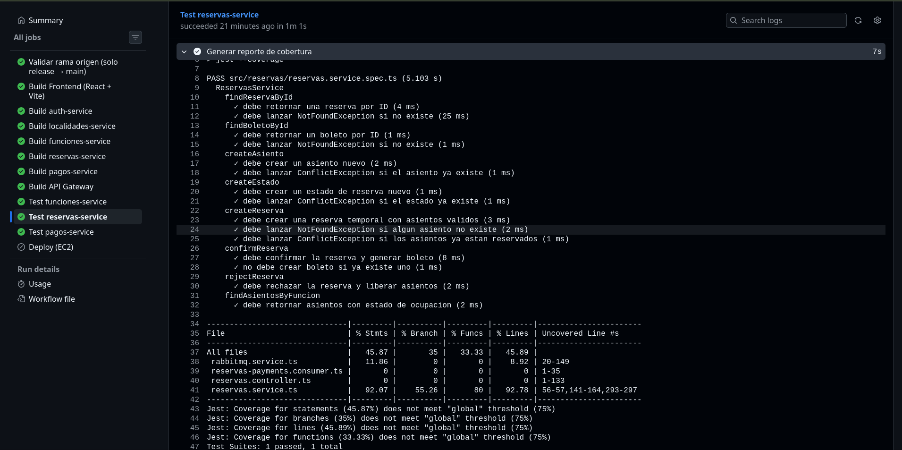

# CI/CD — Integración y Entrega Continua

## Diagrama de flujo

---

## Justificacion de herramientas

### GitHub Actions

**¿Qué?** Plataforma de automatización de flujos de trabajo integrada en GitHub, motor principal del pipeline CI/CD.

**¿Por qué?** Al estar integrada en el repositorio no requiere servidores externos ni configuración adicional para acceder al código. Ofrece runners gratuitos con Ubuntu, matrices de ejecución paralela (`strategy.matrix`) y un ecosistema amplio de acciones reutilizables.

**¿Para qué?** Automatizar validación, construcción, aprovisionamiento de infraestructura y despliegue en cada push a `develop` o `release`, garantizando que ningún commit defectuoso llegue a producción.

---

### Terraform

**¿Qué?** Herramienta de Infraestructura como Código (IaC) de HashiCorp que permite definir y aprovisionar recursos en la nube de forma declarativa.

**¿Por qué?** Permite reproducir la infraestructura de forma idempotente desde el pipeline, usando un backend remoto en S3 con bloqueo de estado en DynamoDB para evitar condiciones de carrera entre ejecuciones concurrentes.

**¿Para qué?**
- **develop:** Aprovisiona una instancia EC2 `t3.medium` en AWS (VPC, subnet, security group) y expone su IP pública como output para los jobs posteriores.
- **release:** Aprovisiona el cluster K3s (1 nodo master + 2 workers) y una instancia adicional para el registry Zot, exportando todas sus IPs como outputs del job.

---

### Ansible

**¿Qué?** Herramienta de automatización de configuración y despliegue que opera sobre SSH sin necesidad de agentes en los nodos remotos.

**¿Por qué?** Permite configurar las instancias EC2 recién creadas por Terraform de forma reproducible mediante roles y playbooks, usando las IPs dinámicas que Terraform expone como outputs.

**¿Para qué?**
- **develop (`configure_develop.yml`):** Aplica los roles `common` y `docker`, copia el `docker-compose.yml` y los archivos SQL de inicialización, genera el `.env` desde una plantilla Jinja2 (`develop_env.j2`) y levanta el stack con `docker compose up -d`.
- **release (`configure_release.yml`):** Aplica el rol `common` en todos los nodos, instala K3s en el master (`k3s_master`), une los workers al cluster (`k3s_agent`), e instala el registry Zot (`zot_registry`). Publica el `kubeconfig` generado como artefacto para el job `deploy-k3s`.

---

### Docker / Docker Compose

**¿Qué?** Docker es la plataforma de contenedores usada para empaquetar cada microservicio. Docker Compose orquesta el stack completo en el entorno de staging.

**¿Por qué?** Garantiza que las imágenes construidas en CI sean exactamente las que se ejecutan en el servidor, eliminando diferencias de entorno.

**¿Para qué?**
- **develop:** Las imágenes se publican en DockerHub con tag `:latest`. Ansible las descarga con `docker compose pull` y levanta el stack en la EC2.
- **release:** Las imágenes se construyen con Docker Buildx (modo HTTP para Zot sin TLS) y se publican con tags `:latest` y `:<sha_corto>` en el registry privado Zot.

---

### Zot Registry

**¿Qué?** Registry OCI ligero y compatible con la especificación de distribución de imágenes de contenedores.

**¿Por qué?** Para el entorno de producción se necesita un registry privado que resida dentro de la misma VPC de AWS, evitando dependencias externas y reduciendo la latencia en el pull de imágenes desde el cluster K3s.

**¿Para qué?** Almacenar las imágenes del release con doble etiqueta (`:latest` y `:<sha_corto>`) para permitir rollbacks a versiones anteriores mediante el SHA del commit.

---

### K3s

**¿Qué?** Distribución ligera de Kubernetes certificada por la CNCF, optimizada para entornos con recursos limitados.

**¿Por qué?** Proporciona la funcionalidad completa de Kubernetes con menor overhead de memoria y CPU, adecuado para instancias EC2 de tamaño moderado en AWS.

**¿Para qué?** Orquestar los microservicios en producción con alta disponibilidad (1 master + 2 workers), gestión de TLS automático con cert-manager y Let's Encrypt, e ingress mediante ingress-nginx.

---

### hashicorp/setup-terraform

**¿Qué?** Acción oficial de HashiCorp para instalar y configurar Terraform en un runner de GitHub Actions.

**¿Por qué?** Estandariza la versión de Terraform (`1.6.6`) usada en cada ejecución del pipeline, independientemente de lo que tenga instalado el runner.

**¿Para qué?** Ejecutar `terraform init`, `terraform validate` y `terraform apply` dentro del pipeline sin necesidad de pre-instalar Terraform manualmente.

---

### actions/upload-artifact / actions/download-artifact

**¿Qué?** Acciones oficiales de GitHub para persistir y recuperar archivos entre jobs del mismo workflow.

**¿Por qué?** Los jobs son efímeros e independientes; sin artefactos no es posible pasar archivos entre ellos.

**¿Para qué?**
- Persistir los reportes de cobertura (`coverage-*`) por 14 días para auditoría.
- Pasar el `k3s-kubeconfig.yaml` generado por `ansible-release` al job `deploy-k3s` por 1 día.

---

### docker/build-push-action y docker/setup-buildx-action

**¿Qué?** Acciones oficiales de Docker para construir y publicar imágenes usando BuildKit/Buildx.

**¿Por qué?** Buildx permite configurar registries HTTP inseguros (necesario para Zot sin TLS) y gestionar la caché de capas de forma eficiente.

**¿Para qué?** Construir las 8 imágenes del proyecto (6 microservicios + api-gateway + frontend) y publicarlas en DockerHub (develop) o en Zot (release) en cada ejecución del pipeline.

---

### azure/setup-kubectl

**¿Qué?** Acción que instala `kubectl` en el runner de GitHub Actions.

**¿Por qué?** `kubectl` no viene preinstalado en los runners de Ubuntu con la versión exacta requerida (`v1.35.5`).

**¿Para qué?** Aplicar los manifiestos de Kubernetes del directorio `k8s/` al cluster K3s en el job `deploy-k3s`.

---

### Jobs del pipeline

| Job | Rama | Depende de | Descripcion |
| --- | --- | --- | --- |
| `test` | ambas | — | Matrix de 6 servicios, `npm run test:cov`, cobertura mín. 75%, `fail-fast: true` |
| `terraform-develop` | develop | `test` | Aprovisiona EC2 staging en AWS; output: `develop_server_ip` |
| `build-push-develop` | develop | `test` + `terraform-develop` | Construye y publica 8 imágenes en DockerHub con `:latest` |
| `ansible-develop` | develop | `terraform-develop` + `build-push-develop` | Configura EC2 y despliega stack Docker Compose |
| `terraform-release` | release | `test` | Aprovisiona K3s master, 2 workers y Zot registry; outputs: IPs |
| `build-push-release` | release | `test` + `terraform-release` | Construye y publica 8 imágenes en Zot con `:latest` + `:<sha>` |
| `ansible-release` | release | `terraform-release` | Instala K3s y Zot; publica kubeconfig como artefacto |
| `deploy-k3s` | release | `build-push-release` + `ansible-release` + `terraform-release` | Aplica manifiestos K8s, verifica rollout, ejecuta rollback si falla |

---

## Secretos requeridos en GitHub

Configurar en **Settings > Secrets and variables > Actions**:

| Secreto | Descripcion |
| --- | --- |
| `AWS_ACCESS_KEY_ID` | Credenciales AWS |
| `AWS_SECRET_ACCESS_KEY` | Credenciales AWS |
| `AWS_REGION` | Region AWS (ej. `us-east-1`) |
| `TF_STATE_BUCKET` | Bucket S3 para el estado de Terraform |
| `TF_STATE_LOCK_TABLE` | Tabla DynamoDB para bloqueo de estado |
| `EC2_KEY_NAME` | Nombre del key pair EC2 en AWS |
| `EC2_SSH_PRIVATE_KEY` | Clave privada PEM para SSH a las instancias EC2 |
| `DOCKERHUB_USERNAME` | Usuario de DockerHub (develop) |
| `DOCKERHUB_TOKEN` | Token de DockerHub (develop) |
| `REGISTRY_USER` | Usuario del registry Zot (release) |
| `REGISTRY_PASS` | Contraseña del registry Zot (release) |
| `POSTGRES_PASSWORD` | Contraseña de PostgreSQL |
| `JWT_SECRET` | Secreto para firma de tokens JWT |
| `RABBITMQ_USER` | Usuario de RabbitMQ |
| `RABBITMQ_PASS` | Contraseña de RabbitMQ |
| `INTERNAL_SERVICE_TOKEN` | Token de comunicación interna entre microservicios |
| `LETSENCRYPT_EMAIL` | Email para notificaciones de cert-manager |

---

## Logs de las pruebas ya integradas en el CI/CD

### Auth Service

### Funciones Service

### Localidades Service

### Pagos Service

### Reservas Service

[Volver a Documentación](../Documentación.md)
