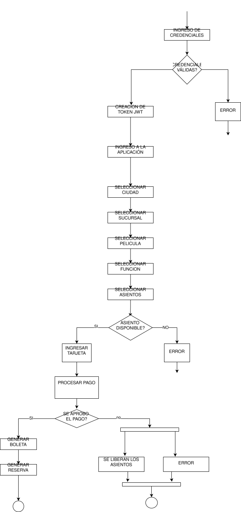

# DIAGRAMA DE ACTIVIDADES

El diagrama de actividades fue utilizado para representar el flujo principal de interacción dentro de la plataforma, modelando las acciones realizadas por los usuarios desde la selección de una película hasta la confirmación final de la compra.

Este diagrama permite visualizar de manera secuencial el comportamiento del sistema, incluyendo decisiones, validaciones y procesos que intervienen durante la reserva de asientos y procesamiento de pagos.

Adicionalmente, el diagrama incorpora puntos de decisión y control que permiten modelar situaciones como disponibilidad de asientos, pagos rechazados y expiración de reservas temporales.

El objetivo principal del diagrama es proporcionar una representación visual del comportamiento del sistema y facilitar la comprensión de la interacción entre los diferentes módulos implementados dentro de la arquitectura propuesta.

[Volver a Documentacion](../Documentación.md)
