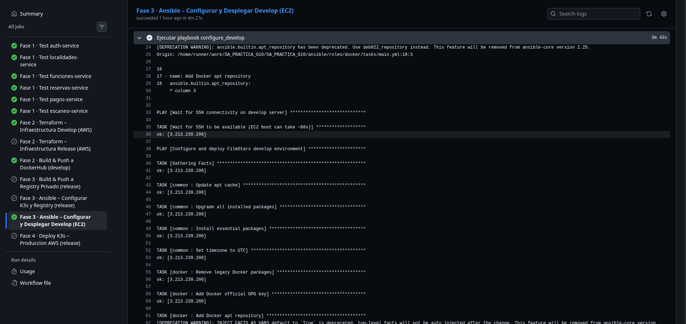
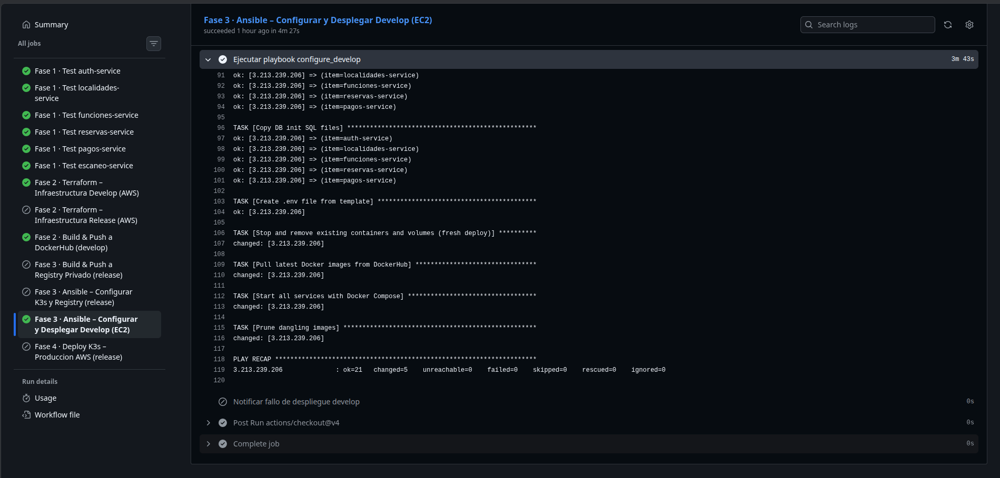

# Ansible — Documentación

## Índice

- [¿Qué es Ansible?](#qué-es-ansible)
- [¿Cómo funciona?](#cómo-funciona)
- [Estructura del proyecto](#estructura-del-proyecto)
- [Configuración global (ansible.cfg)](#configuración-global-ansiblecfg)
- [Inventario](#inventario)
- [Colecciones requeridas](#colecciones-requeridas)
- [Roles — detalle y configuración](#roles--detalle-y-configuración)
- [Playbooks — guía paso a paso](#playbooks--guía-paso-a-paso)
- [Plantillas Jinja2](#plantillas-jinja2)
- [Integración con CI/CD](#integración-con-cicd)

---

## ¿Qué es Ansible?

Ansible es una herramienta de **automatización de configuración y despliegue** desarrollada por Red Hat. Permite gestionar el estado de servidores remotos de forma **declarativa e idempotente** usando archivos YAML llamados **playbooks**.

Sus características principales en comparación con scripts Bash son:

- **Sin agente:** se conecta a los nodos remotos mediante SSH estándar. No requiere instalar ningún cliente en los servidores.
- **Idempotente:** los módulos nativos de Ansible verifican el estado actual antes de actuar. Ejecutar el mismo playbook dos veces produce el mismo resultado sin efectos secundarios.
- **Modular:** la lógica se organiza en **roles** reutilizables, cada uno con una responsabilidad específica (instalar Docker, configurar K3s, etc.).
- **Legible:** los playbooks y roles son YAML autoexplicativo, reduciendo la barrera de incorporación de nuevos colaboradores.

---

## ¿Cómo funciona?

Ansible opera con un modelo **control node → managed nodes**:

El control node lee el **inventario** para conocer qué hosts existen y en qué grupos están organizados, luego ejecuta los **playbooks** que especifican qué **roles** y **tareas** aplicar a cada grupo de hosts.

### Flujo de ejecución

1. Ansible resuelve el inventario y selecciona los hosts objetivo.
2. Abre una conexión SSH a cada host.
3. Transfiere los módulos Python necesarios al host remoto (en `/tmp`).
4. Ejecuta los módulos y recopila el resultado.
5. Limpia los archivos temporales del host.
6. Reporta el resultado al operador (changed / ok / failed).


---

## Configuración global (ansible.cfg)

```ini
[defaults]
host_key_checking  = False
remote_user        = ubuntu
private_key_file   = ~/.ssh/filmstars_ec2.pem
roles_path         = ./roles
stdout_callback    = default
result_format      = yaml
interpreter_python = auto_silent

[ssh_connection]
ssh_args   = -o StrictHostKeyChecking=no -o UserKnownHostsFile=/dev/null -o ServerAliveInterval=30
pipelining = True
```

**Opciones relevantes:**

| Opción | Valor | Propósito |
|--------|-------|-----------|
| `host_key_checking` | `False` | Evita el error de host desconocido en instancias EC2 nuevas |
| `remote_user` | `ubuntu` | Usuario SSH por defecto de las AMIs Ubuntu en AWS |
| `private_key_file` | `~/.ssh/filmstars_ec2.pem` | Clave privada del key pair EC2. En CI/CD se escribe desde el secret al iniciar el job |
| `pipelining` | `True` | Acelera la ejecución agrupando operaciones SSH |
| `interpreter_python` | `auto_silent` | Detecta automáticamente el intérprete Python disponible en el host sin mostrar advertencias |

---

## Inventario

### Entorno develop — `inventory/develop.ini`

```ini
[develop_servers]
3.213.239.206 ansible_user=ubuntu
```

En CI/CD, la IP se sobreescribe dinámicamente con el output de Terraform:

```bash
ansible-playbook \
  -i "$DEVELOP_SERVER_IP," \        # IP dinámica de Terraform output
  ansible/playbooks/configure_develop.yml \
  --private-key ~/.ssh/filmstars_ec2.pem \
  -e "project_root=$GITHUB_WORKSPACE" \
  -e "dockerhub_username=$DOCKERHUB_USERNAME" \
  -e "postgres_password=$POSTGRES_PASSWORD" \
  -e "jwt_secret=$JWT_SECRET" \
  -e "rabbitmq_user=$RABBITMQ_USER" \
  -e "rabbitmq_pass=$RABBITMQ_PASS" \
  -e "internal_service_token=$INTERNAL_SERVICE_TOKEN"
```

### Entorno release — inventario dinámico

Para el entorno `release`, el inventario se construye dinámicamente en el pipeline a partir de los outputs de Terraform:

```bash
# Grupos generados dinámicamente
[k3s_master]
<IP_MASTER>

[k3s_workers]
<IP_WORKER_1>
<IP_WORKER_2>

[registry]
<IP_REGISTRY>
```

---

## Colecciones requeridas

Las colecciones se instalan antes de ejecutar cualquier playbook:

```bash
ansible-galaxy collection install -r ansible/requirements.yml
```

**`ansible/requirements.yml`:**

```yaml
collections:
  - name: community.general
    version: ">=8.0.0,<12.0.0"
  - name: community.docker
    version: ">=3.0.0"
  - name: ansible.posix
    version: ">=1.5.0"
```

| Colección | Uso en el proyecto |
|-----------|-------------------|
| `community.general` | Módulo `community.general.timezone` para configurar UTC |
| `community.docker` | Módulos para gestión avanzada de contenedores Docker |
| `ansible.posix` | Módulos POSIX para operaciones de sistema de archivos |

---

## Roles — detalle y configuración

### Rol `common`

**Responsabilidad:** dejar el sistema operativo en un estado base limpio y actualizado.

**Tareas:**

1. Actualizar el caché APT (`cache_valid_time: 3600` para no repetir si ya está fresco).
2. Actualizar todos los paquetes instalados (`upgrade: dist`, con `autoremove`).
3. Instalar paquetes esenciales: `curl`, `wget`, `git`, `vim`, `htop`, `unzip`, `ca-certificates`, `gnupg`, `lsb-release`, `python3-pip`.
4. Configurar timezone a UTC.

Este rol se aplica a **todos los nodos** de ambos entornos como primer paso de configuración.

---

### Rol `docker`

**Responsabilidad:** instalar Docker Engine CE en su versión estable más reciente del repositorio oficial.

**Tareas:**

1. Eliminar paquetes Docker legacy que puedan estar presentes (`docker`, `docker-engine`, `docker.io`, `containerd`, `runc`).
2. Agregar la clave GPG oficial de Docker.
3. Agregar el repositorio APT estable de Docker para Ubuntu.
4. Instalar: `docker-ce`, `docker-ce-cli`, `containerd.io`, `docker-buildx-plugin`, `docker-compose-plugin`.
5. Habilitar e iniciar el daemon `docker` con `systemd`.
6. Agregar el usuario `ubuntu` al grupo `docker` (para ejecutar sin `sudo`).

Este rol se aplica en `develop` (para Docker Compose) y en la instancia del registry Zot en `release`.

---

### Rol `k3s_master`

**Responsabilidad:** instalar K3s en modo servidor y exponer el token y el kubeconfig al runner de CI/CD para que los workers puedan unirse al clúster.

**Tareas:**

1. Verificar si K3s ya está instalado (`/usr/local/bin/k3s`). Si existe, omite la instalación para garantizar idempotencia.
2. Ejecutar el instalador oficial de K3s con las opciones:
   - `--tls-san {{ ansible_host }}`: incluye la IP pública del nodo en el certificado TLS del API server.
   - `--disable traefik`: deshabilita el Ingress Controller por defecto de K3s (se usa NGINX Ingress Controller).
   - `--write-kubeconfig-mode 644`: permite leer el kubeconfig sin `sudo`.
3. Esperar a que aparezca el archivo `/var/lib/rancher/k3s/server/node-token` (hasta 120 s).
4. Esperar a que el API server responda en el puerto 6443 (hasta 120 s).
5. Leer y decodificar el `node-token` (necesario para que los workers se unan).
6. Leer el kubeconfig y reemplazar `127.0.0.1` por la IP pública del nodo para que sea accesible desde fuera.
7. Guardar el kubeconfig en `/tmp/k3s-kubeconfig.yaml` del **runner** (`delegate_to: localhost`) para el job de despliegue de manifiestos.
8. Guardar el `node-token` en `/tmp/k3s-node-token` del **runner** para el rol `k3s_agent`.

---

### Rol `k3s_agent`

**Responsabilidad:** instalar K3s en modo agente y unir el nodo worker al clúster.

**Tareas:**

1. Verificar si K3s ya está instalado (idempotencia).
2. Leer el `node-token` guardado en `/tmp/k3s-node-token` del runner.
3. Ejecutar el instalador de K3s con las variables:
   - `K3S_URL=https://{{ k3s_master_ip }}:6443`
   - `K3S_TOKEN="{{ k3s_node_token }}"`
4. Garantizar que el servicio `k3s-agent` está activo y habilitado en `systemd`.

La variable `k3s_master_ip` se resuelve dinámicamente en el playbook como `groups['k3s_master'][0]`.

---

### Rol `zot_registry`

**Responsabilidad:** desplegar el registry OCI Zot en la instancia dedicada.

Este rol combina Docker (aplicado antes) con la configuración específica de Zot: descarga la imagen del registry, configura el archivo de configuración desde una plantilla Jinja2 y levanta el contenedor como servicio.

---

## Playbooks — guía paso a paso

### `configure_develop.yml` — Entorno develop

Este playbook configura el servidor único de `develop` para ejecutar todos los microservicios con Docker Compose.

#### Fase 1 — Esperar conectividad SSH

```yaml
- name: Wait for SSH connectivity on develop server
  hosts: develop_servers
  gather_facts: false
  tasks:
    - ansible.builtin.wait_for_connection:
        delay: 10
        timeout: 300
```

Espera hasta 300 segundos con un retardo inicial de 10 s. Esto es necesario porque una instancia EC2 recién creada por Terraform puede tardar entre 30 y 60 segundos en completar el boot y tener SSH disponible. El flag `gather_facts: false` evita que Ansible intente conectarse para recopilar facts antes de que SSH esté disponible.

#### Fase 2 — Configurar SO y Docker

```yaml
roles:
  - common
  - docker
```

Aplica los roles `common` (OS baseline) y `docker` (instalación de Docker Engine y Compose plugin).

#### Fase 3 — Preparar la aplicación

1. **Crear directorio raíz** `/opt/filmstars` con permisos para el usuario `ubuntu`.
2. **Copiar `docker-compose.yml`** desde el workspace del runner al servidor.
3. **Crear directorios de inicialización de DB** para cada servicio (`auth-service`, `localidades-service`, `funciones-service`, `reservas-service`, `pagos-service`).
4. **Copiar archivos `init.sql`** de cada servicio al servidor. Estos archivos crean el esquema inicial de la base de datos en el primer arranque de PostgreSQL.
5. **Generar `.env`** desde la plantilla `develop_env.j2` con los secretos inyectados como variables extra (`-e`) en el comando de Ansible.

#### Fase 4 — Desplegar con Docker Compose

1. `docker compose down --volumes --remove-orphans` — detiene y elimina contenedores, volúmenes y redes del despliegue anterior (fresh deploy).
2. `docker compose pull` — descarga las imágenes más recientes desde DockerHub.
3. `docker compose up -d` — levanta todos los servicios en background.
4. `docker image prune -f` — elimina imágenes obsoletas para liberar espacio en disco.

---

### `configure_release.yml` — Entorno release

Este playbook configura el clúster K3s de producción en cinco fases secuenciales.

#### Fase 1 — Esperar SSH en todos los nodos

```yaml
hosts: all
gather_facts: false
```

Aplica `wait_for_connection` a todos los hosts del inventario de release simultáneamente (master, workers y registry).

#### Fase 2 — Bootstrap de todos los nodos

```yaml
hosts: all
roles:
  - common
```

El rol `common` instala los paquetes base en paralelo en los cuatro nodos.

#### Fase 3 — Instalar K3s master

```yaml
hosts: k3s_master
roles:
  - k3s_master
```

Instala K3s en modo servidor, genera el token de nodo y exporta el kubeconfig al runner. Esta fase debe completarse antes de que los workers puedan unirse.

#### Fase 4 — Instalar K3s agents y unirse al clúster

```yaml
hosts: k3s_workers
vars:
  k3s_master_ip: "{{ groups['k3s_master'][0] }}"
roles:
  - k3s_agent
```

Instala K3s en modo agente en los dos workers usando el token leído del runner. La variable `k3s_master_ip` resuelve la IP del master desde el inventario.

#### Fase 5 — Configurar el registry Zot

```yaml
hosts: registry
roles:
  - docker
  - zot_registry
```

Instala Docker en la instancia del registry y despliega Zot.

---

## Plantillas Jinja2

### `develop_env.j2` — Archivo `.env` de develop

```jinja2
DOCKERHUB_USERNAME={{ dockerhub_username }}
VITE_API_GATEWAY_URL=http://{{ ansible_host }}:3006
VITE_RESERVAS_WS_URL=http://{{ ansible_host }}:3004
POSTGRES_PASSWORD={{ postgres_password }}
JWT_SECRET={{ jwt_secret }}
RABBITMQ_USER={{ rabbitmq_user }}
RABBITMQ_PASS={{ rabbitmq_pass }}
INTERNAL_SERVICE_TOKEN={{ internal_service_token }}
FRONTEND_URL=http://{{ ansible_host }}:5173
```

Las variables `{{ ansible_host }}` se resuelven automáticamente con la IP pública del servidor de develop (provista por el inventario dinámico generado a partir del output de Terraform). Las variables de secretos (`postgres_password`, `jwt_secret`, etc.) se inyectan desde los secrets de GitHub Actions como variables extra al ejecutar el playbook. El archivo se genera con permisos `0600` para restringir su lectura al propietario.

---

## Integración con CI/CD

El pipeline de GitHub Actions ejecuta Ansible inmediatamente después del job de Terraform, usando la IP exportada como output:

```yaml
- name: Install Ansible collections
  run: ansible-galaxy collection install -r ansible/requirements.yml

- name: Write SSH key
  run: |
    echo "${{ secrets.EC2_PRIVATE_KEY }}" > ~/.ssh/filmstars_ec2.pem
    chmod 600 ~/.ssh/filmstars_ec2.pem

- name: Run Ansible playbook (develop)
  run: |
    ansible-playbook \
      -i "${{ env.DEVELOP_SERVER_IP }}," \
      ansible/playbooks/configure_develop.yml \
      --private-key ~/.ssh/filmstars_ec2.pem \
      -e "project_root=$GITHUB_WORKSPACE" \
      -e "dockerhub_username=${{ secrets.DOCKERHUB_USERNAME }}" \
      -e "postgres_password=${{ secrets.POSTGRES_PASSWORD }}" \
      -e "jwt_secret=${{ secrets.JWT_SECRET }}" \
      -e "rabbitmq_user=${{ secrets.RABBITMQ_USER }}" \
      -e "rabbitmq_pass=${{ secrets.RABBITMQ_PASS }}" \
      -e "internal_service_token=${{ secrets.INTERNAL_SERVICE_TOKEN }}"
```

La clave SSH se escribe temporalmente en el runner desde el secret `EC2_PRIVATE_KEY` y se elimina al finalizar el job. Ningún secreto se escribe en el repositorio ni en los archivos de configuración de Ansible.

---

## Capturas





[Volver a Documentación](../Documentación.md)
