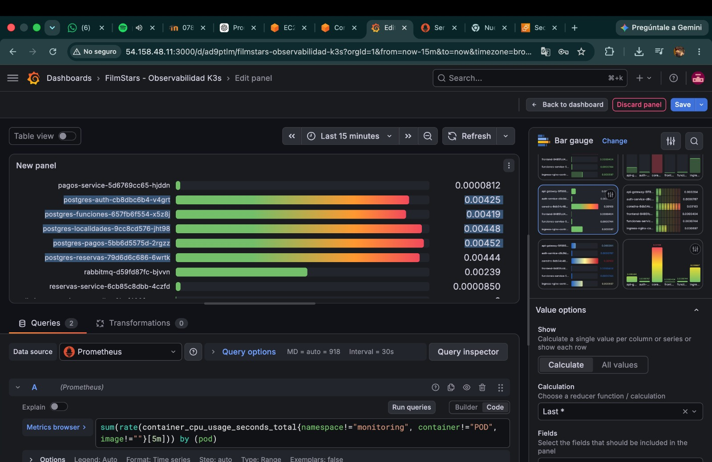

# Prometheus y Grafana — Documentación de Observabilidad

## Índice

- [¿Qué es Prometheus?](#qué-es-prometheus)
- [¿Qué es Grafana?](#qué-es-grafana)
- [Arquitectura del stack de observabilidad](#arquitectura-del-stack-de-observabilidad)
- [Configuración paso a paso — Prometheus](#configuración-paso-a-paso--prometheus)
- [Configuración paso a paso — Grafana](#configuración-paso-a-paso--grafana)
- [Exporters usados en el proyecto](#exporters-usados-en-el-proyecto)
- [Consultas PromQL relevantes](#consultas-promql-relevantes)
- [Alertas operativas](#alertas-operativas)
- [Despliegue en K3s con kube-prometheus-stack](#despliegue-en-k3s-con-kube-prometheus-stack)

---

## ¿Qué es Prometheus?

Prometheus es un sistema de **monitoreo y alertas** de código abierto, originalmente desarrollado en SoundCloud y actualmente mantenido por la CNCF (Cloud Native Computing Foundation). Es el sistema de métricas de referencia en entornos Kubernetes.

### Características principales

- **Modelo de datos de series temporales:** cada métrica es una serie temporal identificada por su nombre y un conjunto de etiquetas (`labels`). Por ejemplo: `http_requests_total{method="GET", status="200", service="api-gateway"}`.
- **Modelo pull:** Prometheus raspa (`scrape`) periódicamente endpoints HTTP `/metrics` expuestos por los servicios. No requiere que los servicios empujen datos a un servidor central.
- **Autodescubrimiento en Kubernetes:** Prometheus puede descubrir automáticamente pods y servicios mediante la API de Kubernetes usando anotaciones como `prometheus.io/scrape: "true"`.
- **PromQL:** lenguaje de consulta propio que permite calcular tasas, percentiles, agregaciones y correlaciones sobre las métricas almacenadas.
- **Alertmanager:** componente complementario que gestiona el enrutamiento y la deduplicación de alertas generadas por Prometheus.

### Formato de métricas (exposition format)

Los endpoints `/metrics` exponen datos en texto plano:

```
# HELP http_requests_total Total de peticiones HTTP recibidas
# TYPE http_requests_total counter
http_requests_total{method="GET",status="200"} 1027
http_requests_total{method="POST",status="201"} 342
http_requests_total{method="POST",status="400"} 18

# HELP http_request_duration_seconds Latencia de peticiones HTTP
# TYPE http_request_duration_seconds histogram
http_request_duration_seconds_bucket{le="0.1"} 850
http_request_duration_seconds_bucket{le="0.5"} 1300
http_request_duration_seconds_bucket{le="1.0"} 1380
http_request_duration_seconds_sum 412.8
http_request_duration_seconds_count 1387
```

---

## ¿Qué es Grafana?

Grafana es una plataforma de **visualización y análisis de métricas** de código abierto. Se conecta a fuentes de datos (datasources) como Prometheus, InfluxDB, Elasticsearch, etc., y permite construir dashboards interactivos con gráficos, tablas y alertas visuales.

### Características principales

- **Datasources:** connectors a sistemas de almacenamiento de métricas. En este proyecto, Prometheus es el datasource principal.
- **Dashboards:** colecciones de paneles configurables. Grafana dispone de un repositorio público de dashboards preconstruidos importables por ID.
- **Alerting:** sistema propio de alertas basado en consultas al datasource, con notificaciones a Slack, email, PagerDuty, etc.
- **Explore:** interfaz ad-hoc para consultas PromQL sin necesidad de guardar un dashboard.
- **Provisioning:** dashboards y datasources pueden definirse como archivos YAML/JSON que se cargan automáticamente al iniciar Grafana, eliminando la configuración manual.

---


Todo el stack corre en el namespace `monitoring` del clúster K3s, aislado de los workloads de la aplicación en el namespace `filmstars`.

---

## Configuración paso a paso — Prometheus

### Paso 1 — Crear el namespace de monitoreo

```bash
kubectl create namespace monitoring
```

### Paso 2 — Instalar kube-prometheus-stack con Helm

La forma recomendada de desplegar Prometheus + Grafana + Alertmanager + Node Exporter en Kubernetes es usando el chart oficial `kube-prometheus-stack`:

```bash
helm repo add prometheus-community https://prometheus-community.github.io/helm-charts
helm repo update

helm install kube-prometheus-stack prometheus-community/kube-prometheus-stack \
  --namespace monitoring \
  --set prometheus.prometheusSpec.retention=15d \
  --set prometheus.prometheusSpec.storageSpec.volumeClaimTemplate.spec.storageClassName=local-path \
  --set prometheus.prometheusSpec.storageSpec.volumeClaimTemplate.spec.resources.requests.storage=10Gi \
  --set grafana.adminPassword=<GRAFANA_ADMIN_PASSWORD> \
  --set grafana.service.type=NodePort \
  --set grafana.service.nodePort=30030
```

**Opciones relevantes:**

| Opción | Valor | Descripción |
|--------|-------|-------------|
| `retention` | `15d` | Tiempo de retención de métricas en disco |
| `storageClassName` | `local-path` | StorageClass de K3s para el PVC de Prometheus |
| `storage` | `10Gi` | Tamaño del PVC de Prometheus |
| `grafana.adminPassword` | secret | Contraseña del usuario `admin` de Grafana |
| `grafana.service.type` | `NodePort` | Expone Grafana en un puerto del nodo para acceso externo |
| `grafana.service.nodePort` | `30030` | Puerto del nodo (accesible en `http://<IP_MASTER>:30030`) |

### Paso 3 — Verificar el despliegue

```bash
kubectl get pods -n monitoring
```

Los pods esperados son:

```
kube-prometheus-stack-prometheus-0              2/2     Running
kube-prometheus-stack-grafana-<hash>            3/3     Running
kube-prometheus-stack-alertmanager-0            2/2     Running
kube-prometheus-stack-operator-<hash>           1/1     Running
kube-prometheus-stack-kube-state-metrics-<hash> 1/1     Running
kube-prometheus-stack-prometheus-node-exporter-<hash> 1/1 Running
```

### Paso 4 — Configurar scrape de pods del namespace filmstars

El chart `kube-prometheus-stack` incluye el operador de Prometheus. Para indicarle que raspe los pods del namespace `filmstars`, se crea un recurso `ServiceMonitor`:

```yaml
apiVersion: monitoring.coreos.com/v1
kind: ServiceMonitor
metadata:
  name: filmstars-services
  namespace: monitoring
  labels:
    release: kube-prometheus-stack
spec:
  namespaceSelector:
    matchNames:
      - filmstars
  selector:
    matchLabels:
      monitored: "true"
  endpoints:
    - port: metrics
      interval: 30s
      path: /metrics
```

Los servicios del namespace `filmstars` que exponen métricas deben tener la etiqueta `monitored: "true"` y un puerto nombrado `metrics`.

### Paso 5 — Configurar scrape del NGINX Ingress Controller

El NGINX Ingress Controller expone métricas en el puerto `10254`. Para capturarlas:

```yaml
apiVersion: monitoring.coreos.com/v1
kind: ServiceMonitor
metadata:
  name: nginx-ingress
  namespace: monitoring
  labels:
    release: kube-prometheus-stack
spec:
  namespaceSelector:
    matchNames:
      - ingress-nginx
  selector:
    matchLabels:
      app.kubernetes.io/name: ingress-nginx
  endpoints:
    - port: metrics
      interval: 30s
```

### Paso 6 — Verificar que Prometheus raspa los targets

Acceder a la UI de Prometheus en `http://<IP_MASTER>:9090/targets` para confirmar que todos los targets están en estado `UP`.

---

## Configuración paso a paso — Grafana

### Paso 1 — Acceder a Grafana

Con la configuración de NodePort del paso anterior, Grafana es accesible en:

```
http://<IP_MASTER>:30030
```

Credenciales iniciales:
- **Usuario:** `admin`
- **Contraseña:** la definida en `grafana.adminPassword` durante el `helm install`

### Paso 2 — Verificar el datasource de Prometheus

El chart `kube-prometheus-stack` configura automáticamente Prometheus como datasource. Verificar en **Configuration → Data Sources** que el datasource `Prometheus` apunta a `http://kube-prometheus-stack-prometheus.monitoring.svc.cluster.local:9090` y tiene estado `Data source is working`.

### Paso 3 — Importar dashboards preconstruidos

Grafana dispone de dashboards oficiales para Kubernetes en el repositorio [grafana.com/grafana/dashboards](https://grafana.com/grafana/dashboards). Para importarlos:

1. Ir a **Dashboards → Import**.
2. Introducir el ID del dashboard.
3. Seleccionar el datasource `Prometheus`.
4. Hacer clic en **Import**.

**Dashboards recomendados para FilmStars:**

| Dashboard | ID | Contenido |
|-----------|-----|-----------|
| Kubernetes / Compute Resources / Namespace | 17375 | CPU y memoria por pod en el namespace `filmstars` |
| Kubernetes / Compute Resources / Node | 17376 | Recursos por nodo EC2 |
| Node Exporter Full | 1860 | CPU, memoria, disco, red por nodo |
| NGINX Ingress Controller | 9614 | Tasa de peticiones, latencia y errores del Ingress |
| Kubernetes Cluster Overview | 7249 | Vista general del clúster K3s |

### Paso 4 — Crear un dashboard personalizado para FilmStars

Para crear un dashboard con las métricas específicas de la aplicación:

1. Ir a **Dashboards → New Dashboard → Add new panel**.
2. Seleccionar el datasource `Prometheus`.
3. Introducir una consulta PromQL (ver sección [Consultas PromQL relevantes](#consultas-promql-relevantes)).
4. Configurar el tipo de visualización (Time series, Stat, Gauge, Table).
5. Guardar el panel y el dashboard.

### Paso 5 — Configurar provisioning (opcional, recomendado para CI/CD)

Para que los dashboards y el datasource se carguen automáticamente al desplegar Grafana, se configuran mediante archivos YAML en `values.yaml` del chart:

```yaml
grafana:
  datasources:
    datasources.yaml:
      apiVersion: 1
      datasources:
        - name: Prometheus
          type: prometheus
          url: http://kube-prometheus-stack-prometheus.monitoring.svc.cluster.local:9090
          isDefault: true

  dashboardProviders:
    dashboardproviders.yaml:
      apiVersion: 1
      providers:
        - name: default
          orgId: 1
          folder: FilmStars
          type: file
          disableDeletion: false
          options:
            path: /var/lib/grafana/dashboards/default

  dashboards:
    default:
      filmstars-overview:
        gnetId: 17375
        revision: 2
        datasource: Prometheus
```

---

## Exporters usados en el proyecto

| Exporter | Puerto | Qué expone |
|----------|--------|-----------|
| **Node Exporter** | `:9100` | Métricas del SO: CPU, memoria, disco, red, carga del sistema por nodo EC2. Desplegado como DaemonSet (un pod por nodo). |
| **kube-state-metrics** | `:8080` | Estado de los objetos de Kubernetes: pods en `Running`/`Pending`/`Failed`, deployments disponibles, PVCs vinculados, etc. |
| **NGINX Ingress Controller** | `:10254` | Peticiones HTTP por código de estado, latencia por percentil, conexiones activas por servicio de backend. |
| **cAdvisor** (integrado en kubelet) | `:10250` | Uso de CPU y memoria por contenedor, incluido en K3s sin configuración adicional. |

---

## Consultas PromQL relevantes

### Tasa de peticiones al API Gateway (por minuto)

```promql
rate(nginx_ingress_controller_requests{ingress="filmstars-ingress"}[5m]) * 60
```

### Latencia p95 del Ingress Controller

```promql
histogram_quantile(
  0.95,
  sum(rate(nginx_ingress_controller_request_duration_seconds_bucket{ingress="filmstars-ingress"}[5m])) by (le)
)
```

### Tasa de errores HTTP (5xx) en el Ingress

```promql
sum(rate(nginx_ingress_controller_requests{status=~"5.."}[5m]))
/
sum(rate(nginx_ingress_controller_requests[5m]))
```

### Uso de CPU por pod en el namespace filmstars

```promql
sum(rate(container_cpu_usage_seconds_total{namespace="filmstars", container!=""}[5m])) by (pod)
```

### Uso de memoria por pod en filmstars

```promql
sum(container_memory_working_set_bytes{namespace="filmstars", container!=""}) by (pod)
```

### Porcentaje de memoria usada vs. límite por pod

```promql
sum(container_memory_working_set_bytes{namespace="filmstars"}) by (pod)
/
sum(kube_pod_container_resource_limits{namespace="filmstars", resource="memory"}) by (pod)
* 100
```

### Pods no disponibles en el namespace filmstars

```promql
kube_deployment_status_replicas_unavailable{namespace="filmstars"}
```

---

## Alertas operativas

Las alertas se definen como recursos `PrometheusRule` gestionados por el operador de Prometheus:

```yaml
apiVersion: monitoring.coreos.com/v1
kind: PrometheusRule
metadata:
  name: filmstars-alerts
  namespace: monitoring
  labels:
    release: kube-prometheus-stack
spec:
  groups:
    - name: filmstars.pods
      rules:
        - alert: PodCrashLooping
          expr: rate(kube_pod_container_status_restarts_total{namespace="filmstars"}[15m]) > 0
          for: 5m
          labels:
            severity: critical
          annotations:
            summary: "Pod {{ $labels.pod }} en CrashLoopBackOff"
            description: "El pod {{ $labels.pod }} ha reiniciado más de una vez en los últimos 15 minutos."

        - alert: PodNotReady
          expr: kube_pod_status_ready{namespace="filmstars", condition="true"} == 0
          for: 5m
          labels:
            severity: warning
          annotations:
            summary: "Pod {{ $labels.pod }} no está en estado Ready"

    - name: filmstars.resources
      rules:
        - alert: HighMemoryUsage
          expr: |
            sum(container_memory_working_set_bytes{namespace="filmstars", container!=""}) by (pod)
            /
            sum(kube_pod_container_resource_limits{namespace="filmstars", resource="memory"}) by (pod)
            > 0.85
          for: 10m
          labels:
            severity: warning
          annotations:
            summary: "Uso de memoria alto en {{ $labels.pod }}"
            description: "El pod {{ $labels.pod }} supera el 85% de su límite de memoria por más de 10 minutos."

    - name: filmstars.ingress
      rules:
        - alert: HighLatencyP95
          expr: |
            histogram_quantile(
              0.95,
              sum(rate(nginx_ingress_controller_request_duration_seconds_bucket{ingress="filmstars-ingress"}[5m])) by (le)
            ) > 0.5
          for: 5m
          labels:
            severity: warning
          annotations:
            summary: "Latencia p95 del API Gateway superior a 500 ms"

        - alert: HighErrorRate
          expr: |
            sum(rate(nginx_ingress_controller_requests{status=~"5.."}[5m]))
            /
            sum(rate(nginx_ingress_controller_requests[5m]))
            > 0.05
          for: 5m
          labels:
            severity: critical
          annotations:
            summary: "Tasa de errores 5xx superior al 5%"
```

Las alertas en estado `firing` son recogidas por **Alertmanager**, que puede enrutarlas a canales de notificación (Slack, email, webhooks). La configuración de Alertmanager se define en el `values.yaml` del chart bajo `alertmanager.config`.

---

## Despliegue en K3s con kube-prometheus-stack

### Resumen del proceso completo

```bash
# 1. Agregar el repositorio de Helm
helm repo add prometheus-community https://prometheus-community.github.io/helm-charts
helm repo update

# 2. Crear el namespace
kubectl create namespace monitoring

# 3. Instalar el stack
helm install kube-prometheus-stack prometheus-community/kube-prometheus-stack \
  --namespace monitoring \
  --values k8s/monitoring/values.yaml

# 4. Verificar pods
kubectl get pods -n monitoring --watch

# 5. Acceder a Grafana
echo "Grafana: http://$(kubectl get node -o jsonpath='{.items[0].status.addresses[?(@.type=="ExternalIP")].address}'):30030"

# 6. Acceder a Prometheus (opcional, para depuración)
kubectl port-forward -n monitoring svc/kube-prometheus-stack-prometheus 9090:9090
```

### Compatibilidad con K3s

K3s deshabilita por defecto algunos componentes de Kubernetes estándar (como el scheduler y el controller-manager expuestos en puertos seguros). El chart `kube-prometheus-stack` requiere ajustes menores para K3s:

```yaml
# values.yaml para K3s
kubeScheduler:
  enabled: false

kubeControllerManager:
  enabled: false

kubeEtcd:
  enabled: false

kubeProxy:
  enabled: false

prometheus:
  prometheusSpec:
    storageSpec:
      volumeClaimTemplate:
        spec:
          storageClassName: local-path
          accessModes: ["ReadWriteOnce"]
          resources:
            requests:
              storage: 10Gi
```

Estos componentes no son accesibles en K3s de la misma forma que en un clúster Kubernetes estándar. Deshabilitarlos evita errores de scrape que aparecerían en la UI de Prometheus como targets en estado `DOWN`.

---

## Capturas

  

[Volver a Documentación](../Documentación.md)
