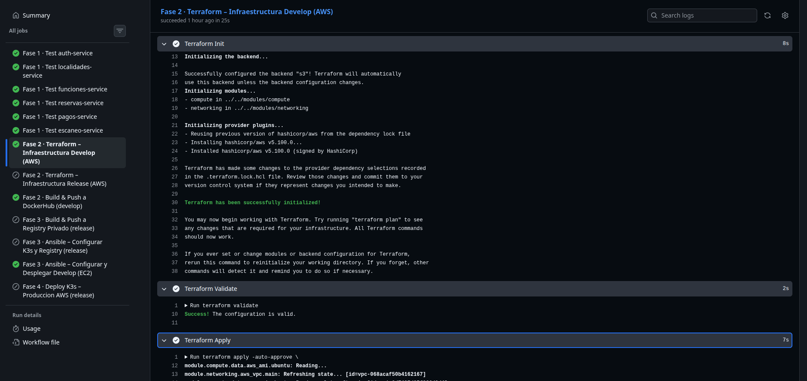
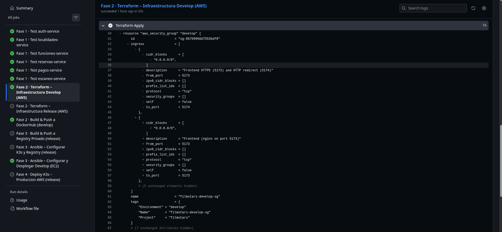

# Terraform — Documentación

## Índice

- [¿Qué es Terraform?](#qué-es-terraform)
- [¿Cómo funciona?](#cómo-funciona)
- [Estructura del proyecto](#estructura-del-proyecto)
- [Guía paso a paso — entorno develop](#guía-paso-a-paso--entorno-develop)
- [Guía paso a paso — entorno release](#guía-paso-a-paso--entorno-release)
- [Módulos reutilizables](#módulos-reutilizables)
- [Backend de estado remoto](#backend-de-estado-remoto)
- [Integración con CI/CD](#integración-con-cicd)

---

## ¿Qué es Terraform?

Terraform es una herramienta de **Infraestructura como Código (IaC)** desarrollada por HashiCorp. Permite definir, aprovisionar y gestionar la infraestructura de cualquier proveedor de nube (AWS, GCP, Azure, etc.) o servicio (Kubernetes, GitHub, Cloudflare…) usando un lenguaje declarativo propio llamado **HCL (HashiCorp Configuration Language)**.

A diferencia de los scripts imperativos (`aws-cli` + Bash), en los que el desarrollador indica _cómo_ crear cada recurso paso a paso, con Terraform el desarrollador declara _qué_ recursos deben existir y en qué estado. Terraform calcula la diferencia entre el estado actual y el estado deseado, y genera un **plan de ejecución** que el operador puede revisar antes de aplicar cualquier cambio.

### Conceptos clave

| Término | Descripción |
|---------|-------------|
| **Provider** | Plugin que conecta Terraform con un servicio (p. ej. `hashicorp/aws`). Traduce los recursos HCL en llamadas a la API del proveedor. |
| **Resource** | Unidad de infraestructura que Terraform gestiona (instancia EC2, VPC, Security Group, etc.). |
| **Module** | Grupo reutilizable de recursos con entradas (`variables`) y salidas (`outputs`). Equivalente a una función en programación. |
| **State** | Archivo `terraform.tfstate` que registra el estado actual de la infraestructura gestionada. Es la fuente de verdad de Terraform. |
| **Backend** | Lugar donde se almacena el state. En este proyecto se usa S3 con bloqueo DynamoDB. |
| **Plan** | Previsualización de los cambios que Terraform aplicará (`terraform plan`). |
| **Apply** | Ejecución real de los cambios planificados (`terraform apply`). |

---

## ¿Cómo funciona?

El flujo de trabajo estándar de Terraform tiene tres fases:

```
1. terraform init    → Descarga providers y configura el backend remoto
2. terraform plan    → Calcula los cambios necesarios sin aplicarlos
3. terraform apply   → Aplica los cambios al proveedor (AWS en este caso)
```

Internamente, Terraform:

1. Lee los archivos `.tf` del directorio actual y construye el grafo de dependencias entre recursos.
2. Consulta el state almacenado en el backend para conocer el estado actual.
3. Llama a la API del proveedor para obtener el estado real de los recursos existentes.
4. Calcula el diff entre el estado deseado (`.tf`) y el estado real.
5. Presenta el plan al operador y, al confirmarse, ejecuta las operaciones necesarias (crear, modificar o destruir recursos) en el orden correcto respetando las dependencias.

El state se actualiza al finalizar cada `apply`, garantizando que la próxima ejecución parte del estado correcto.

---

Cada entorno es un directorio de Terraform independiente con su propio estado remoto. Los módulos `networking` y `compute` son compartidos y parametrizados por entorno.

---

## Guía paso a paso — entorno develop

El entorno `develop` provisiona **un único servidor** (`t3.small`, 30 GB EBS) con Docker Compose para ejecutar todos los microservicios en contenedores sobre una única máquina.

### Paso 1 — Prerrequisitos

Antes de ejecutar Terraform es necesario tener:

- **Terraform ≥ 1.6.0** instalado localmente o disponible en el runner de CI/CD.
- **Credenciales AWS** configuradas (`AWS_ACCESS_KEY_ID`, `AWS_SECRET_ACCESS_KEY`, `AWS_SESSION_TOKEN` si se usa AssumeRole). En CI/CD se inyectan como secrets de GitHub Actions.
- Un **key pair EC2** creado previamente en la región `us-east-1`. El nombre se pasa como variable `key_name`.
- Un **bucket S3** y una **tabla DynamoDB** para el backend de estado (ver sección [Backend de estado remoto](#backend-de-estado-remoto)).

### Paso 2 — Inicializar el backend

```bash
terraform -chdir=terraform/environments/develop init \
  -backend-config="bucket=$TF_STATE_BUCKET" \
  -backend-config="region=$AWS_REGION" \
  -backend-config="dynamodb_table=$TF_STATE_LOCK_TABLE"
```

Este comando descarga el provider `hashicorp/aws ~> 5.0` y configura el backend S3. El archivo `backend.tf` solo declara la clave del state (`filmstars/develop/terraform.tfstate`) y el cifrado; el bucket y la tabla se inyectan en tiempo de inicialización para no hardcodear valores sensibles en el repositorio.

### Paso 3 — Revisar el plan

```bash
terraform -chdir=terraform/environments/develop plan \
  -var="key_name=$EC2_KEY_NAME" \
  -var="aws_region=us-east-1" \
  -var="allowed_ssh_cidr=0.0.0.0/0"
```

Terraform mostrará todos los recursos que creará: la VPC (`10.1.0.0/16`), la subred pública (`10.1.1.0/24`), el Internet Gateway, la tabla de rutas, el Security Group y la instancia EC2 con su Elastic IP.

### Paso 4 — Aplicar los cambios

```bash
terraform -chdir=terraform/environments/develop apply \
  -var="key_name=$EC2_KEY_NAME" \
  -var="aws_region=us-east-1" \
  -var="allowed_ssh_cidr=0.0.0.0/0" \
  -auto-approve
```

El flag `-auto-approve` se usa en CI/CD para omitir la confirmación interactiva. En ejecuciones manuales se recomienda omitirlo para revisar el plan antes de confirmar.

### Paso 5 — Leer los outputs

```bash
terraform -chdir=terraform/environments/develop output develop_server_ip
```

La IP pública del servidor se exporta como output `develop_server_ip` y es consumida directamente por el paso de Ansible en el pipeline para generar el inventario dinámico.

### Recursos creados en develop

| Recurso | Nombre | Descripción |
|---------|--------|-------------|
| `aws_vpc` | `filmstars-develop-vpc` | VPC con DNS habilitado, CIDR `10.1.0.0/16` |
| `aws_internet_gateway` | `filmstars-develop-igw` | Gateway de salida a Internet |
| `aws_subnet` | `filmstars-develop-public-subnet` | Subred pública `10.1.1.0/24` en `us-east-1a` |
| `aws_route_table` | `filmstars-develop-public-rt` | Ruta `0.0.0.0/0` → IGW |
| `aws_security_group` | `filmstars-develop-sg` | Puertos 22, 80, 443, 5173, 3001–3007 |
| `aws_instance` | `filmstars-develop-develop-server` | `t3.small`, Ubuntu 22.04, EBS 30 GB gp3 cifrado |
| `aws_eip` | `filmstars-develop-develop-server-eip` | IP estática asociada a la instancia |

### Reglas del Security Group (develop)

| Puerto | Protocolo | Origen | Propósito |
|--------|-----------|--------|-----------|
| 22 | TCP | `allowed_ssh_cidr` | SSH — Ansible y runners CI/CD |
| 80 | TCP | `0.0.0.0/0` | HTTP |
| 443 | TCP | `0.0.0.0/0` | HTTPS |
| 5173 | TCP | `0.0.0.0/0` | Frontend (nginx en develop) |
| 3006 | TCP | `0.0.0.0/0` | API Gateway |
| 3001–3007 | TCP | `0.0.0.0/0` | Microservicios backend |

---

## Guía paso a paso — entorno release

El entorno `release` aprovisiona **cuatro instancias EC2**: tres nodos K3s (`t3.medium`) para el clúster de Kubernetes y una instancia adicional (`t3.small`, 50 GB) para el registry privado Zot.

### Paso 1 — Inicializar

```bash
terraform -chdir=terraform/environments/release init \
  -backend-config="bucket=$TF_STATE_BUCKET" \
  -backend-config="region=$AWS_REGION" \
  -backend-config="dynamodb_table=$TF_STATE_LOCK_TABLE"
```

El state de `release` es independiente del de `develop` (clave `filmstars/release/terraform.tfstate`).

### Paso 2 — Plan y apply

```bash
terraform -chdir=terraform/environments/release apply \
  -var="key_name=$EC2_KEY_NAME" \
  -var="aws_region=us-east-1" \
  -var="allowed_ssh_cidr=0.0.0.0/0" \
  -auto-approve
```

### Recursos creados en release

| Recurso | Nombre | Descripción |
|---------|--------|-------------|
| `aws_vpc` | `filmstars-release-vpc` | VPC `10.2.0.0/16` |
| `aws_subnet` | `filmstars-release-public-subnet` | Subred `10.2.1.0/24` |
| `aws_security_group` | `filmstars-k3s-sg` | Puertos K3s: 22, 80, 443, 6443, 2379-2380, 10250-10252, 8472/UDP, 30000-32767 |
| `aws_security_group` | `filmstars-registry-sg` | Puerto 5000 solo desde dentro de la VPC |
| `aws_instance` | `filmstars-release-k3s-master` | `t3.medium`, 30 GB EBS |
| `aws_instance` | `filmstars-release-k3s-worker-1` | `t3.medium`, 30 GB EBS |
| `aws_instance` | `filmstars-release-k3s-worker-2` | `t3.medium`, 30 GB EBS |
| `aws_instance` | `filmstars-release-registry` | `t3.small`, 50 GB EBS |
| `aws_eip` x4 | — | IPs estáticas para cada instancia |

### Reglas del Security Group K3s (release)

| Puerto | Protocolo | Origen | Propósito |
|--------|-----------|--------|-----------|
| 22 | TCP | `allowed_ssh_cidr` | SSH Ansible y CI/CD |
| 80 / 443 | TCP | `0.0.0.0/0` | NGINX Ingress Controller |
| 6443 | TCP | `0.0.0.0/0` | API Server K3s (kubectl / kubeconfig) |
| 2379–2380 | TCP | self (intra-SG) | etcd peer communication |
| 10250–10252 | TCP | self (intra-SG) | kubelet / controller-manager |
| 8472 | UDP | self (intra-SG) | Flannel VXLAN overlay |
| 30000–32767 | TCP | `0.0.0.0/0` | NodePort services |

---

## Módulos reutilizables

### Módulo `networking`

Crea la infraestructura de red completa de un entorno.

**Variables de entrada:**

| Variable | Tipo | Descripción |
|----------|------|-------------|
| `environment` | `string` | Prefijo para nombrar recursos (`develop` / `release`) |
| `vpc_cidr` | `string` | CIDR de la VPC (p. ej. `10.1.0.0/16`) |
| `public_subnet_cidr` | `string` | CIDR de la subred pública |
| `availability_zone` | `string` | AZ de AWS (p. ej. `us-east-1a`) |

**Outputs:**

| Output | Descripción |
|--------|-------------|
| `vpc_id` | ID de la VPC creada |
| `public_subnet_id` | ID de la subred pública |
| `vpc_cidr` | CIDR block de la VPC (usado por el SG del registry) |

### Módulo `compute`

Crea instancias EC2 con Elastic IPs a partir de un mapa de configuración.

**Variables de entrada:**

| Variable | Tipo | Descripción |
|----------|------|-------------|
| `environment` | `string` | Prefijo de nomenclatura |
| `key_name` | `string` | Nombre del key pair EC2 para SSH |
| `subnet_id` | `string` | ID de la subred donde lanzar las instancias |
| `security_group_ids` | `list(string)` | Lista de IDs de Security Groups a aplicar |
| `instances` | `map(object)` | Mapa de instancias: clave = nombre lógico, valor = `{instance_type, volume_size, tags}` |

**Outputs:**

| Output | Descripción |
|--------|-------------|
| `instance_ids` | Mapa `nombre → ID de instancia` |
| `instance_public_ips` | Mapa `nombre → IP pública (Elastic IP)` |

El módulo usa `for_each` sobre el mapa `instances`, lo que permite crear un número arbitrario de instancias con una sola declaración del módulo. La AMI se selecciona dinámicamente usando un `data "aws_ami"` que busca la última imagen oficial de Ubuntu 22.04 LTS publicada por Canonical.

---

## Backend de estado remoto

El estado de Terraform se almacena en **S3** con **bloqueo distribuido vía DynamoDB**, configurado en `backend.tf`:

```hcl
terraform {
  backend "s3" {
    key     = "filmstars/develop/terraform.tfstate"
    encrypt = true
    # bucket, region y dynamodb_table se inyectan con -backend-config en CI/CD
  }
}
```

**¿Por qué un backend remoto?**

- Permite que múltiples miembros del equipo y los runners de CI/CD compartan el mismo estado sin sobrescribirse mutuamente.
- El bloqueo de DynamoDB garantiza que solo un `terraform apply` se ejecuta a la vez por entorno.
- S3 provee versionado del state, permitiendo recuperar estados anteriores ante errores.

**Recursos AWS necesarios (pre-existentes, no gestionados por Terraform):**

| Recurso | Propósito |
|---------|-----------|
| Bucket S3 con versionado y cifrado SSE-S3 | Almacén del state |
| Tabla DynamoDB con clave primaria `LockID` (tipo `String`) | Bloqueo distribuido |

Estos recursos se crean manualmente una única vez antes del primer `terraform init`, ya que no pueden ser gestionados por el mismo Terraform que los necesita para su state.

---

## Integración con CI/CD

En el pipeline de GitHub Actions, Terraform se ejecuta en dos jobs:

**Job `terraform-develop`** (rama `develop`):

```yaml
- name: Terraform Init
  run: |
    terraform -chdir=terraform/environments/develop init \
      -backend-config="bucket=${{ secrets.TF_STATE_BUCKET }}" \
      -backend-config="region=${{ secrets.AWS_REGION }}" \
      -backend-config="dynamodb_table=${{ secrets.TF_STATE_LOCK_TABLE }}"

- name: Terraform Apply
  run: |
    terraform -chdir=terraform/environments/develop apply \
      -var="key_name=${{ secrets.EC2_KEY_NAME }}" \
      -var="aws_region=${{ secrets.AWS_REGION }}" \
      -auto-approve

- name: Export server IP
  run: |
    echo "DEVELOP_SERVER_IP=$(terraform -chdir=terraform/environments/develop \
      output -raw develop_server_ip)" >> $GITHUB_ENV
```

La IP exportada como variable de entorno es consumida inmediatamente por el job de Ansible para construir el inventario y ejecutar el playbook de configuración.

---

## Capturas





[Volver a Documentación](../Documentación.md)
