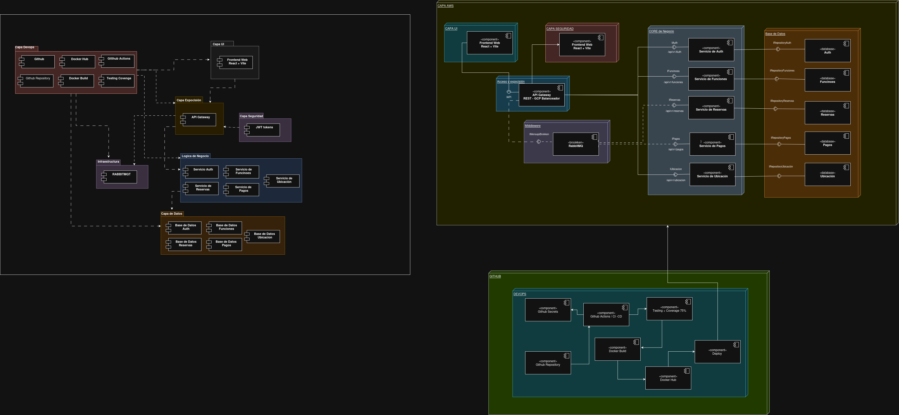
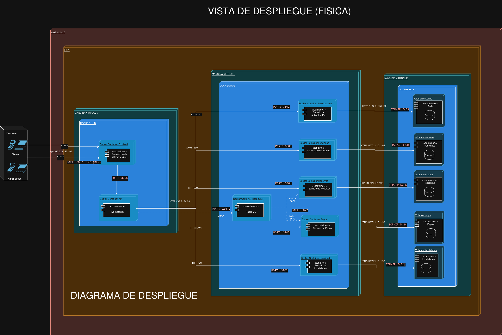

# Modelos de Vistas 4+1

El modelo de vistas 4+1 es una metodología de diseño de arquitectura de software, propuesta por Philippe Kruchten, que permite describir y comprender la arquitectura de un sistema de forma integral. Dado que un sistema de software es complejo y debe satisfacer los intereses de diversos actores como usuarios finales, desarrolladores, integradores, administradores de sistemas, este modelo utiliza perspectivas separadas pero complementarias, permitiendo abstraer detalles innecesarios en cada contexto.

Las vistas contempladas son: Lógica, Procesos, Desarrollo, Física y la vista de Escenarios, que actúa como el hilo conductor que valida todas las demás.

## 1. Vista Lógica
La vista lógica está orientada principalmente a los **usuarios finales** y analistas del sistema. Se encarga de capturar y modelar cómo el sistema satisface los requerimientos funcionales también concido como lo que el sistema debe hacer. En esta vista, se identifican las abstracciones clave a través de clases, interfaces, módulos y objetos del dominio, estableciendo sus relaciones, asociaciones y dependencias fundamentales sin preocuparse por los detalles técnicos de bajo nivel o el despliegue físico.

En este caso se desarrolló una vista lógica basada en el modelo de dominio del sistema FilmStars, identificando los servicios principales como Usuario Función, Reservas, Localidad y Pago. Se establecen las relaciones entre estas entidades. Por ejemplo, un Usuario puede realizar Reservas para Funciones específicas, y cada Reserva está asociada a una Localidad y un Pago. Esta vista ayuda a entender la estructura conceptual del sistema y cómo los diferentes elementos interactúan a nivel de negocio.

## 2. Vista de Procesos
La vista de procesos está dirigida a los **integradores de sistemas** y arquitectos. Esta vista enfatiza el comportamiento dinámico del sistema en tiempo de ejecución. Trata aspectos no funcionales cruciales como la concurrencia, distribución, tolerancia a fallos, carga, rendimiento y escalabilidad. Aquí se detalla cómo los elementos identificados en la vista lógica se mapean a hilos y procesos de ejecución, así como el flujo de comunicación, el paso de mensajes y la sincronización entre distintos componentes que operan simultáneamente.

En el caso de FilmStars, se modelaron los procesos relacionados con la autenticación, gestión de funciones, reservas y pagos. Se muestra cómo los usuarios interactúan con el sistema a través de solicitudes, cómo estas solicitudes son manejadas por el API Gateway y cómo se comunican los microservicios entre sí utilizando tanto comunicación síncrona como asíncrona. Esta vista es esencial para garantizar que el sistema pueda manejar múltiples usuarios y operaciones simultáneamente sin comprometer la integridad o el rendimiento.

## 3. Vista de Componentes (Vista de Desarrollo)

### Introducción
La vista de desarrollo o componentes presenta el sistema FilmStars desde la perspectiva de los **programadores y gestores de software**. Su objetivo es mostrar cómo se organizan los módulos de software en el entorno de desarrollo, cómo se separan las responsabilidades por capas y de qué forma se comunican los componentes físicos de código.

### Diagrama de Paquetes
El diagrama de paquetes organiza la solución en tres niveles principales:
* **Capa UI:** Contiene el Frontend Web (React + Vite). Utiliza interfaces de control para invocar la lógica de negocio.
* **Lógica de negocio:** Servicios que implementan las reglas principales (Autenticación, Funciones, Localidades, Reservaciones, Pagos). Concentra los procesos del dominio.
* **Infraestructura:** Componentes de soporte técnico (`rabbitmq-client`, `postgresql-driver`, `jwt-library`) que abstraen detalles de comunicación y persistencia.

### Componentes Principales del Sistema
1. Frontend Web (React + Vite)
2. API Gateway
3. Servicio de Autenticación
4. Servicio de Funciones, Salas / Horarios
5. Servicio de Localidades
6. Servicio de Reservas
7. Servicio de Pagos
8. RabbitMQ Broker
9. Pasarela de Pago Simulado
10. Bases de datos PostgreSQL por dominio

### Comunicación entre Componentes
* **Síncrona (REST/HTTPS):** Entre el Frontend y el API Gateway, y de este a los microservicios. También llamadas internas (Ej. Reservas hacia Funciones, o Pagos hacia pasarela externa).
* **Asíncrona (RabbitMQ):** Entre el Servicio de Reservas y el Servicio de Pagos. Permite desacoplar procesos pesados.
* **Persistencia:** Cada servicio mantiene su propia base de datos PostgreSQL, asegurando la autonomía.

### Tecnologías Utilizadas
| Categoría | Tecnología |
|---|---|
| Frontend | React + Vite |
| Backend | Microservicios / API REST |
| Integración | API Gateway |
| Comunicación síncrona | REST / HTTPS |
| Comunicación asíncrona | RabbitMQ |
| Base de datos | PostgreSQL |
| Seguridad | JWT |

### Explicación del Diagrama de Componentes
El frontend web canaliza las solicitudes hacia el API Gateway. Este distribuye las peticiones a los microservicios encapsulados. Existe un claro desacoplamiento facilitado por la mensajería a través de RabbitMQ (por ejemplo, para pagos y reservas) y persistencia dividida (bases de datos independientes para funcionalidades puntuales). Esto favorece el aislamiento, mantenibilidad y escalado.

## 4. Vista Física (Vista de Despliegue)

### Introducción
La vista física o de despliegue se dirige a los **ingenieros de sistemas y operaciones (DevOps)**. Describe topológicamente cómo se distribuyen los componentes de software sobre la infraestructura de ejecución (hardware). Identifica los nodos de red, los contenedores y los servicios externos.

### Nodos del Sistema
1. **Nodo Cliente:** Actores físicos interactuando desde navegadores web (HTTPS Puerto 443).
2. **Servidor Frontend:** Aplicación web reactiva para interfaz visual, enviando solicitudes al backend.
3. **Servidor Backend (Docker Host):** Microservicios organizados bajo un esquema SOA en contenedores separados (API Gateway, Autenticación, Funciones, etc.) comunicándose vía REST internos, AMQP (5672) o TCP/IP (5432).
4. **Broker de Mensajería:** Nodo con RabbitMQ para orquestar la comunicación asíncrona interna (Puerto 5672).
5. **Servicio de Bases de Datos (PostgreSQL):** Clúster de bases de datos aisladas por servicio mediante TCP/IP (Puerto 5432).
6. **Servicios Externos:** Pasarela de pago simulado (HTTPS 443) y proveedor de correo (SMTP 587).

### Explicación del Diagrama de Despliegue
El tráfico web entra por el servidor frontend y se dirige al servidor backend central gestionado por un API Gateway. Una vez en el servidor de Docker, el flujo se bifurca hacia el microservicio apuntado. Las cargas de operaciones persistentes van al servidor de Base de Datos respectivo, aislando responsabilidades funcionales en hardware diferenciado (o contenedores dev), y las tareas de integración asíncronas dependen del nodo de encolamiento (Broker) manteniéndose independientes del tiempo de ejecución sincrónico principal.

## 5. Vista de Escenarios (La vista "+1")
La vista de escenarios también conocida como vista de casos de uso interactúa y unifica a las otras cuatro vistas. Está diseñada para **todos los interesados o stakeholders**. Funciona como una abstracción para identificar interfaces operacionales comprobables. En lugar de detallar de inmediato la arquitectura global, muestra pequeñas narrativas casos de uso que explican cómo el sistema debe comportarse ante secuencias específicas de eventos de usuario o sistema. Sirve para descubrir elementos arquitectónicos, guiando el diseño de las demás vistas, y posteriormente se emplea para validar y probar si la arquitectura propuesta resuelve los problemas reales o requerimientos funcionales declarados.

[\[archivo crudo de vistas 4+1\](https://app.diagrams.net/#G17zqvzKtzFauwvckD7d33XzBFcmADsWsG#%7B%22pageId%22%3A%228e4zzOSsQAcUt3Mhw_pj%22%7D)](https://drive.google.com/file/d/17zqvzKtzFauwvckD7d33XzBFcmADsWsG/view?usp=sharing)
---
[Volver a Documentacion](../Documentación.md)
