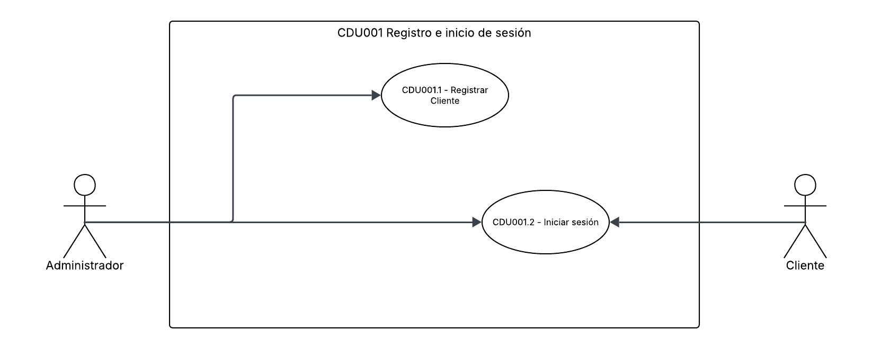
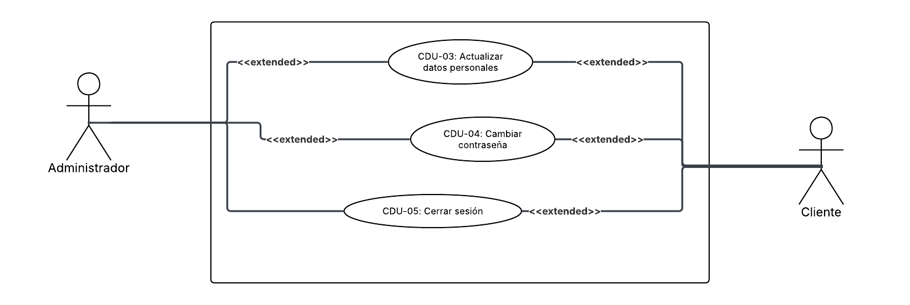
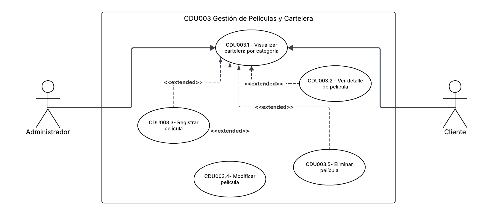
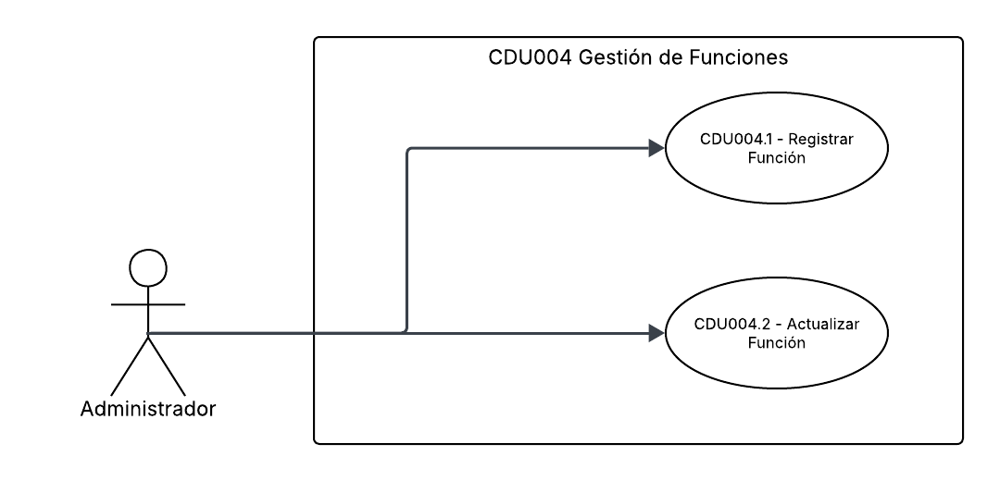
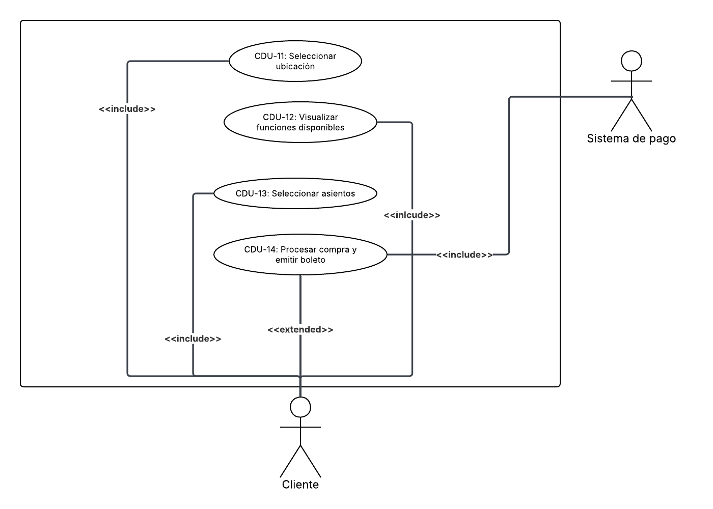

# Casos de Uso

## Core del negocio

## Casos de uso de alto nivel

## Primera descomposición
**CDU001**: **Registro e inicio de sesión**: Es el punto de partido para que cualquier usuario pueda interactuar con el sistema. Permite a los usuarios crear una cuenta y autenticarse para acceder a las funcionalidades del sistema.

**CDU002**: **Gestión de información personal**: Permite a los usuarios actualizar su información personal, como nombre, correo electrónico y contraseña. De la misma manera, permite a los usuarios gestionar su perfil y preferencias.

**CDU003**: **Gestión de películas y cartelera**: Permite al administrador gestionar las películas disponibles en el sistema y mostrarlas en cartelerasegún su tipo de proyección.

**CDU004**: **Gestión de funciones**: Permite al administrador gestionar las funciones de las películas, incluyendo la asignación de horarios y salas.

**CDU005**: **Reserva y Compra de Boletos**: Permite a los usuarios seleccionar su ubicación, explorar funciones disponibles, reservar asientos en tiempo real y completar la compra de sus boletos.

# Casos de uso expandidos
## Registro e inicio de sesión
### CU-01: Registrar Cliente

| Campo | Descripción |
|-------|-------------|
| **ID** | CU-01 |
| **Nombre** | Registrar Cliente |
| **Actor** | Usuario |
| **Descripción** | Permite a un nuevo usuario crear una cuenta en la plataforma proporcionando sus datos personales para acceder a las funcionalidades del sistema. |
| **Precondiciones** | El usuario no está registrado en el sistema. |
| **Postcondiciones** | El usuario queda registrado en el sistema y puede iniciar sesión. |

**Flujo principal:**
| Paso | Actor | Acción |
|------|-------|--------|
| 1 | Usuario | Accede a la página de registro. |
| 2 | Usuario | Ingresa su nombre, correo electrónico y contraseña. |
| 3 | Usuario | Confirma la contraseña y envía el formulario. |
| 4 | Sistema | Valida que todos los campos estén completos y con formato correcto. |
| 5 | Sistema | Verifica que el correo electrónico no esté registrado previamente. |
| 6 | Sistema | Almacena el nuevo usuario con la contraseña cifrada. |
| 7 | Sistema | Muestra un mensaje de registro exitoso y redirige al inicio de sesión. |

**Flujos alternativos:**
| ID | Condición | Acción |
|----|-----------|--------|
| FA-01 | El usuario ya tiene una cuenta | En el paso 5, el sistema notifica que el correo ya está en uso y sugiere iniciar sesión. |
| FA-02 | El usuario cancela el registro | En cualquier paso, el usuario puede cancelar y el sistema descarta los datos ingresados. |

**Flujos de excepción:**
| ID | Condición | Acción |
|----|-----------|--------|
| FE-01 | Formato de correo inválido | En el paso 4, el sistema muestra un mensaje de error indicando el formato correcto y solicita corrección. |
| FE-02 | Contraseñas no coinciden | En el paso 4, el sistema muestra un mensaje de error y limpia los campos de contraseña. |
| FE-03 | Error de conexión con la base de datos | En el paso 6, el sistema muestra un mensaje de error genérico y solicita reintentar. |

---

### CU-02: Iniciar Sesión

| Campo | Descripción |
|-------|-------------|
| **ID** | CU-03 |
| **Nombre** | Iniciar Sesión |
| **Actor** | Usuario |
| **Descripción** | Permite a un usuario registrado autenticarse en la plataforma mediante su correo electrónico y contraseña para acceder a las funcionalidades del sistema. |
| **Precondiciones** | El usuario tiene una cuenta registrada y no tiene una sesión activa. |
| **Postcondiciones** | El sistema genera un token de sesión válido y el usuario accede a la plataforma. |

**Flujo principal:**

| Paso | Actor | Acción |
|------|-------|--------|
| 1 | Usuario | Accede a la página de inicio de sesión. |
| 2 | Usuario | Ingresa su correo electrónico y contraseña. |
| 3 | Usuario | Envía el formulario. |
| 4 | Sistema | Valida que los campos no estén vacíos y tengan formato correcto. |
| 5 | Sistema | Verifica que el correo esté registrado y que la contraseña coincida con el hash almacenado. |
| 6 | Sistema | Genera un token JWT y lo asocia a la sesión del usuario. |
| 7 | Sistema | Redirige al usuario a la página principal de la plataforma. |

**Flujos alternativos:**

| ID | Condición | Acción |
|----|-----------|--------|
| FA-01 | El usuario no tiene cuenta | En el paso 5, el sistema informa que el correo no está registrado y sugiere crear una cuenta. |
| FA-02 | El usuario cancela | En cualquier paso, el usuario puede cancelar y el sistema descarta los datos ingresados. |

**Flujos de excepción:**

| ID | Condición | Acción |
|----|-----------|--------|
| FE-01 | Contraseña incorrecta | En el paso 5, el sistema muestra un mensaje de credenciales inválidas sin especificar cuál campo es incorrecto. |
| FE-02 | Formato de correo inválido | En el paso 4, el sistema muestra un error de formato y solicita corrección antes de continuar. |
| FE-03 | Error de conexión con la base de datos | En el paso 5, el sistema muestra un mensaje de error genérico y solicita reintentar. |

---

## Gestión de información personal

### CU-03: Actualizar Datos Personales

| Campo | Descripción |
|-------|-------------|
| **ID** | CU-03 |
| **Nombre** | Actualizar Datos Personales |
| **Actor** | Cliente, Administrador |
| **Descripción** | Permite al usuario modificar su nombre y correo electrónico registrados en la plataforma. |
| **Precondiciones** | El usuario tiene una sesión activa. |
| **Postcondiciones** | Los datos personales del usuario quedan actualizados en el sistema. |

**Flujo principal:**

| Paso | Actor | Acción |
|------|-------|--------|
| 1 | Usuario | Accede a la sección de perfil desde el menú de usuario. |
| 2 | Usuario | Selecciona la opción de editar datos personales. |
| 3 | Usuario | Modifica los campos deseados y envía el formulario. |
| 4 | Sistema | Valida que los campos no estén vacíos y tengan formato correcto. |
| 5 | Sistema | Verifica que el nuevo correo electrónico no esté en uso por otra cuenta. |
| 6 | Sistema | Actualiza los datos del usuario en la base de datos. |
| 7 | Sistema | Muestra un mensaje de confirmación de actualización exitosa. |

**Flujos alternativos:**

| ID | Condición | Acción |
|----|-----------|--------|
| FA-01 | El usuario no modifica ningún campo | En el paso 3, el sistema no realiza ninguna operación y mantiene los datos actuales. |
| FA-02 | El usuario cancela | En cualquier paso, el usuario puede cancelar y el sistema descarta los cambios. |

**Flujos de excepción:**

| ID | Condición | Acción |
|----|-----------|--------|
| FE-01 | Formato de correo inválido | En el paso 4, el sistema muestra un mensaje de error y solicita corrección. |
| FE-02 | El nuevo correo ya está en uso | En el paso 5, el sistema notifica que el correo pertenece a otra cuenta y solicita uno diferente. |

---

### CU-04: Cambiar Contraseña

| Campo | Descripción |
|-------|-------------|
| **ID** | CU-04 |
| **Nombre** | Cambiar Contraseña |
| **Actor** | Cliente, Administrador |
| **Descripción** | Permite al usuario actualizar su contraseña actual por una nueva, previa verificación de la contraseña vigente. |
| **Precondiciones** | El usuario tiene una sesión activa. |
| **Postcondiciones** | La contraseña del usuario queda actualizada en el sistema. |

**Flujo principal:**

| Paso | Actor | Acción |
|------|-------|--------|
| 1 | Usuario | Accede a la sección de perfil y selecciona la opción de cambiar contraseña. |
| 2 | Usuario | Ingresa su contraseña actual. |
| 3 | Usuario | Ingresa la nueva contraseña y la confirma. |
| 4 | Usuario | Envía el formulario. |
| 5 | Sistema | Verifica que la contraseña actual coincida con el hash almacenado. |
| 6 | Sistema | Valida que la nueva contraseña cumpla con los requisitos de seguridad. |
| 7 | Sistema | Almacena la nueva contraseña cifrada. |
| 8 | Sistema | Muestra un mensaje de confirmación y redirige al inicio de sesión. |

**Flujos alternativos:**

| ID | Condición | Acción |
|----|-----------|--------|
| FA-01 | El usuario cancela | En cualquier paso, el usuario puede cancelar y el sistema descarta los cambios. |

**Flujos de excepción:**

| ID | Condición | Acción |
|----|-----------|--------|
| FE-01 | Contraseña actual incorrecta | En el paso 5, el sistema muestra un error de credenciales inválidas sin revelar detalles adicionales. |
| FE-02 | Nueva contraseña no cumple requisitos | En el paso 6, el sistema indica los requisitos no cumplidos y solicita corrección. |
| FE-03 | Nueva contraseña y confirmación no coinciden | En el paso 6, el sistema muestra un error y limpia los campos de nueva contraseña. |

---

### CU-05: Cerrar Sesión

| Campo | Descripción |
|-------|-------------|
| **ID** | CU-05 |
| **Nombre** | Cerrar Sesión |
| **Actor** | Cliente, Administrador |
| **Descripción** | Permite al usuario finalizar su sesión activa en la plataforma, invalidando el token de autenticación. |
| **Precondiciones** | El usuario tiene una sesión activa. |
| **Postcondiciones** | El token de sesión queda invalidado y el usuario es redirigido a la página de inicio. |

**Flujo principal:**

| Paso | Actor | Acción |
|------|-------|--------|
| 1 | Usuario | Selecciona la opción de cerrar sesión desde el menú de usuario. |
| 2 | Sistema | Invalida el token JWT asociado a la sesión activa. |
| 3 | Sistema | Redirige al usuario a la página de inicio de sesión. |

**Flujos alternativos:**

| ID | Condición | Acción |
|----|-----------|--------|
| FA-01 | El usuario cancela el cierre de sesión | En el paso 1, el sistema no realiza ninguna acción y mantiene la sesión activa. |

**Flujos de excepción:**

| ID | Condición | Acción |
|----|-----------|--------|
| FE-01 | Error al invalidar el token | En el paso 2, el sistema muestra un mensaje de error e intenta invalidar el token nuevamente. |

## Gestión de películas y cartelera

### CU-06: Visualizar Cartelera por Categoría

| Campo | Descripción |
|-------|-------------|
| **ID** | CU-06 |
| **Nombre** | Visualizar Cartelera por Categoría |
| **Actor** | Cliente |
| **Descripción** | Permite al cliente explorar las películas disponibles en cartelera, segmentadas por su tipo de proyección: Estrenos, Pre-ventas y Re-Estrenos. |
| **Precondiciones** | Existe al menos una película registrada en el catálogo. |
| **Postcondiciones** | El cliente visualiza las películas disponibles según la categoría seleccionada. |

**Flujo principal:**

| Paso | Actor | Acción |
|------|-------|--------|
| 1 | Cliente | Accede a la sección de cartelera desde la página principal. |
| 2 | Cliente | Selecciona una categoría de proyección: Estrenos, Pre-ventas o Re-Estrenos. |
| 3 | Sistema | Recupera y muestra las películas activas correspondientes a la categoría seleccionada. |
| 4 | Cliente | Navega por el listado de películas disponibles. |

**Flujos alternativos:**

| ID | Condición | Acción |
|----|-----------|--------|
| FA-01 | El cliente no selecciona categoría | En el paso 2, el sistema muestra todas las películas disponibles sin filtro de categoría. |

**Flujos de excepción:**

| ID | Condición | Acción |
|----|-----------|--------|
| FE-01 | No hay películas en la categoría seleccionada | En el paso 3, el sistema muestra un mensaje indicando que no hay contenido disponible en esa categoría. |

---

### CU-07: Ver Detalle de Película

| Campo | Descripción |
|-------|-------------|
| **ID** | CU-07 |
| **Nombre** | Ver Detalle de Película |
| **Actor** | Cliente |
| **Descripción** | Permite al cliente consultar la información completa de una película seleccionada desde la cartelera, incluyendo sinopsis, duración, género y funciones disponibles. |
| **Precondiciones** | La película existe en el catálogo y tiene al menos una función programada. |
| **Postcondiciones** | El cliente visualiza los detalles de la película y puede proceder a seleccionar una función. |

**Flujo principal:**

| Paso | Actor | Acción |
|------|-------|--------|
| 1 | Cliente | Selecciona una película desde la cartelera. |
| 2 | Sistema | Recupera y muestra los detalles de la película. |
| 3 | Sistema | Muestra las funciones disponibles para la película (cine, sala, fecha y horario). |
| 4 | Cliente | Revisa la información y selecciona una función para continuar con la compra. |

**Flujos alternativos:**

| ID | Condición | Acción |
|----|-----------|--------|
| FA-01 | El cliente no selecciona ninguna función | En el paso 4, el cliente puede regresar a la cartelera sin continuar con la compra. |

**Flujos de excepción:**

| ID | Condición | Acción |
|----|-----------|--------|
| FE-01 | La película no tiene funciones programadas | En el paso 3, el sistema muestra un mensaje indicando que no hay funciones disponibles por el momento. |

---

### CU-15: Registrar Película

| Campo | Descripción |
|-------|-------------|
| **ID** | CU-15 |
| **Nombre** | Registrar Película |
| **Actor** | Administrador |
| **Descripción** | Permite al administrador registrar una nueva película en el catálogo del sistema, asignándole su categoría de proyección. |
| **Precondiciones** | El administrador tiene una sesión activa. |
| **Postcondiciones** | La película queda registrada en el catálogo y visible en la cartelera según su categoría asignada. |

**Flujo principal:**

| Paso | Actor | Acción |
|------|-------|--------|
| 1 | Administrador | Accede al panel de administración y selecciona la opción de registrar película. |
| 2 | Administrador | Ingresa los datos de la película. |
| 3 | Administrador | Sube la imagen del póster y envía el formulario. |
| 4 | Sistema | Valida que todos los campos obligatorios estén completos. |
| 5 | Sistema | Verifica que no exista una película con el mismo título en el catálogo. |
| 6 | Sistema | Almacena la película con su categoría asignada. |
| 7 | Sistema | Muestra un mensaje de confirmación de registro exitoso. |

**Flujos alternativos:**

| ID | Condición | Acción |
|----|-----------|--------|
| FA-01 | El administrador no sube póster | En el paso 3, el sistema asigna una imagen por defecto a la película. |
| FA-02 | El administrador cancela | El administrador puede cancelar y el sistema descarta los datos ingresados. |

**Flujos de excepción:**

| ID | Condición | Acción |
|----|-----------|--------|
| FE-01 | Campos obligatorios incompletos | En el paso 4, el sistema resalta los campos faltantes y solicita completarlos. |
| FE-02 | Película duplicada | En el paso 5, el sistema notifica que ya existe una película con ese título y solicita verificar. |

---

### CU-16: Modificar Película

| Campo | Descripción |
|-------|-------------|
| **ID** | CU-16 |
| **Nombre** | Modificar Película |
| **Actor** | Administrador |
| **Descripción** | Permite al administrador editar los datos de una película existente en el catálogo, incluyendo su categoría de proyección. |
| **Precondiciones** | El administrador tiene una sesión activa y la película existe en el catálogo. |
| **Postcondiciones** | Los datos actualizados de la película quedan persistidos en el sistema. |

**Flujo principal:**

| Paso | Actor | Acción |
|------|-------|--------|
| 1 | Administrador | Accede al catálogo de películas y selecciona la película a modificar. |
| 2 | Administrador | Edita los campos deseados y envía el formulario. |
| 3 | Sistema | Valida que los campos obligatorios no queden vacíos. |
| 4 | Sistema | Actualiza los datos de la película en la base de datos. |
| 5 | Sistema | Muestra un mensaje de confirmación de actualización exitosa. |

**Flujos alternativos:**

| ID | Condición | Acción |
|----|-----------|--------|
| FA-01 | El administrador no modifica ningún campo | En el paso 2, el sistema no realiza ninguna operación y mantiene los datos actuales. |
| FA-02 | El administrador cancela | En cualquier paso, el administrador puede cancelar y el sistema descarta los cambios. |

**Flujos de excepción:**

| ID | Condición | Acción |
|----|-----------|--------|
| FE-01 | Campos obligatorios vacíos | En el paso 3, el sistema resalta los campos faltantes y solicita completarlos. |

---

### CU-17: Eliminar Película

| Campo | Descripción |
|-------|-------------|
| **ID** | CU-17 |
| **Nombre** | Eliminar Película |
| **Actor** | Administrador |
| **Descripción** | Permite al administrador eliminar una película del catálogo del sistema. |
| **Precondiciones** | El administrador tiene una sesión activa y la película existe en el catálogo. |
| **Postcondiciones** | La película queda eliminada del catálogo y deja de ser visible en la cartelera. |

**Flujo principal:**

| Paso | Actor | Acción |
|------|-------|--------|
| 1 | Administrador | Accede al catálogo de películas y selecciona la película a eliminar. |
| 2 | Administrador | Confirma la eliminación en el cuadro de diálogo de confirmación. |
| 3 | Sistema | Verifica que la película no tenga funciones activas o futuras asociadas. |
| 4 | Sistema | Elimina la película del catálogo. |
| 5 | Sistema | Muestra un mensaje de confirmación de eliminación exitosa. |

**Flujos alternativos:**

| ID | Condición | Acción |
|----|-----------|--------|
| FA-01 | El administrador cancela la eliminación | En el paso 2, el sistema cierra el diálogo y mantiene la película en el catálogo. |

**Flujos de excepción:**

| ID | Condición | Acción |
|----|-----------|--------|
| FE-01 | La película tiene funciones activas asociadas | En el paso 3, el sistema impide la eliminación y notifica que existen funciones vigentes vinculadas. |

## Gestión de funciones

### CU-08: Registrar Función

| Campo | Descripción |
|-------|-------------|
| **ID** | CU-08 |
| **Nombre** | Registrar Función |
| **Actor** | Administrador |
| **Descripción** | Permite al administrador programar una nueva función asignando una película a una sala, fecha y horario específicos. |
| **Precondiciones** | El administrador tiene una sesión activa. Existen películas y salas registradas en el sistema. |
| **Postcondiciones** | La función queda registrada y disponible para que los clientes consulten y compren boletos. |

**Flujo principal:**

| Paso | Actor | Acción |
|------|-------|--------|
| 1 | Administrador | Accede al panel de administración y selecciona la opción de registrar función. |
| 2 | Administrador | Selecciona la película, el cine, la sala, la fecha y el horario. |
| 3 | Administrador | Confirma la capacidad de asientos y envía el formulario. |
| 4 | Sistema | Valida que todos los campos estén completos. |
| 5 | Sistema | Verifica que no exista otra función programada en la misma sala, fecha y horario. |
| 6 | Sistema | Registra la función y genera el mapa de asientos disponibles. |
| 7 | Sistema | Muestra un mensaje de confirmación de registro exitoso. |

**Flujos alternativos:**

| ID | Condición | Acción |
|----|-----------|--------|
| FA-01 | El administrador cancela | En cualquier paso, el administrador puede cancelar y el sistema descarta los datos ingresados. |

**Flujos de excepción:**

| ID | Condición | Acción |
|----|-----------|--------|
| FE-01 | Campos obligatorios incompletos | En el paso 4, el sistema resalta los campos faltantes y solicita completarlos. |
| FE-02 | Conflicto de sala y horario | En el paso 5, el sistema notifica que la sala ya tiene una función programada en ese horario. |

---

### CU-09: Actualizar Función

| Campo | Descripción |
|-------|-------------|
| **ID** | CU-09 |
| **Nombre** | Actualizar Función |
| **Actor** | Administrador |
| **Descripción** | Permite al administrador modificar los datos de una función existente, como su fecha, horario o sala asignada. |
| **Precondiciones** | El administrador tiene una sesión activa y la función existe en el sistema sin boletos vendidos. |
| **Postcondiciones** | Los datos de la función quedan actualizados en el sistema. |

**Flujo principal:**

| Paso | Actor | Acción |
|------|-------|--------|
| 1 | Administrador | Accede al listado de funciones y selecciona la función a modificar. |
| 2 | Administrador | Modifica los campos deseados y envía el formulario. |
| 3 | Sistema | Verifica que la función no tenga boletos vendidos ni asientos bloqueados activos. |
| 4 | Sistema | Valida que los nuevos datos no generen conflicto de sala y horario. |
| 5 | Sistema | Actualiza los datos de la función en la base de datos. |
| 6 | Sistema | Muestra un mensaje de confirmación de actualización exitosa. |

**Flujos alternativos:**

| ID | Condición | Acción |
|----|-----------|--------|
| FA-01 | El administrador no modifica ningún campo | En el paso 2, el sistema no realiza ninguna operación y mantiene los datos actuales. |
| FA-02 | El administrador cancela | En cualquier paso, el administrador puede cancelar y el sistema descarta los cambios. |

**Flujos de excepción:**

| ID | Condición | Acción |
|----|-----------|--------|
| FE-01 | La función tiene boletos vendidos | En el paso 3, el sistema impide la modificación e informa que existen compras registradas para esta función. |
| FE-02 | Conflicto de sala y horario | En el paso 4, el sistema notifica que la sala ya tiene una función en el nuevo horario solicitado. |

---

### CU-10: Cancelar Función

| Campo | Descripción |
|-------|-------------|
| **ID** | CU-10 |
| **Nombre** | Cancelar Función |
| **Actor** | Administrador |
| **Descripción** | Permite al administrador cancelar una función programada, eliminándola del sistema y liberando los asientos asociados. |
| **Precondiciones** | El administrador tiene una sesión activa y la función existe en el sistema. |
| **Postcondiciones** | La función queda cancelada y los asientos previamente bloqueados o vendidos son liberados. |

**Flujo principal:**

| Paso | Actor | Acción |
|------|-------|--------|
| 1 | Administrador | Accede al listado de funciones y selecciona la función a cancelar. |
| 2 | Administrador | Confirma la cancelación en el cuadro de diálogo de confirmación. |
| 3 | Sistema | Verifica el estado de la función y los boletos asociados. |
| 4 | Sistema | Cancela la función y libera todos los asientos bloqueados o reservados. |
| 5 | Sistema | Muestra un mensaje de confirmación de cancelación exitosa. |

**Flujos alternativos:**

| ID | Condición | Acción |
|----|-----------|--------|
| FA-01 | El administrador cancela la acción | En el paso 2, el sistema cierra el diálogo y mantiene la función activa. |

**Flujos de excepción:**

| ID | Condición | Acción |
|----|-----------|--------|
| FE-01 | Error de conexión con la base de datos | En el paso 4, el sistema muestra un mensaje de error genérico y solicita reintentar. |

## Reserva y Compra de Boletos

### CU-11: Seleccionar Ubicación

| Campo | Descripción |
|-------|-------------|
| **ID** | CU-11 |
| **Nombre** | Seleccionar Ubicación |
| **Actor** | Cliente |
| **Descripción** | Permite al cliente seleccionar su ciudad para visualizar dinámicamente los cines disponibles y sus funciones en dicha localidad. |
| **Precondiciones** | Existe al menos un cine registrado con funciones disponibles en el sistema. |
| **Postcondiciones** | El sistema muestra los cines disponibles en la ciudad seleccionada. |

**Flujo principal:**

| Paso | Actor | Acción |
|------|-------|--------|
| 1 | Cliente | Accede a la página principal de la plataforma. |
| 2 | Cliente | Selecciona su ciudad desde el listado de ciudades disponibles. |
| 3 | Sistema | Recupera y muestra los cines disponibles en la ciudad seleccionada. |
| 4 | Cliente | Selecciona un cine para ver sus funciones disponibles. |

**Flujos alternativos:**

| ID | Condición | Acción |
|----|-----------|--------|
| FA-01 | El cliente cambia de ciudad | El cliente puede seleccionar otra ciudad y el sistema actualiza el listado de cines. |

**Flujos de excepción:**

| ID | Condición | Acción |
|----|-----------|--------|
| FE-01 | No hay cines disponibles en la ciudad seleccionada | En el paso 3, el sistema muestra un mensaje indicando que no hay cines disponibles en esa localidad. |

---

### CU-12: Visualizar Funciones Disponibles

| Campo | Descripción |
|-------|-------------|
| **ID** | CU-12 |
| **Nombre** | Visualizar Funciones Disponibles |
| **Actor** | Cliente |
| **Descripción** | Permite al cliente consultar las funciones disponibles en el cine seleccionado, con sus horarios, sala y disponibilidad de asientos. |
| **Precondiciones** | El cliente ha seleccionado un cine. |
| **Postcondiciones** | El cliente visualiza las funciones disponibles y puede seleccionar una para continuar con la compra. |

**Flujo principal:**

| Paso | Actor | Acción |
|------|-------|--------|
| 1 | Cliente | Selecciona un cine. |
| 2 | Sistema | Recupera y muestra las funciones disponibles en ese cine. |
| 3 | Cliente | Filtra las funciones por película y horarios. |
| 4 | Cliente | Selecciona una función específica para proceder con la compra. |

**Flujos alternativos:**

| ID | Condición | Acción |
|----|-----------|--------|
| FA-01 | El cliente aplica filtro por película | En el paso 3, el sistema muestra únicamente las funciones correspondientes a la película seleccionada. |
| FA-02 | El cliente aplica filtro por fecha | En el paso 3, el sistema muestra únicamente las funciones programadas para esa fecha. |
| FA-03 | El cliente regresa a la selección de cine | En cualquier paso, el cliente puede volver al listado de cines sin seleccionar función. |

**Flujos de excepción:**

| ID | Condición | Acción |
|----|-----------|--------|
| FE-01 | No hay funciones disponibles en el cine seleccionado | En el paso 2, el sistema muestra un mensaje indicando que no hay funciones programadas. |

---

### CU-13: Seleccionar Asientos

| Campo | Descripción |
|-------|-------------|
| **ID** | CU-13 |
| **Nombre** | Seleccionar Asientos |
| **Actor** | Cliente |
| **Descripción** | Permite al cliente elegir sus asientos mediante un mapa interactivo de la sala, bloqueándolos temporalmente para evitar condiciones de carrera con otros usuarios concurrentes. |
| **Precondiciones** | El cliente tiene una sesión activa y ha seleccionado una función. |
| **Postcondiciones** | Los asientos seleccionados quedan bloqueados temporalmente a nombre del cliente y se inicia el contador de expiración de reserva. |

**Flujo principal:**

| Paso | Actor | Acción |
|------|-------|--------|
| 1 | Cliente | Accede al mapa interactivo de la sala para la función seleccionada. |
| 2 | Sistema | Muestra el estado actualizado de cada asiento: Disponible, Ocupado o Bloqueado temporalmente. |
| 3 | Cliente | Selecciona uno o más asientos disponibles. |
| 4 | Sistema | Envía la solicitud de bloqueo a la cola de mensajería para su validación. |
| 5 | Sistema | Bloquea temporalmente los asientos seleccionados e inicia el contador de expiración. |
| 6 | Sistema | Confirma visualmente al cliente los asientos bloqueados y muestra el tiempo restante de reserva. |
| 7 | Cliente | Procede a confirmar la compra. |

**Flujos alternativos:**

| ID | Condición | Acción |
|----|-----------|--------|
| FA-01 | El cliente deselecciona un asiento | En el paso 3, el sistema libera el bloqueo del asiento y lo vuelve a estado disponible. |
| FA-02 | El cliente decide no continuar | El cliente puede abandonar y el sistema libera los asientos bloqueados. |

**Flujos de excepción:**

| ID | Condición | Acción |
|----|-----------|--------|
| FE-01 | El asiento fue tomado por otro usuario al momento de bloquearlo | En el paso 5, el sistema notifica que el asiento ya no está disponible y actualiza el mapa. |
| FE-02 | Expiración del tiempo de reserva | El sistema libera automáticamente los asientos bloqueados y notifica al cliente que el tiempo ha vencido. |

---

### CU-14: Procesar Compra y Emitir Boleto

| Campo | Descripción |
|-------|-------------|
| **ID** | CU-14 |
| **Nombre** | Procesar Compra y Emitir Boleto |
| **Actor** | Cliente, Sistema de Pagos |
| **Descripción** | Permite al cliente confirmar su selección de asientos, procesar el pago a través del sistema externo y recibir su boleto digital como resultado de una transacción exitosa. |
| **Precondiciones** | El cliente tiene una sesión activa y tiene asientos bloqueados temporalmente dentro del tiempo de reserva vigente. |
| **Postcondiciones** | El pago queda registrado, los asientos pasan a estado Ocupado y el cliente recibe su boleto digital. |

**Flujo principal:**

| Paso | Actor | Acción |
|------|-------|--------|
| 1 | Cliente | Revisa el resumen de su compra y confirma. |
| 2 | Sistema | Envía la solicitud de compra a la cola de mensajería para su validación. |
| 3 | Sistema | El consumidor de la cola valida que los asientos siguen bloqueados y disponibles. |
| 4 | Cliente | Ingresa los datos de pago y confirma la transacción. |
| 5 | Sistema | Envía la solicitud de cobro al Sistema de Pagos. |
| 6 | Sistema de Pagos | Procesa la transacción y retorna el resultado al sistema. |
| 7 | Sistema | Registra el pago, cambia el estado de los asientos a Ocupado y genera el boleto digital. |
| 8 | Sistema | Muestra el boleto al cliente con los detalles de la función, asientos y número de confirmación. |

**Flujos alternativos:**

| ID | Condición | Acción |
|----|-----------|--------|
| FA-01 | El cliente cancela antes de pagar | En el paso 4, el sistema libera los asientos bloqueados y regresa al mapa de asientos. |

**Flujos de excepción:**

| ID | Condición | Acción |
|----|-----------|--------|
| FE-01 | Los asientos expiraron antes de confirmar el pago | En el paso 3, el consumidor detecta que el bloqueo venció, rechaza la operación y notifica al cliente para reiniciar la selección. |
| FE-02 | El pago es rechazado por el Sistema de Pagos | En el paso 6, el sistema notifica el rechazo al cliente, mantiene el bloqueo temporal activo y permite reintentar. |
| FE-03 | Error de conexión con el Sistema de Pagos | En el paso 5, el sistema encola el reintento de cobro y notifica al cliente que la transacción está en proceso. |

