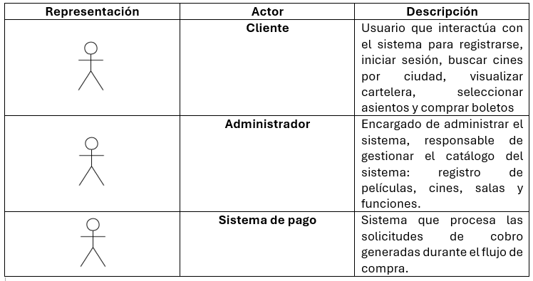
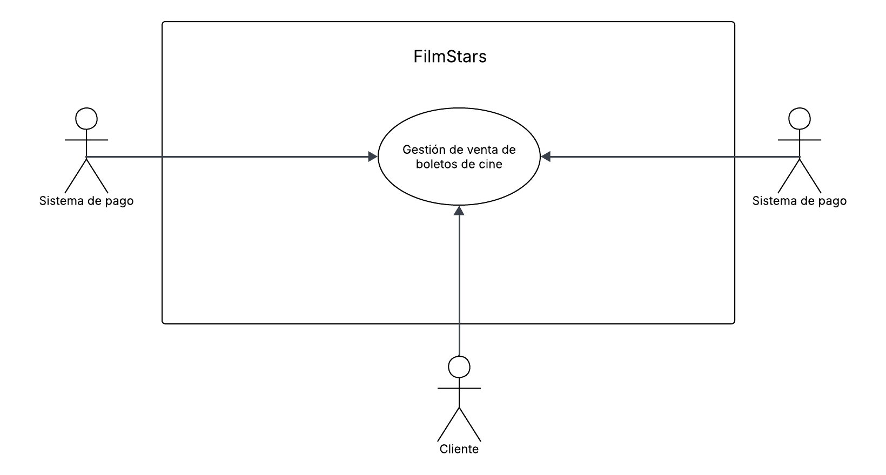
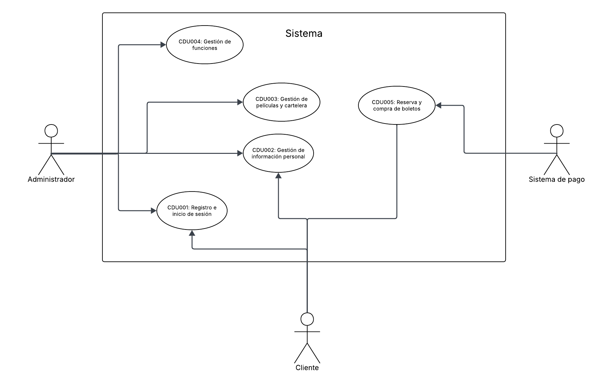

# Casos de Uso

## Core del negocio

## Casos de uso de alto nivel

### Primera descomposición
CDU001: **Registro e inicio de sesión**: Es el punto de partido para que cualquier usuario pueda interactuar con el sistema. Permite a los usuarios crear una cuenta y autenticarse para acceder a las funcionalidades del sistema.

CDU002: **Gestión de información personal**: Permite a los usuarios actualizar su información personal, como nombre, correo electrónico y contraseña. De la misma manera, permite a los usuarios gestionar su perfil y preferencias.

CDU003: **Gestión de películas y cartelera**: Permite al administrador gestionar las películas disponibles en el sistema y mostrarlas en cartelerasegún su tipo de proyección.

CDU004: **Gestión de funciones**: Permite al administrador gestionar las funciones de las películas, incluyendo la asignación de horarios y salas.

CDU005: **Compra de boletos**: Permite a los usuarios comprar boletos, así como seleccionar los asientos que deseen comprar para dicha función para asistir a las funciones de las películas.

