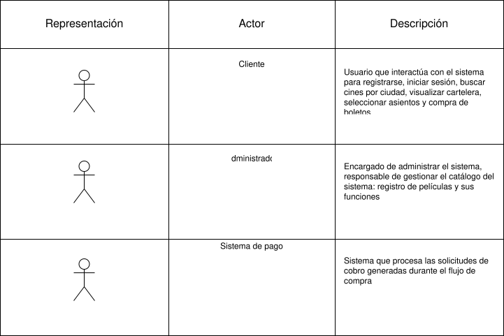
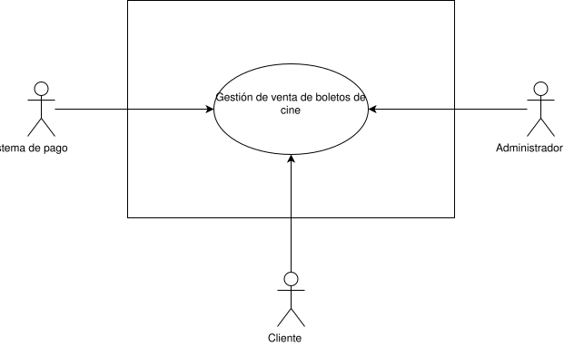
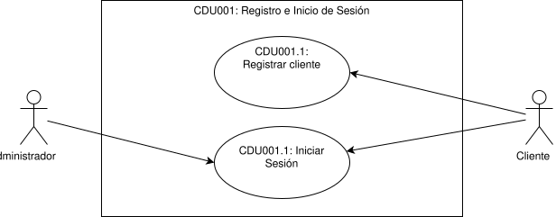
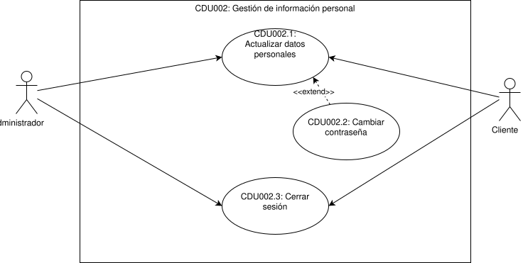
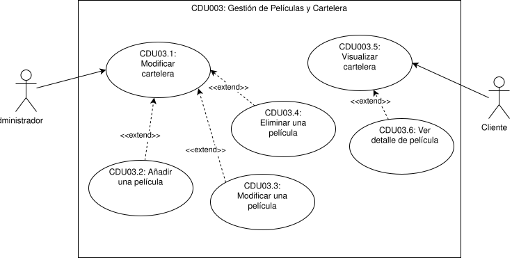
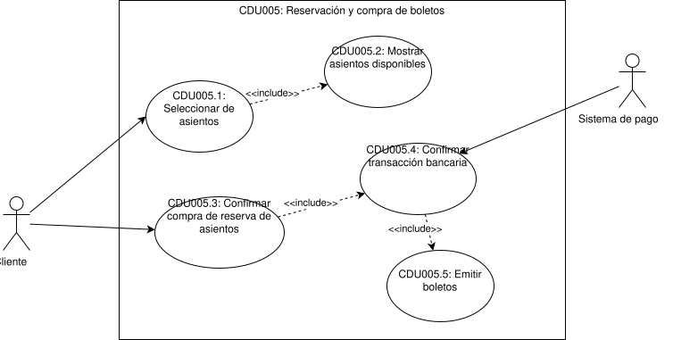

# Casos de Uso

## Core del negocio

## Casos de uso de alto nivel

## Primera descomposición
**CDU01**: **Registro e inicio de sesión**: Es el punto de partido para que cualquier usuario pueda interactuar con el sistema. Permite a los usuarios crear una cuenta y autenticarse para acceder a las funcionalidades del sistema.

**CDU02**: **Gestión de información personal**: Permite a los usuarios actualizar su información personal, como nombre, correo electrónico y contraseña. De la misma manera, permite a los usuarios gestionar su perfil.

**CDU03**: **Gestión de películas y cartelera**: Permite al administrador gestionar las películas del sistema y mostrarlas en cartelera según su tipo de proyección.

**CDU04**: **Gestión de funciones de cine**: Permite al administrador gestionar las funciones de las películas, incluyendo la asignación de horarios y salas.s

**CDU05**: **Reserva y Compra de Boletos**: Permite a los usuarios seleccionar su ubicación, explorar funciones disponibles, reservar asientos en tiempo real y completar la compra de sus boletos.

# Casos de uso expandidos
## Registro e inicio de sesión
### CDU-001.1: Registrar Cliente

| Campo | Descripción |
|-------|-------------|
| **ID** | CDU-001.1 |
| **Nombre** | Registrar Cliente |
| **Actor** | Usuario |
| **Descripción** | Permite a un nuevo usuario crear una cuenta en la plataforma proporcionando sus datos personales para acceder a las funcionalidades del sistema. |
| **Precondiciones** | El usuario no está registrado en el sistema. |
| **Postcondiciones** | El usuario queda registrado en el sistema y puede iniciar sesión. |

**Flujo principal:**
| Paso | Actor | Acción |
|------|-------|--------|
| 1 | Usuario | Accede a la página de registro. |
| 2 | Usuario | Ingresa su nombre, correo electrónico y contraseña. |
| 3 | Usuario | Confirma la contraseña y envía el formulario. |
| 4 | Sistema | Valida que todos los campos estén completos y con formato correcto. |
| 5 | Sistema | Verifica que el correo electrónico no esté registrado previamente. |
| 6 | Sistema | Almacena el nuevo usuario con la contraseña cifrada. |
| 7 | Sistema | Muestra un mensaje de registro exitoso y redirige al inicio de sesión. |

**Flujos alternativos:**
| ID | Condición | Acción |
|----|-----------|--------|
| FA-01 | El usuario ya tiene una cuenta | En el paso 5, el sistema notifica que el correo ya está en uso y sugiere iniciar sesión. |
| FA-02 | El usuario cancela el registro | El usuario puede cancelar y el sistema descarta los datos ingresados. |

**Flujos de excepción:**
| ID | Condición | Acción |
|----|-----------|--------|
| FE-01 | Formato de correo inválido | En el paso 4, el sistema muestra un mensaje de error indicando el formato correcto y solicita corrección. |
| FE-02 | Contraseñas no coinciden | En el paso 4, el sistema muestra un mensaje de error y limpia los campos de contraseña. |
| FE-03 | Error de conexión con la base de datos | En el paso 6, el sistema muestra un mensaje de error genérico y solicita reintentar. |

---

### CDU-001.2: Iniciar Sesión

| Campo | Descripción |
|-------|-------------|
| **ID** | CDU-001.2 |
| **Nombre** | Iniciar Sesión |
| **Actor** | Usuario |
| **Descripción** | Permite a un usuario registrado autenticarse en la plataforma mediante su correo electrónico y contraseña para acceder a las funcionalidades del sistema. |
| **Precondiciones** | El usuario tiene una cuenta registrada y no tiene una sesión activa. |
| **Postcondiciones** | El sistema genera un token de sesión válido y el usuario accede a la plataforma. |

**Flujo principal:**

| Paso | Actor | Acción |
|------|-------|--------|
| 1 | Usuario | Accede a la página de inicio de sesión. |
| 2 | Usuario | Ingresa su correo electrónico y contraseña. |
| 3 | Usuario | Envía el formulario. |
| 4 | Sistema | Valida que los campos no estén vacíos y tengan formato correcto. |
| 5 | Sistema | Verifica que el correo esté registrado y que la contraseña coincida con el hash almacenado. |
| 6 | Sistema | Genera un token JWT y lo asocia a la sesión del usuario. |
| 7 | Sistema | Redirige al usuario a la página principal de la plataforma. |

**Flujos alternativos:**

| ID | Condición | Acción |
|----|-----------|--------|
| FA-01 | El usuario no tiene cuenta | En el paso 5, el sistema informa que el correo no está registrado y sugiere crear una cuenta. |
| FA-02 | El usuario cancela | En cualquier paso, el usuario puede cancelar y el sistema descarta los datos ingresados. |

**Flujos de excepción:**

| ID | Condición | Acción |
|----|-----------|--------|
| FE-01 | Contraseña incorrecta | En el paso 5, el sistema muestra un mensaje de credenciales inválidas sin especificar cuál campo es incorrecto. |
| FE-02 | Formato de correo inválido | En el paso 4, el sistema muestra un error de formato y solicita corrección antes de continuar. |
| FE-03 | Error de conexión con la base de datos | En el paso 5, el sistema muestra un mensaje de error genérico y solicita reintentar. |

---

## Gestión de información personal

### CDU-002.1: Actualizar Datos Personales

| Campo | Descripción |
|-------|-------------|
| **ID** | CDU-002.1 |
| **Nombre** | Actualizar Datos Personales |
| **Actor** | Cliente, Administrador |
| **Descripción** | Permite al usuario modificar su nombre y correo electrónico registrados en la plataforma. |
| **Precondiciones** | El usuario tiene una sesión activa. |
| **Postcondiciones** | Los datos personales del usuario quedan actualizados en el sistema. |

**Flujo principal:**

| Paso | Actor | Acción |
|------|-------|--------|
| 1 | Usuario | Accede a la sección de perfil desde el menú de usuario. |
| 2 | Usuario | Selecciona la opción de editar datos personales. |
| 3 | Usuario | Modifica los campos deseados y envía el formulario. |
| 4 | Sistema | Valida que los campos no estén vacíos y tengan formato correcto. |
| 5 | Sistema | Verifica que el nuevo correo electrónico no esté en uso por otra cuenta. |
| 6 | Sistema | Actualiza los datos del usuario en la base de datos. |
| 7 | Sistema | Muestra un mensaje de confirmación de actualización exitosa. |

**Flujos alternativos:**

| ID | Condición | Acción |
|----|-----------|--------|
| FA-01 | El usuario no modifica ningún campo | En el paso 3, el sistema no realiza ninguna operación y mantiene los datos actuales. |
| FA-02 | El usuario cancela | En cualquier paso, el usuario puede cancelar y el sistema descarta los cambios. |

**Flujos de excepción:**

| ID | Condición | Acción |
|----|-----------|--------|
| FE-01 | Formato de correo inválido | En el paso 4, el sistema muestra un mensaje de error y solicita corrección. |
| FE-02 | El nuevo correo ya está en uso | En el paso 5, el sistema notifica que el correo pertenece a otra cuenta y solicita uno diferente. |

---

### CDU-002.2: Cambiar Contraseña

| Campo | Descripción |
|-------|-------------|
| **ID** | CDU-002.2 |
| **Nombre** | Cambiar Contraseña |
| **Actor** | Cliente, Administrador |
| **Descripción** | Permite al usuario actualizar su contraseña actual por una nueva, previa verificación de la contraseña vigente. |
| **Precondiciones** | El usuario tiene una sesión activa. |
| **Postcondiciones** | La contraseña del usuario queda actualizada en el sistema. |

**Flujo principal:**

| Paso | Actor | Acción |
|------|-------|--------|
| 1 | Usuario | Accede a la sección de perfil y selecciona la opción de cambiar contraseña. |
| 2 | Usuario | Ingresa su contraseña actual. |
| 3 | Usuario | Ingresa la nueva contraseña y la confirma. |
| 4 | Usuario | Envía el formulario. |
| 5 | Sistema | Verifica que la contraseña actual coincida con el hash almacenado. |
| 6 | Sistema | Valida que la nueva contraseña cumpla con los requisitos de seguridad. |
| 7 | Sistema | Almacena la nueva contraseña cifrada. |
| 8 | Sistema | Muestra un mensaje de confirmación y redirige al inicio de sesión. |

**Flujos alternativos:**

| ID | Condición | Acción |
|----|-----------|--------|
| FA-01 | El usuario cancela | En cualquier paso, el usuario puede cancelar y el sistema descarta los cambios. |

**Flujos de excepción:**

| ID | Condición | Acción |
|----|-----------|--------|
| FE-01 | Contraseña actual incorrecta | En el paso 5, el sistema muestra un error de credenciales inválidas sin revelar detalles adicionales. |
| FE-02 | Nueva contraseña no cumple requisitos | En el paso 6, el sistema indica los requisitos no cumplidos y solicita corrección. |
| FE-03 | Nueva contraseña y confirmación no coinciden | En el paso 6, el sistema muestra un error y limpia los campos de nueva contraseña. |

---

### CDU-002.3: Cerrar Sesión

| Campo | Descripción |
|-------|-------------|
| **ID** | CDU-002.3 |
| **Nombre** | Cerrar Sesión |
| **Actor** | Cliente, Administrador |
| **Descripción** | Permite al usuario finalizar su sesión activa en la plataforma, invalidando el token de autenticación. |
| **Precondiciones** | El usuario tiene una sesión activa. |
| **Postcondiciones** | El token de sesión queda invalidado y el usuario es redirigido a la página de inicio. |

**Flujo principal:**

| Paso | Actor | Acción |
|------|-------|--------|
| 1 | Usuario | Selecciona la opción de cerrar sesión desde el menú de usuario. |
| 2 | Sistema | Invalida el token JWT asociado a la sesión activa. |
| 3 | Sistema | Redirige al usuario a la página de inicio de sesión. |

**Flujos alternativos:**

| ID | Condición | Acción |
|----|-----------|--------|
| FA-01 | El usuario cancela el cierre de sesión | En el paso 1, el sistema no realiza ninguna acción y mantiene la sesión activa. |

**Flujos de excepción:**

| ID | Condición | Acción |
|----|-----------|--------|
| FE-01 | Error al invalidar el token | En el paso 2, el sistema muestra un mensaje de error e intenta invalidar el token nuevamente. |

## Gestión de películas y cartelera

### CDU-003.1: Modificar Cartelera

| Campo | Descripción |
|-------|-------------|
| **ID** | CDU-003.1 |
| **Nombre** | Modificar Cartelera |
| **Actor** | Administrador |
| **Descripción** | Permite al administrador agregar o quitar películas de la cartelera activa, controlando qué títulos son visibles para los clientes según su tipo de proyección. |
| **Precondiciones** | El administrador tiene una sesión activa. Existen películas registradas en el sistema. |
| **Postcondiciones** | La cartelera queda actualizada y los cambios son visibles para los clientes de forma inmediata. |

**Flujo principal:**

| Paso | Actor | Acción |
|------|-------|--------|
| 1 | Administrador | Accede al panel de administración y selecciona la opción de gestión de cartelera. |
| 2 | Sistema | Muestra el listado de películas en cartelera y las disponibles para agregar. |
| 3 | Administrador | Selecciona las películas a agregar o quitar de la cartelera. |
| 4 | Administrador | Confirma los cambios. |
| 5 | Sistema | Valida que las películas seleccionadas existan y tengan información completa. |
| 6 | Sistema | Actualiza la cartelera en la base de datos. |
| 7 | Sistema | Muestra un mensaje de confirmación de actualización exitosa. |

**Flujos alternativos:**

| ID | Condición | Acción |
|----|-----------|--------|
| FA-01 | El administrador cancela | En cualquier paso, el administrador puede cancelar y el sistema descarta los cambios. |
| FA-02 | El administrador no realiza cambios | En el paso 4, el sistema no ejecuta ninguna operación y mantiene la cartelera actual. |

**Flujos de excepción:**

| ID | Condición | Acción |
|----|-----------|--------|
| FE-01 | La película seleccionada no tiene información completa | En el paso 5, el sistema notifica al administrador los campos faltantes y no permite agregarla a la cartelera. |
| FE-02 | Error de conexión con la base de datos | En el paso 6, el sistema muestra un mensaje de error genérico y solicita reintentar. |

---

### CDU-003.2: Añadir Película

| Campo | Descripción |
|-------|-------------|
| **ID** | CDU-003.2 |
| **Nombre** | Añadir Película |
| **Actor** | Administrador |
| **Descripción** | Permite al administrador registrar una nueva película en el sistema con toda su información, incluyendo título, género, duración, sinopsis, clasificación y tipo de proyección. |
| **Precondiciones** | El administrador tiene una sesión activa. |
| **Postcondiciones** | La película queda registrada en el sistema y puede ser gestionada en la cartelera y en funciones. |

**Flujo principal:**

| Paso | Actor | Acción |
|------|-------|--------|
| 1 | Administrador | Accede al panel de administración y selecciona la opción de añadir película. |
| 2 | Administrador | Ingresa el título, género, duración, sinopsis, clasificación y tipo de proyección. |
| 3 | Administrador | Carga la imagen del póster de la película. |
| 4 | Administrador | Envía el formulario. |
| 5 | Sistema | Valida que todos los campos obligatorios estén completos y con formato correcto. |
| 6 | Sistema | Verifica que no exista otra película con el mismo título registrada. |
| 7 | Sistema | Almacena la película con toda su información en la base de datos. |
| 8 | Sistema | Muestra un mensaje de confirmación de registro exitoso. |

**Flujos alternativos:**

| ID | Condición | Acción |
|----|-----------|--------|
| FA-01 | El administrador no carga imagen | En el paso 3, el sistema asigna una imagen predeterminada a la película. |
| FA-02 | El administrador cancela | En cualquier paso, el administrador puede cancelar y el sistema descarta los datos ingresados. |

**Flujos de excepción:**

| ID | Condición | Acción |
|----|-----------|--------|
| FE-01 | Campos obligatorios incompletos | En el paso 5, el sistema resalta los campos faltantes y solicita completarlos. |
| FE-02 | Ya existe una película con el mismo título | En el paso 6, el sistema notifica la duplicidad y sugiere verificar el catálogo existente. |
| FE-03 | Formato de imagen no permitido | En el paso 5, el sistema indica los formatos aceptados y solicita cargar nuevamente el archivo. |

---

### CDU-003.3: Modificar Película

| Campo | Descripción |
|-------|-------------|
| **ID** | CDU-003.3 |
| **Nombre** | Modificar Película |
| **Actor** | Administrador |
| **Descripción** | Permite al administrador editar la información de una película existente en el sistema, como su título, sinopsis, clasificación, género o tipo de proyección. |
| **Precondiciones** | El administrador tiene una sesión activa. La película existe en el sistema. |
| **Postcondiciones** | La información de la película queda actualizada en el sistema y los cambios son visibles para los clientes. |

**Flujo principal:**

| Paso | Actor | Acción |
|------|-------|--------|
| 1 | Administrador | Accede al catálogo de películas y selecciona la película a modificar. |
| 2 | Sistema | Muestra el formulario con la información actual de la película. |
| 3 | Administrador | Modifica los campos deseados y envía el formulario. |
| 4 | Sistema | Valida que los campos modificados no estén vacíos y tengan formato correcto. |
| 5 | Sistema | Verifica que el nuevo título no corresponda a otra película ya registrada. |
| 6 | Sistema | Actualiza la información de la película en la base de datos. |
| 7 | Sistema | Muestra un mensaje de confirmación de actualización exitosa. |

**Flujos alternativos:**

| ID | Condición | Acción |
|----|-----------|--------|
| FA-01 | El administrador no modifica ningún campo | En el paso 3, el sistema no realiza ninguna operación y mantiene la información actual. |
| FA-02 | El administrador cancela | En cualquier paso, el administrador puede cancelar y el sistema descarta los cambios. |

**Flujos de excepción:**

| ID | Condición | Acción |
|----|-----------|--------|
| FE-01 | Campo obligatorio vacío tras la edición | En el paso 4, el sistema resalta los campos inválidos y solicita corrección. |
| FE-02 | El nuevo título corresponde a otra película registrada | En el paso 5, el sistema notifica la duplicidad y solicita un título diferente. |
| FE-03 | Error de conexión con la base de datos | En el paso 6, el sistema muestra un mensaje de error genérico y solicita reintentar. |

---

### CDU-003.4: Eliminar Película

| Campo | Descripción |
|-------|-------------|
| **ID** | CDU-003.4 |
| **Nombre** | Eliminar Película |
| **Actor** | Administrador |
| **Descripción** | Permite al administrador eliminar del sistema una película que no tenga funciones activas ni boletos vendidos asociados. |
| **Precondiciones** | El administrador tiene una sesión activa. La película existe en el sistema. |
| **Postcondiciones** | La película queda eliminada del sistema y no aparece más en el catálogo ni en la cartelera. |

**Flujo principal:**

| Paso | Actor | Acción |
|------|-------|--------|
| 1 | Administrador | Accede al catálogo de películas y selecciona la película a eliminar. |
| 2 | Administrador | Selecciona la opción de eliminar. |
| 3 | Sistema | Solicita confirmación al administrador. |
| 4 | Administrador | Confirma la eliminación. |
| 5 | Sistema | Verifica que la película no tenga funciones activas ni boletos vendidos asociados. |
| 6 | Sistema | Elimina la película y su información de la base de datos. |
| 7 | Sistema | Muestra un mensaje de confirmación de eliminación exitosa. |

**Flujos alternativos:**

| ID | Condición | Acción |
|----|-----------|--------|
| FA-01 | El administrador cancela la eliminación | En el paso 4, el sistema descarta la operación y mantiene la película en el catálogo. |

**Flujos de excepción:**

| ID | Condición | Acción |
|----|-----------|--------|
| FE-01 | La película tiene funciones activas asociadas | En el paso 5, el sistema impide la eliminación e informa que existen funciones programadas para ese título. |
| FE-02 | La película tiene boletos vendidos asociados | En el paso 5, el sistema impide la eliminación e informa que existen transacciones registradas. |
| FE-03 | Error de conexión con la base de datos | En el paso 6, el sistema muestra un mensaje de error genérico y solicita reintentar. |

---

### CDU-003.5: Visualizar Cartelera

| Campo | Descripción |
|-------|-------------|
| **ID** | CDU-003.5 |
| **Nombre** | Visualizar Cartelera |
| **Actor** | Cliente |
| **Descripción** | Permite al cliente consultar las películas actualmente en cartelera, incluyendo su título, género, clasificación, duración y tipos de proyección disponibles. |
| **Precondiciones** | Existe al menos una película en cartelera. |
| **Postcondiciones** | El cliente visualiza la cartelera y puede seleccionar una película para ver su detalle. |

**Flujo principal:**

| Paso | Actor | Acción |
|------|-------|--------|
| 1 | Cliente | Accede a la sección de cartelera desde la página principal. |
| 2 | Sistema | Recupera y muestra las películas actualmente en cartelera. |
| 3 | Cliente | Aplica filtros opcionales por género, clasificación o tipo de proyección. |
| 4 | Sistema | Actualiza la vista mostrando únicamente las películas que coincidan con los filtros seleccionados. |
| 5 | Cliente | Selecciona una película para ver su detalle. |

**Flujos alternativos:**

| ID | Condición | Acción |
|----|-----------|--------|
| FA-01 | El cliente no aplica filtros | En el paso 3, el sistema muestra todas las películas en cartelera sin filtrar. |
| FA-02 | El cliente limpia los filtros | El sistema restaura la vista completa de la cartelera. |

**Flujos de excepción:**

| ID | Condición | Acción |
|----|-----------|--------|
| FE-01 | No hay películas en cartelera | En el paso 2, el sistema muestra un mensaje indicando que no hay títulos disponibles en este momento. |
| FE-02 | Ninguna película coincide con los filtros aplicados | En el paso 4, el sistema muestra un mensaje indicando que no hay resultados para los filtros seleccionados. |

---

### CDU-003.6: Visualizar Detalle de Película

| Campo | Descripción |
|-------|-------------|
| **ID** | CDU-003.6 |
| **Nombre** | Visualizar Detalle de Película |
| **Actor** | Cliente |
| **Descripción** | Permite al cliente consultar la información completa de una película seleccionada, incluyendo sinopsis, reparto, clasificación, duración y funciones disponibles. |
| **Precondiciones** | La película existe en el sistema y está en cartelera. |
| **Postcondiciones** | El cliente visualiza el detalle completo de la película y puede proceder a seleccionar una función. |

**Flujo principal:**

| Paso | Actor | Acción |
|------|-------|--------|
| 1 | Cliente | Selecciona una película desde la cartelera. |
| 2 | Sistema | Recupera y muestra la información completa de la película: título, póster, sinopsis, género, clasificación, duración, reparto y tipos de proyección. |
| 3 | Sistema | Muestra las funciones disponibles para esa película ordenadas por fecha y horario. |
| 4 | Cliente | Revisa la información y selecciona una función para continuar con la compra. |

**Flujos alternativos:**

| ID | Condición | Acción |
|----|-----------|--------|
| FA-01 | El cliente regresa a la cartelera | En cualquier paso, el cliente puede volver al listado de cartelera sin seleccionar función. |
| FA-02 | El cliente filtra funciones por tipo de proyección | En el paso 3, el sistema muestra únicamente las funciones del tipo seleccionado. |

**Flujos de excepción:**

| ID | Condición | Acción |
|----|-----------|--------|
| FE-01 | La película no tiene funciones programadas | En el paso 3, el sistema muestra un mensaje indicando que no hay funciones disponibles para ese título en este momento. |
| FE-02 | Error al recuperar la información de la película | En el paso 2, el sistema muestra un mensaje de error genérico y sugiere regresar a la cartelera. |

---

## Gestión de funciones

### CDU-004.1: Registrar Función

| Campo | Descripción |
|-------|-------------|
| **ID** | CDU-004.1 |
| **Nombre** | Registrar Función |
| **Actor** | Administrador |
| **Descripción** | Permite al administrador programar una nueva función asignando una película a una sala, fecha y horario específicos. |
| **Precondiciones** | El administrador tiene una sesión activa. Existen películas y salas registradas en el sistema. |
| **Postcondiciones** | La función queda registrada y disponible para que los clientes consulten y compren boletos. |

**Flujo principal:**

| Paso | Actor | Acción |
|------|-------|--------|
| 1 | Administrador | Accede al panel de administración y selecciona la opción de registrar función. |
| 2 | Administrador | Selecciona la película, el cine, la sala, la fecha y el horario. |
| 3 | Administrador | Confirma la capacidad de asientos y envía el formulario. |
| 4 | Sistema | Valida que todos los campos estén completos. |
| 5 | Sistema | Verifica que no exista otra función programada en la misma sala, fecha y horario. |
| 6 | Sistema | Registra la función y genera el mapa de asientos disponibles. |
| 7 | Sistema | Muestra un mensaje de confirmación de registro exitoso. |

**Flujos alternativos:**

| ID | Condición | Acción |
|----|-----------|--------|
| FA-01 | El administrador cancela | En cualquier paso, el administrador puede cancelar y el sistema descarta los datos ingresados. |

**Flujos de excepción:**

| ID | Condición | Acción |
|----|-----------|--------|
| FE-01 | Campos obligatorios incompletos | En el paso 4, el sistema resalta los campos faltantes y solicita completarlos. |
| FE-02 | Conflicto de sala y horario | En el paso 5, el sistema notifica que la sala ya tiene una función programada en ese horario. |

---

### CDU-004.2: Actualizar Función

| Campo | Descripción |
|-------|-------------|
| **ID** | CDU-004.2 |
| **Nombre** | Actualizar Función |
| **Actor** | Administrador |
| **Descripción** | Permite al administrador modificar los datos de una función existente, como su fecha, horario o sala asignada. |
| **Precondiciones** | El administrador tiene una sesión activa y la función existe en el sistema sin boletos vendidos. |
| **Postcondiciones** | Los datos de la función quedan actualizados en el sistema. |

**Flujo principal:**

| Paso | Actor | Acción |
|------|-------|--------|
| 1 | Administrador | Accede al listado de funciones y selecciona la función a modificar. |
| 2 | Administrador | Modifica los campos deseados y envía el formulario. |
| 3 | Sistema | Verifica que la función no tenga boletos vendidos ni asientos bloqueados activos. |
| 4 | Sistema | Valida que los nuevos datos no generen conflicto de sala y horario. |
| 5 | Sistema | Actualiza los datos de la función en la base de datos. |
| 6 | Sistema | Muestra un mensaje de confirmación de actualización exitosa. |

**Flujos alternativos:**

| ID | Condición | Acción |
|----|-----------|--------|
| FA-01 | El administrador no modifica ningún campo | En el paso 2, el sistema no realiza ninguna operación y mantiene los datos actuales. |
| FA-02 | El administrador cancela | En cualquier paso, el administrador puede cancelar y el sistema descarta los cambios. |

**Flujos de excepción:**

| ID | Condición | Acción |
|----|-----------|--------|
| FE-01 | La función tiene boletos vendidos | En el paso 3, el sistema impide la modificación e informa que existen compras registradas para esta función. |
| FE-02 | Conflicto de sala y horario | En el paso 4, el sistema notifica que la sala ya tiene una función en el nuevo horario solicitado. |

## Reserva y Compra de Boletos

### CDU-005.1: Seleccionar Ubicación

| Campo | Descripción |
|-------|-------------|
| **ID** | CDU-005.1 |
| **Nombre** | Seleccionar Ubicación |
| **Actor** | Cliente |
| **Descripción** | Permite al cliente seleccionar su ciudad para visualizar dinámicamente los cines disponibles y sus funciones en dicha localidad. |
| **Precondiciones** | Existe al menos un cine registrado con funciones disponibles en el sistema. |
| **Postcondiciones** | El sistema muestra los cines disponibles en la ciudad seleccionada. |

**Flujo principal:**

| Paso | Actor | Acción |
|------|-------|--------|
| 1 | Cliente | Accede a la página principal de la plataforma. |
| 2 | Cliente | Selecciona su ciudad desde el listado de ciudades disponibles. |
| 3 | Sistema | Recupera y muestra los cines disponibles en la ciudad seleccionada. |
| 4 | Cliente | Selecciona un cine para ver sus funciones disponibles. |

**Flujos alternativos:**

| ID | Condición | Acción |
|----|-----------|--------|
| FA-01 | El cliente cambia de ciudad | El cliente puede seleccionar otra ciudad y el sistema actualiza el listado de cines. |

**Flujos de excepción:**

| ID | Condición | Acción |
|----|-----------|--------|
| FE-01 | No hay cines disponibles en la ciudad seleccionada | En el paso 3, el sistema muestra un mensaje indicando que no hay cines disponibles en esa localidad. |

---

### CDU-005.2: Visualizar Funciones Disponibles

| Campo | Descripción |
|-------|-------------|
| **ID** | CDU-005.2 |
| **Nombre** | Visualizar Funciones Disponibles |
| **Actor** | Cliente |
| **Descripción** | Permite al cliente consultar las funciones disponibles en el cine seleccionado, con sus horarios, sala y disponibilidad de asientos. |
| **Precondiciones** | El cliente ha seleccionado un cine. |
| **Postcondiciones** | El cliente visualiza las funciones disponibles y puede seleccionar una para continuar con la compra. |

**Flujo principal:**

| Paso | Actor | Acción |
|------|-------|--------|
| 1 | Cliente | Selecciona un cine. |
| 2 | Sistema | Recupera y muestra las funciones disponibles en ese cine. |
| 3 | Cliente | Filtra las funciones por película y horarios. |
| 4 | Cliente | Selecciona una función específica para proceder con la compra. |

**Flujos alternativos:**

| ID | Condición | Acción |
|----|-----------|--------|
| FA-01 | El cliente aplica filtro por película | En el paso 3, el sistema muestra únicamente las funciones correspondientes a la película seleccionada. |
| FA-02 | El cliente aplica filtro por fecha | En el paso 3, el sistema muestra únicamente las funciones programadas para esa fecha. |
| FA-03 | El cliente regresa a la selección de cine | En cualquier paso, el cliente puede volver al listado de cines sin seleccionar función. |

**Flujos de excepción:**

| ID | Condición | Acción |
|----|-----------|--------|
| FE-01 | No hay funciones disponibles en el cine seleccionado | En el paso 2, el sistema muestra un mensaje indicando que no hay funciones programadas. |

---

### CDU-005.3: Seleccionar Asientos

| Campo | Descripción |
|-------|-------------|
| **ID** | CDU-005.3 |
| **Nombre** | Seleccionar Asientos |
| **Actor** | Cliente |
| **Descripción** | Permite al cliente elegir sus asientos mediante un mapa interactivo de la sala. La disponibilidad se actualiza en tiempo real a través de WebSocket. |
| **Precondiciones** | El cliente tiene una sesión activa y ha seleccionado una función. |
| **Postcondiciones** | Los asientos seleccionados quedan marcados como no disponibles en tiempo real para el resto de usuarios. El cliente avanza al siguiente paso del flujo de compra. |

**Flujo principal:**

| Paso | Actor | Acción |
|------|-------|--------|
| 1 | Cliente | Accede al mapa interactivo de la sala para la función seleccionada. |
| 2 | Sistema | Establece una conexión WebSocket con el cliente para la sala correspondiente. |
| 3 | Sistema | Muestra el estado actualizado de cada asiento: Disponible, Seleccionado u Ocupado. |
| 4 | Cliente | Selecciona uno o más asientos disponibles. |
| 5 | Sistema | Marca los asientos como Seleccionados y transmite el cambio de estado vía WebSocket a todos los clientes conectados a esa función. |
| 6 | Sistema | Refleja visualmente en el mapa de todos los usuarios que los asientos ya no están disponibles. |
| 7 | Cliente | Confirma su selección y avanza al siguiente paso. |

**Flujos alternativos:**

| ID | Condición | Acción |
|----|-----------|--------|
| FA-01 | El cliente deselecciona un asiento | En el paso 4, el sistema vuelve el asiento a estado Disponible y lo transmite vía WebSocket a todos los usuarios conectados. |
| FA-02 | El cliente decide no continuar | El sistema libera los asientos seleccionados y notifica el cambio a todos los usuarios conectados vía WebSocket. |

**Flujos de excepción:**

| ID | Condición | Acción |
|----|-----------|--------|
| FE-01 | Se pierde la conexión WebSocket | El sistema intenta reconectar automáticamente y, al restablecer la conexión, sincroniza el estado actual del mapa de asientos. |

---

### CDU-005.4: Procesar Compra y Emitir Boleto

| Campo | Descripción |
|-------|-------------|
| **ID** | CDU-005.4 |
| **Nombre** | Procesar Compra y Emitir Boleto |
| **Actor** | Cliente, Sistema de Pagos |
| **Descripción** | Permite al cliente confirmar su selección de asientos, procesar el pago a través del sistema externo y recibir su boleto digital como resultado de una transacción exitosa. |
| **Precondiciones** | El cliente tiene una sesión activa y tiene asientos seleccionados en el mapa interactivo. |
| **Postcondiciones** | El pago queda registrado, los asientos pasan a estado Ocupado y el cliente recibe su boleto digital. |

**Flujo principal:**

| Paso | Actor | Acción |
|------|-------|--------|
| 1 | Cliente | Revisa el resumen de su compra y confirma. |
| 2 | Sistema | Envía la solicitud de compra a la cola de mensajería para su validación. |
| 3 | Sistema | El consumidor de la cola valida que los asientos siguen bloqueados y disponibles. |
| 4 | Cliente | Ingresa los datos de pago y confirma la transacción. |
| 5 | Sistema | Envía la solicitud de cobro al Sistema de Pagos. |
| 6 | Sistema de Pagos | Procesa la transacción y retorna el resultado al sistema. |
| 7 | Sistema | Registra el pago, cambia el estado de los asientos a Ocupado y genera el boleto digital. |
| 8 | Sistema | Muestra el boleto al cliente con los detalles de la función, asientos y número de confirmación. |

**Flujos alternativos:**

| ID | Condición | Acción |
|----|-----------|--------|
| FA-01 | El cliente cancela antes de pagar | En el paso 4, el sistema libera los asientos bloqueados y regresa al mapa de asientos. |

**Flujos de excepción:**

| ID | Condición | Acción |
|----|-----------|--------|
| FE-01 | Un asiento seleccionado fue tomado por otro usuario antes de confirmar el pago | En el paso 3, el sistema detecta el conflicto, notifica al cliente y lo redirige al mapa de asientos para actualizar su selección. |
| FE-02 | El pago es rechazado por el Sistema de Pagos | En el paso 6, el sistema notifica el rechazo al cliente, mantiene el bloqueo temporal activo y permite reintentar. |
| FE-03 | Error de conexión con el Sistema de Pagos | En el paso 5, el sistema encola el reintento de cobro y notifica al cliente que la transacción está en proceso. |

[Volver a Documentacion](../Documentación.md)
