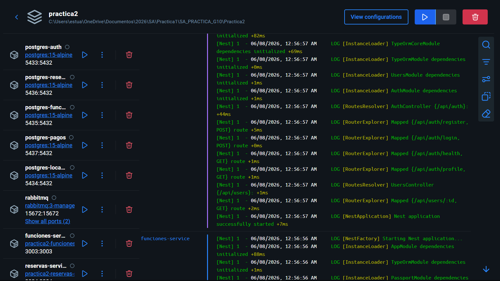
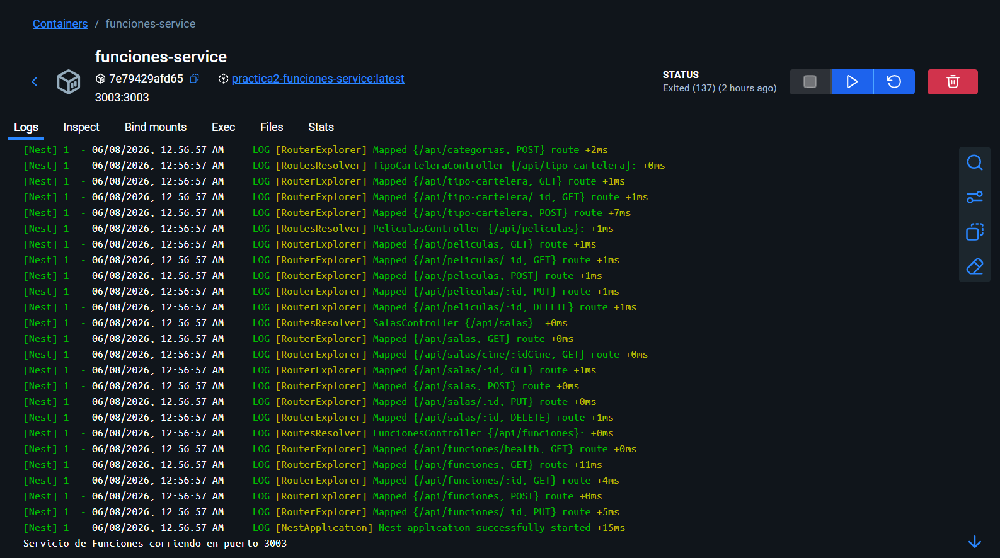
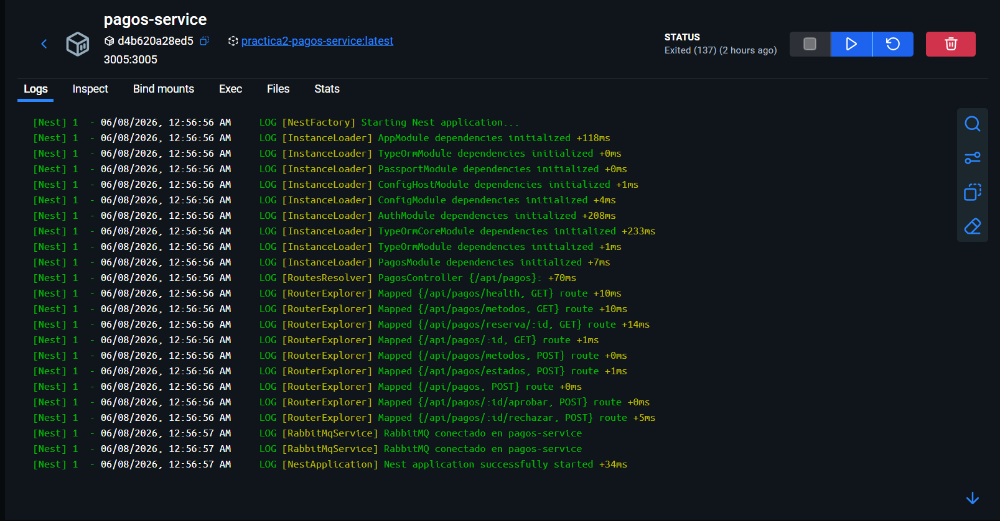
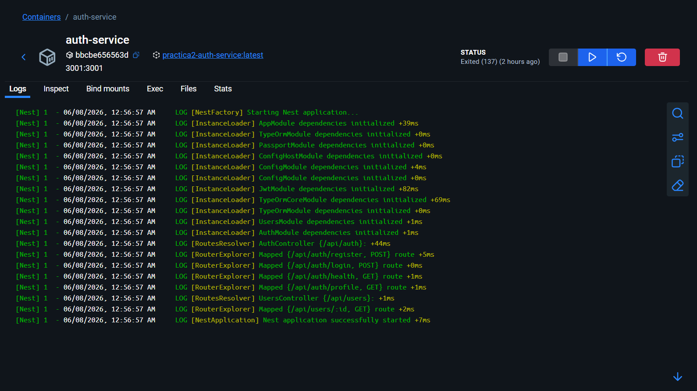
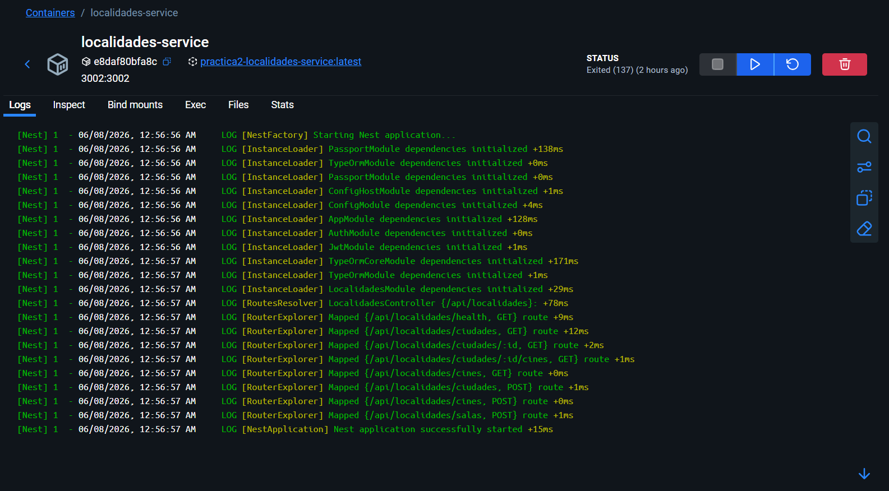
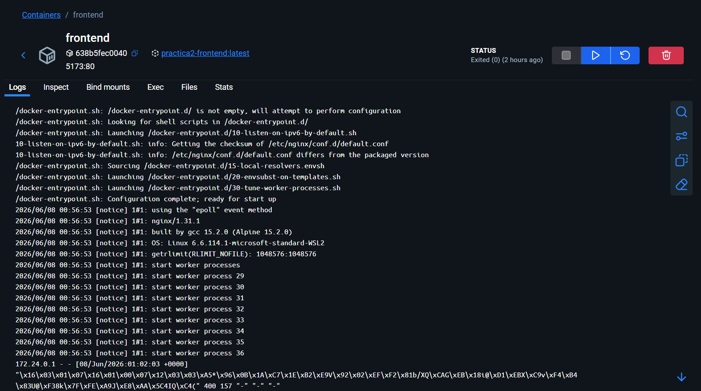
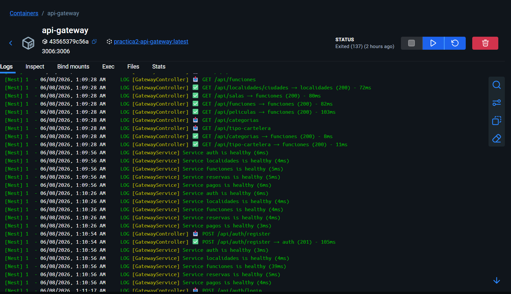

# Despliegue
Para desplegar el sistema completo en un entorno local utilizando Docker, se configuró un archivo `docker-compose.yml` el cual se encarga de orquestar la construcción y ejecución de todos los servicios, bases de datos y el frontend.

A continuación se detallan los pasos para levantar el sistema, verificar su funcionamiento y acceder a las diferentes partes de la aplicación.

### Requisitos
- Docker Desktop instalado y corriendo
- Puerto 3006, 5173 y 15672 libres en el host

### Levantar todo con Docker Compose
Desde la carpeta `Practica2/`:
```bash
# Primera vez o cuando haya cambios en el codigo
docker compose up --build

# Una vez se haya ejecutado la primera vez, para levantar sin reconstruir

docker compose up -d
```

### URLs de acceso

| Recurso | URL |
|---|---|
| Frontend | http://localhost:5173 |
| API Gateway | http://localhost:3006 |
| RabbitMQ Management | http://localhost:15672 (guest/guest) |

### Estado del sistema
Para verificar que todos los servicios estén corriendo correctamente, se pueden realizar health checks siguientes:

```bash
curl http://localhost:3006/health
curl http://localhost:3006/api/auth/health
curl http://localhost:3006/api/localidades/health
curl http://localhost:3006/api/funciones/health
```

### Consulta de logs
Para monitorear los logs de los servicios en tiempo real, se pueden utilizar los siguientes comandos:

```bash
# Todos los servicios
docker compose logs -f

# Un servicio especifico
#docker compose logs -f *servicio_a_consultar*
docker compose logs -f auth-service
```

### Detener los servicios

```bash
# Detener sin borrar volumenes (conserva datos de BD)
docker compose down

# Detener y borrar volumenes (resetea todas las BDs)
docker compose down -v
```

### Despliegue sin Docker
Para correr un servicio individualmente durante desarrollo:

```bash
# Desde la carpeta del servicio
pnpm install
pnpm start:dev
```

El frontend en modo desarrollo:
```bash
cd frontend
pnpm install
pnpm dev
```

### Evidencias
Una vez ejecutado ejecutado el comando `docker compose up --build`, se pueden observar los siguientes logs en la terminal, indicando que todos los servicios se han levantado correctamente:

##### Logs del sistema completo levantado con Docker Compose


##### Logs Servicio de Funciones


##### Logs Servicio de Pagos


##### Logs Servicio de Autenticacion


##### Logs Servicio de Localidades


##### Logs  Frontend


##### Logs API Gateway

