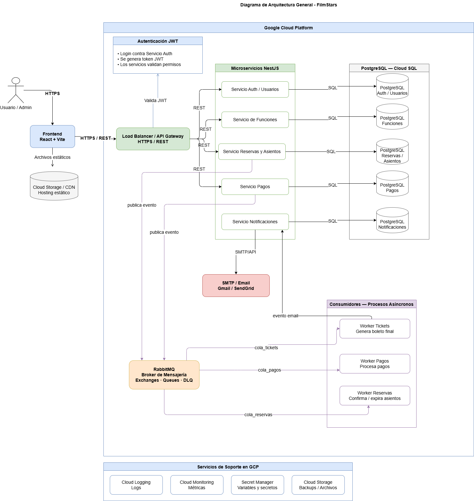

Descripción
------------

Este diagrama muestra la arquitectura general propuesta para la aplicación "FilmStars" desplegada en Google Cloud Platform (GCP). Incluye los siguientes componentes principales:

- Frontend: Aplicación React + Vite que sirve contenido estático (CDN / Cloud Storage) y consume la API a través de HTTPS/REST.
- Load Balancer / API Gateway: Punto de entrada HTTPS/REST que valida JWT y enruta solicitudes a los microservicios.
- Autenticación JWT: Servicio de autenticación que valida credenciales y emite tokens JWT.
- Microservicios (NestJS): Servicios separados para Auth/Usuarios, Funciones, Reservas/Asientos, Pagos y Notificaciones, comunicándose con bases de datos PostgreSQL (Cloud SQL) mediante SQL.
- PostgreSQL / Cloud SQL: Instancias de bases de datos dedicadas para cada servicio (Auth/Usuarios, Funciones, Reservas/Asientos, Pagos, Notificaciones).
- RabbitMQ: Broker de mensajería para procesos asíncronos con colas `cola_tickets`, `cola_pagos` y `cola_reservas`.
- Consumidores / Workers: Procesos asíncronos que procesan tickets, pagos y confirmación/expiración de reservas.
- Servicio de Email (SMTP / SendGrid): Usado por el servicio de notificaciones para enviar correos electrónicos.
- Servicios de soporte en GCP: Cloud Logging, Cloud Monitoring, Secret Manager y Cloud Storage.

El diagrama ilustra tanto comunicaciones síncronas (REST/HTTPS) como asincrónicas (mensajería) y dónde se publican eventos (por ejemplo, hacia RabbitMQ). También muestra la separación de datos por servicio en instancias de Cloud SQL para mejorar la escalabilidad y la seguridad.
