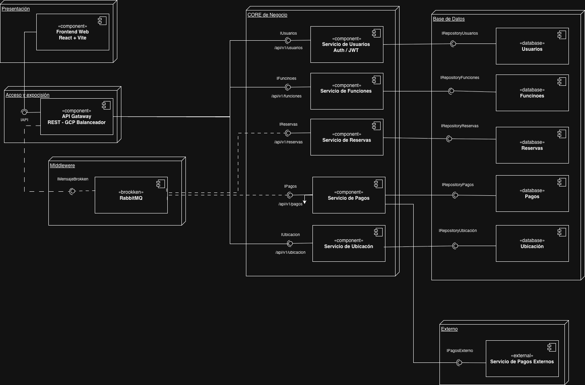

# Diagrama de Componentes

## Introduccion

El diagrama de componentes fue utilizado para representar la organizacion estructural del sistema FilmStars desde la perspectiva de desarrollo. Su objetivo es mostrar como se separan los modulos principales, que responsabilidad tiene cada componente y de que forma se comunican entre si dentro de la arquitectura propuesta.

Este diagrama permite visualizar la division del sistema por capas, el punto de entrada principal, los servicios del dominio, la infraestructura de mensajeria y las bases de datos independientes por servicio.

---

## Componentes representados

Dentro del diagrama se modelan los siguientes elementos principales:

- Frontend Web desarrollado con React + Vite
- API Gateway como punto central de acceso
- Servicio de Usuarios para autenticacion y manejo de JWT
- Servicio de Funciones para cartelera, salas y horarios
- Servicio de Reservas para seleccion y confirmacion de asientos
- Servicio de Pagos para procesar transacciones
- Servicio de Ubicacion para ciudades y cines
- RabbitMQ como broker de mensajeria
- Servicio externo de Pagos Simulados
- Bases de datos PostgreSQL separadas por dominio

---

## Organizacion por capas

El diagrama agrupa la solucion en secciones estructurales que reflejan responsabilidades tecnicas dentro del sistema:

- **Presentación** contiene el frontend, responsable de mostrar la información al usuario.
- **Acceso y exposicion:** contiene el la API Gateway, responsables de recibir solicitudes del cliente y exponer endpoints del sistema.
- **Core de negocio:** contiene los microservicios que implementan la logica principal del dominio.
- **Middleware:** representa la mensajeria asincronica mediante RabbitMQ para desacoplar procesos criticos.
- **Base de datos:** muestra la persistencia aislada por servicio.
- **Externo:** representa integraciones fuera del sistema, como la pasarela de pago simulada.

Esta separacion ayuda a mantener bajo acoplamiento, escalabilidad por dominio y claridad arquitectonica.

---

## Comunicacion entre componentes

La comunicacion principal representada en el diagrama es la siguiente:

1. El usuario interactua con el `Frontend Web`.
2. El frontend envia solicitudes al `API Gateway`.
3. El gateway enruta las peticiones a los servicios internos correspondientes.
4. Cada microservicio trabaja con su propia interfaz y su repositorio asociado.
5. Cada servicio persiste unicamente en su base de datos dedicada.
6. Los procesos que requieren desacoplamiento utilizan `RabbitMQ`.
7. El `Servicio de Pagos` consume ademas un servicio externo de pago simulado.

Este enfoque permite combinar comunicacion sincronica para operaciones inmediatas y comunicacion asincronica para flujos criticos como pagos y reservas.

---

## Interfaces y endpoints visibles

El diagrama tambien hace explicita la exposicion de contratos e interfaces, entre ellos:

- `IAPI`
- `IUsuarios` -> `/api/v1/usuarios`
- `IFunciones` -> `/api/v1/funciones`
- `IReservas` -> `/api/v1/reservas`
- `IPagos` -> `/api/v1/pagos`
- `IUbicacion` -> `/api/v1/ubicacion`

Adicionalmente, cada servicio se conecta con una interfaz de repositorio para preservar separacion entre logica de negocio y persistencia.

---

[Volver a Documentacion](../Documentación.md)

[Ver archivo fuente del diagrama](https://drive.google.com/file/d/1alBOvHarK1cIwI4lkC1yuDCeJe3t4x2m/view)
