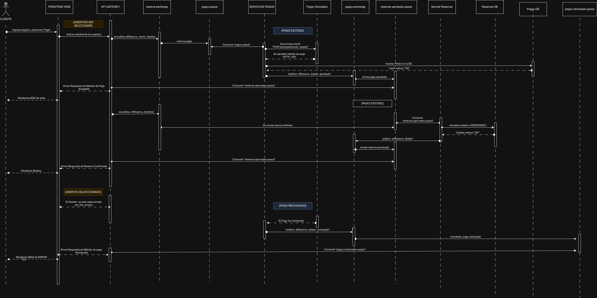

# Diagrama de Secuencia

## Introduccion

El diagrama de secuencia fue utilizado para representar el flujo dinamico del caso mas critico dentro de FilmStars: la reserva de asientos, el procesamiento del pago y la confirmacion final de la compra. Su objetivo es mostrar el orden temporal de las interacciones entre cliente, frontend, gateway, servicios internos, colas de mensajeria y bases de datos.

Este diagrama permite entender como se coordina la comunicacion sincronica y asincronica durante el proceso de compra de boletos.

---

## Participantes representados

Dentro del diagrama se observan los siguientes participantes:

- Cliente
- Frontend Web
- API Gateway
- Servicio de Reservas
- `reserva.exchange`
- `pagos.queue`
- Servicio de Pagos
- Servicio externo de Pagos Simulados
- `pagos.exchange`
- `reservas.aprobado.queue`
- `pagos.rechazado.queue`
- Reservas DB
- Pagos DB

---

## Estados y puntos de decision

El diagrama no solo muestra mensajes entre participantes, tambien marca estados intermedios dentro del proceso de compra:

- `[ASIENTOS SIN SELECCINAR]`
- `[ASIENTO SELECCIONADO]`
- `[PAGO EXITOSO]`
- `[PAGO RECHAZADO]`

Ademas, se representa de forma explicita el caso donde un asiento ya fue tomado por otro usuario antes de completar el flujo. Esto confirma que el diagrama modela tanto el camino ideal como los escenarios de conflicto.

---

## Flujo principal representado

El flujo central del diagrama puede resumirse de la siguiente manera:

1. El cliente selecciona asientos y confirma que desea pagar.
2. El frontend envia la solicitud al sistema a traves del API Gateway.
3. El servicio de reservas activa la validacion de asientos y publica la informacion de la reserva.
4. La reserva publica primero la seleccion de asientos mediante `idReserva` y `Asiento()`.
5. Luego publica la solicitud de pago con `idReserva`, monto y tarjeta, enrutada mediante `reserva.exchange` hacia `pagos.queue` con el evento `reserva.pagar`.
6. El servicio de pagos consume `pagos.queue` y llama al servicio externo `Pagos Simulados` mediante `POST /procesar`.
7. Si el pago es aprobado, el resultado se registra en `Pagos DB`.
8. Despues se publica `idReserva, estado: aprobado`, pasando por `pagos.exchange` y llegando a `reservas.aprobado.queue`.
9. El flujo de reservas consume esa confirmacion, actualiza el estado a `RESERVADO` en `Reservas DB` y publica la informacion del boleto.
10. Finalmente se enruta la reserva procesada y el frontend renderiza el boleto o un mensaje de exito.

---

## Rama de pago aprobado

Cuando el pago es exitoso, el diagrama muestra esta secuencia puntual:

1. El servicio de pagos recibe aprobacion `HTTP: 200`.
2. Inserta el pago en la base de datos.
3. Publica el estado `aprobado`.
4. Se enruta el evento de confirmacion de reserva.
5. Reservas consume el mensaje aprobado.
6. Se actualizan los asientos y la reserva queda confirmada.
7. El frontend termina renderizando el boleto.

---

## Manejo de escenarios alternos

El diagrama tambien contempla casos importantes dentro del proceso:

- **Asiento ya seleccionado por otro usuario:** el sistema detecta el conflicto y evita continuar con una reserva inconsistente.
- **Pago rechazado:** el servicio de pagos publica `idReserva, estado: rechazado`, se enruta `pago.rechazado`, el consumidor procesa `pagos.rechazado.queue` y el frontend muestra un mensaje de error.
- **Respuesta final al frontend:** dependiendo del resultado, la interfaz muestra exito o error.

Esto evidencia que la compra no depende de una sola llamada directa, sino de una coordinacion entre multiples componentes desacoplados.

---

## Uso de mensajeria

Uno de los puntos mas importantes del diagrama es el uso de RabbitMQ dentro del flujo:

- La reserva publica eventos hacia colas de pago.
- El servicio de pagos consume y procesa de forma desacoplada.
- Los resultados del pago aprobado se publican de nuevo para que reservas confirme el flujo.
- Los resultados del pago rechazado se publican en una cola separada para devolver error de forma consistente.

Este enfoque mejora tolerancia a fallos, desacoplamiento y control de operaciones criticas, especialmente en escenarios concurrentes donde varios usuarios pueden intentar comprar al mismo tiempo.

---

## Observaciones sobre el diagrama fuente

El archivo fuente `json` contiene varios typos en etiquetas como `API GATEWEY`, `Conusme`, `aprovado` y `selccionar`, pero la intencion del flujo sigue siendo clara. Tambien existe un nodo con contenido serializado interno de draw.io, por lo que el diagrama exportado no esta completamente limpio a nivel tecnico, aunque semanticamente si se puede interpretar.

---

[Volver a Documentacion](../Documentación.md)
