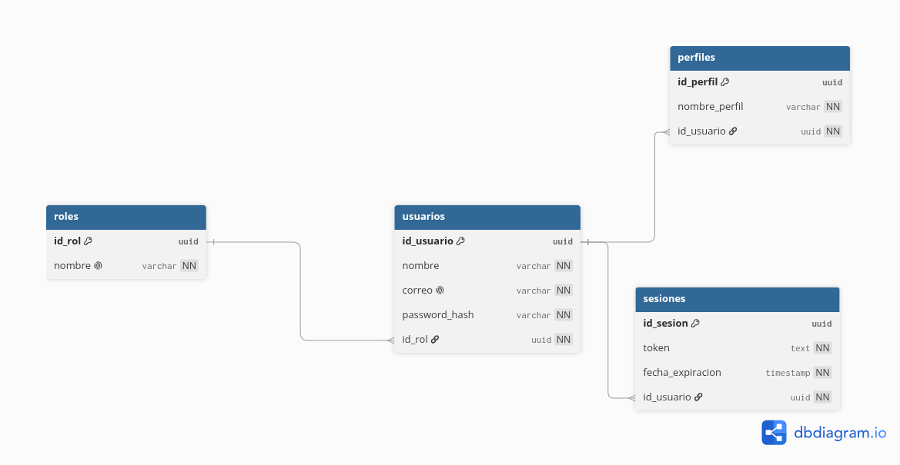
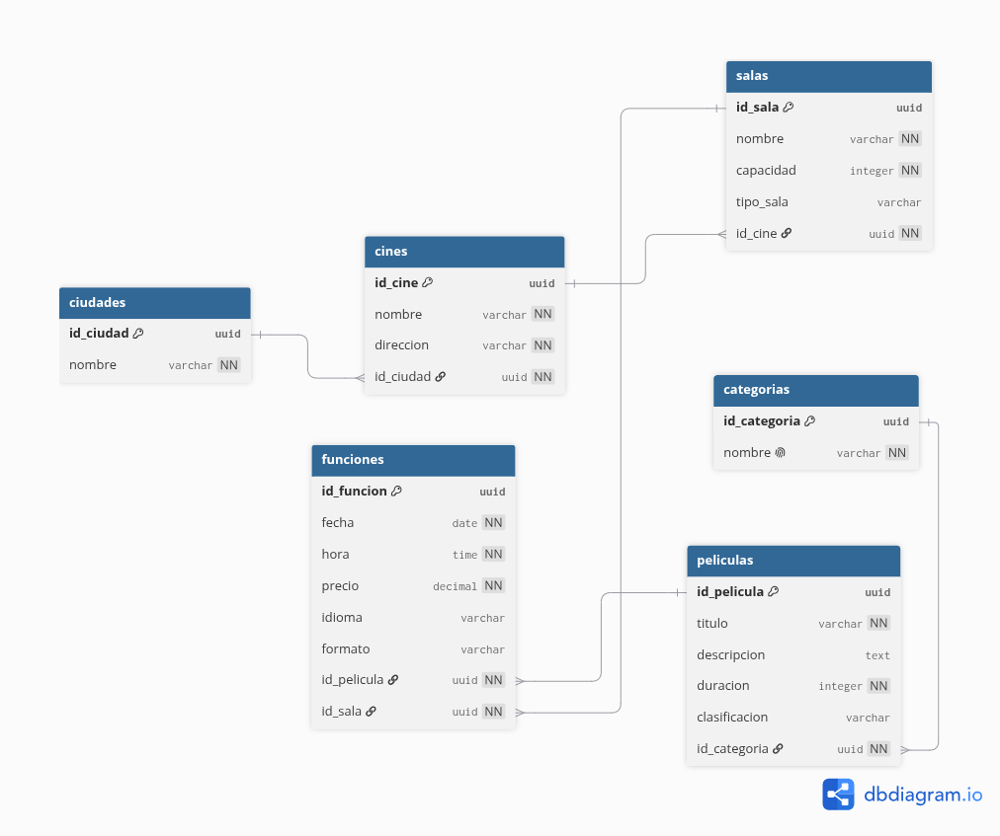
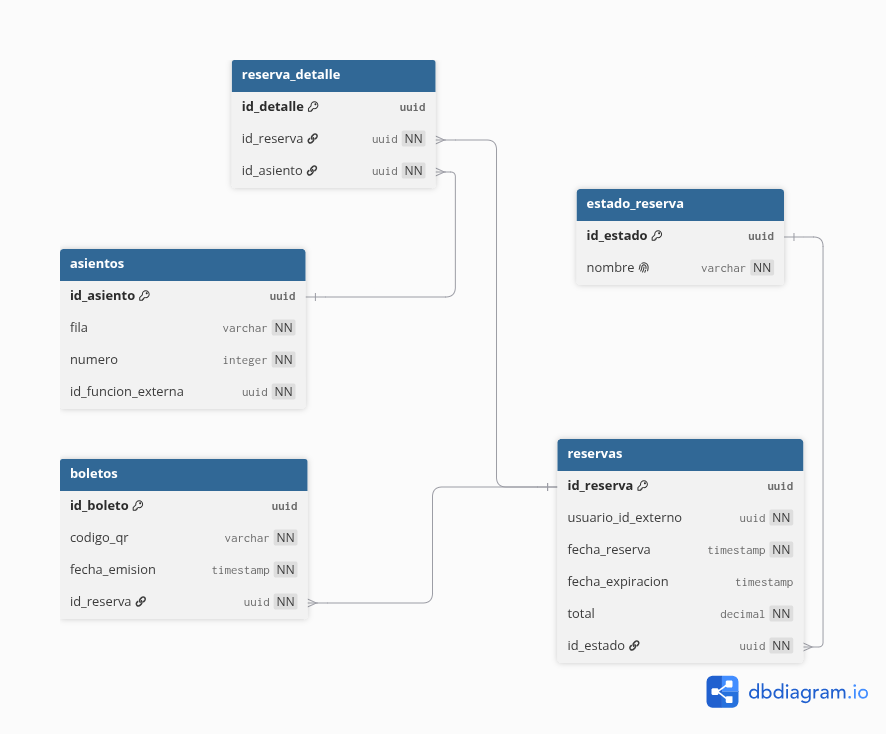
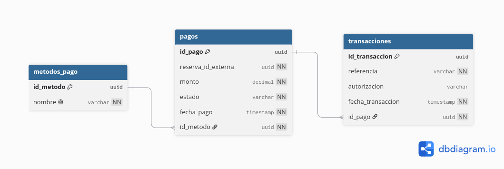
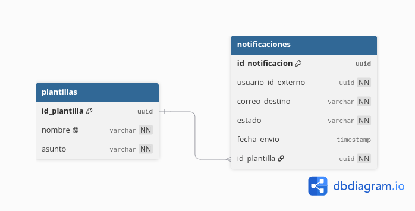
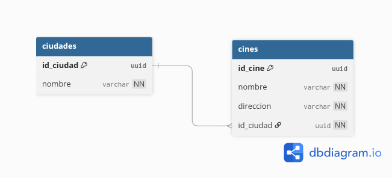

# EXPLICACION DE DIAGRAMAS ENTIDAD RELACION


Para el diseño y modelado de la persistencia del sistema se decidió dividir la base de datos en cinco dominios funcionales independientes, siguiendo el enfoque de arquitectura orientada a servicios (SOA). Esta separación permite mantener desacoplamiento entre componentes, facilitar la escalabilidad del sistema y garantizar independencia entre los distintos módulos de negocio.

Los dominios definidos fueron los siguientes:

- Manejo de usuarios
- Manejo de funciones y cartelera
- Manejo de reservas y asientos
- Manejo de pagos
- Manejo de notificaciones

Para la elaboración de los diagramas entidad-relación se utilizó la herramienta dbdiagram.io, permitiendo modelar de forma visual las entidades, relaciones y restricciones definidas para cada servicio.

Adicionalmente, con el objetivo de mantener trazabilidad y facilitar futuras modificaciones, dentro de la carpeta ER/ se incluyen tanto los diagramas exportados en formato PNG como los archivos fuente osea el código crudo utilizado para generar los diagramas, permitiendo replicar, modificar o regenerar los modelos de datos cuando sea necesario.

Cada uno de los siguientes apartados describe el propósito de las entidades utilizadas, las relaciones existentes entre ellas y la integración que poseen dentro de la arquitectura general del proyecto.


### 1. Manejo de Usuarios

Para el manejo de usuarios se decidió implementar un servicio independiente encargado de gestionar el registro y autenticación de usuarios dentro de la plataforma. Este servicio funciona como el punto central de identificación de los usuarios y permite que los demás servicios puedan relacionar información mediante identificadores externos, evitando dependencias directas entre bases de datos.

Las tablas utilizadas para este módulo fueron:

* Roles
* Usuarios



#### Tabla Roles

La tabla **roles** almacena los diferentes tipos de usuario disponibles dentro del sistema. Su propósito es permitir clasificar usuarios según las funcionalidades o privilegios que posean dentro de la plataforma.

Ejemplos:

* Cliente
* Administrador

Responsabilidades:

* Clasificar usuarios dentro del sistema
* Permitir diferenciación de funcionalidades
* Facilitar escalabilidad para futuros tipos de usuarios

Relación:

```text
Roles (1) -------- (N) Usuarios
```

#### Tabla Usuarios

La tabla **usuarios** representa la entidad principal del servicio y almacena la información necesaria para identificar a los usuarios registrados dentro de la plataforma.

Responsabilidades:

* Registrar usuarios dentro del sistema
* Gestionar credenciales de acceso
* Mantener información básica del usuario
* Asociar usuarios a un rol específico
* Proporcionar identificadores únicos utilizados por otros servicios

Los usuarios registrados dentro de esta tabla podrán interactuar con las funcionalidades principales del sistema, como realizar reservas, efectuar pagos y recibir notificaciones.

Campos principales almacenados:

* Identificador único del usuario
* Nombre del usuario
* Correo electrónico
* Contraseña cifrada
* Fecha de registro
* Rol asociado

Relación:

```text
Usuarios (N) -------- (1) Roles
```

#### Relación con otros servicios

Este servicio no comparte tablas directamente con otros módulos. En su lugar, utiliza identificadores externos para relacionar información.

Servicios consumidores:

* Servicio de Reservas → utiliza `usuario_id_externo` para asociar reservas
* Servicio de Pagos → utiliza información relacionada con reservas del usuario
* Servicio de Notificaciones → utiliza información del usuario para generar mensajes

Esta separación permite mantener desacoplada la arquitectura, evitando dependencias directas entre servicios y facilitando la escalabilidad del sistema.

### 2. Manejo de Funciones en Cartelera

Para la administración de películas y funciones disponibles se implementó un servicio independiente encargado de gestionar la información relacionada con películas, salas y horarios disponibles dentro de la plataforma.

Este servicio permite organizar la información necesaria para que los usuarios puedan consultar la cartelera, seleccionar funciones y posteriormente realizar reservas.

Las tablas utilizadas para este módulo fueron:

* Salas
* Categorías
* Clasificaciones
* Tipo Cartelera
* Películas
* Funciones



#### Tabla Salas

La tabla **salas** almacena las salas disponibles donde se realizarán las funciones dentro de la plataforma.

Cada sala mantiene una referencia externa hacia el servicio de locaciones mediante `id_cine_externo`, permitiendo asociar salas a complejos cinematográficos sin generar dependencias directas entre bases de datos.

Responsabilidades:

* Definir capacidad de salas
* Clasificar tipos de sala (2D, 3D, IMAX, VIP, etc.)
* Asociar funciones a espacios físicos
* Mantener relación lógica con complejos cinematográficos

Relación:

```text
Cines (externo) -------- (N) Salas

Salas (1) -------- (N) Funciones
```

---

#### Tabla Categorías

La tabla **categorias** almacena el género cinematográfico de cada película.

Ejemplos:

* Acción
* Comedia
* Drama
* Terror

Responsabilidades:

* Clasificar películas por género
* Facilitar búsquedas y filtros

Relación:

```text
Categorias (1) -------- (N) Peliculas
```

---

#### Tabla Clasificaciones

La tabla **clasificaciones** almacena las restricciones o recomendaciones de edad para las películas.

Ejemplos:

* PG
* PG-13
* R
* +18

Responsabilidades:

* Informar restricciones de contenido
* Filtrar contenido según audiencia

Relación:

```text
Clasificaciones (1) -------- (N) Peliculas
```

---

#### Tabla Tipo Cartelera

La tabla **tipo_cartelera** almacena el estado de exhibición de una película.

Ejemplos:

* Pre Estreno
* Estreno
* Reestreno
* Cartelera Regular

Responsabilidades:

* Diferenciar disponibilidad de películas
* Organizar estrenos y contenido disponible

Relación:

```text
TipoCartelera (1) -------- (N) Peliculas
```

---

#### Tabla Películas

La tabla **peliculas** representa el catálogo principal de contenido disponible dentro de la plataforma.

Responsabilidades:

* Registrar información cinematográfica
* Asociar géneros y clasificaciones
* Mantener información utilizada por cartelera

Relaciones:

```text
Categorias (1) -------- (N) Peliculas

Clasificaciones (1) -------- (N) Peliculas

TipoCartelera (1) -------- (N) Peliculas
```

---

#### Tabla Funciones

La tabla **funciones** almacena las proyecciones disponibles para reservar.

Responsabilidades:

* Definir horarios disponibles
* Asociar películas con salas
* Proporcionar información para reservas

Relaciones:

```text
Peliculas (1) -------- (N) Funciones

Salas (1) -------- (N) Funciones
```

---

#### Relación con otros servicios

Este servicio comparte información con otros módulos mediante identificadores externos.

Servicios relacionados:

* Servicio de Locaciones → utiliza `id_cine_externo` para asociar salas con complejos cinematográficos
* Servicio de Reservas → utiliza `id_funcion_externa` para reservar asientos
* Servicio de Notificaciones → utiliza información de funciones para mensajes
* Servicio de Pagos → utiliza información proveniente de reservas asociadas a funciones

Esta separación permite que la información de cartelera pueda administrarse independientemente del resto del sistema.

### 3. Manejo de Reservas y Asientos

Para la gestión de reservas se implementó un servicio independiente encargado de administrar la disponibilidad de asientos, controlar reservas temporales y gestionar la compra de boletos asociados a funciones específicas.

Este servicio representa uno de los componentes más importantes del sistema debido a que debe controlar escenarios donde múltiples usuarios intentan reservar los mismos asientos simultáneamente.

Las tablas utilizadas para este módulo fueron:

* Estado Asiento
* Asientos
* Reservas
* Reserva Detalle
* Boletos



#### Tabla Estado Asiento

La tabla **estado_asiento** almacena los estados posibles que puede tener un asiento dentro de una función.

Estados utilizados:

* Libre
* Pendiente de Pago
* Ocupado

Responsabilidades:

* Controlar disponibilidad de asientos
* Gestionar reservas temporales
* Evitar conflictos entre múltiples usuarios

Relación:

```text id="d9kjx3"
EstadoAsiento (1) -------- (N) Asientos
```

---

#### Tabla Asientos

La tabla **asientos** almacena los asientos disponibles para cada función.

Cada asiento se encuentra asociado a una función específica mediante un identificador externo, permitiendo manejar disponibilidad independiente entre funciones.

Responsabilidades:

* Mantener disponibilidad por función
* Asociar estados de ocupación
* Evitar duplicidad de reservas

Relación:

```text id="4ik92w"
EstadoAsiento (1) -------- (N) Asientos

Asientos (1) -------- (N) ReservaDetalle
```

---

#### Tabla Reservas

La tabla **reservas** almacena la información principal relacionada con una reserva realizada por un usuario.

Responsabilidades:

* Asociar reservas a usuarios
* Registrar tiempos de expiración
* Mantener información general de compra
* Controlar montos asociados

Cada reserva utiliza un identificador externo del usuario para mantener independencia entre servicios.

Relación:

```text id="82s7xy"
Reservas (1) -------- (N) ReservaDetalle

Reservas (1) -------- (1) Boletos
```

---

#### Tabla Reserva Detalle

La tabla **reserva_detalle** funciona como intermediario entre reservas y asientos, permitiendo asociar múltiples asientos a una misma compra.

Responsabilidades:

* Relacionar reservas con asientos
* Permitir múltiples asientos por compra
* Mantener trazabilidad de selección

Relación:

```text id="5iy7lv"
Reservas (1) -------- (N) ReservaDetalle

Asientos (1) -------- (N) ReservaDetalle
```

---

#### Tabla Boletos

La tabla **boletos** almacena la evidencia generada después de completar exitosamente una compra.

Responsabilidades:

* Generar comprobantes de acceso
* Asociar boletos a reservas
* Mantener información de emisión

Relación:

```text id="l6zcsm"
Reservas (1) -------- (1) Boletos
```

---

#### Relación con otros servicios

Este servicio interactúa constantemente con otros módulos del sistema.

Servicios relacionados:

* Servicio de Usuarios → utiliza `usuario_id_externo` para asociar clientes
* Servicio de Cartelera → utiliza `id_funcion_externa` para identificar funciones
* Servicio de Pagos → procesa montos asociados a reservas
* Servicio de Notificaciones → informa cambios de estado y emisión de boletos

---

#### Manejo de concurrencia

Debido a que múltiples usuarios pueden intentar reservar el mismo asiento simultáneamente, se implementa un control mediante estados.

Flujo general:

```text id="zrm9jp"
LIBRE

↓

PENDIENTE_PAGO

↓

Pago aprobado ?

↓           ↓

Sí          No

↓           ↓

OCUPADO    LIBRE
```

Esto permite bloquear temporalmente los asientos mientras un usuario completa el proceso de pago, evitando conflictos entre reservas concurrentes.

### 4. Manejo de Pagos

Para la gestión financiera del sistema se implementó un servicio independiente encargado de procesar pagos realizados mediante tarjeta y registrar la información relacionada con las transacciones generadas.

Este servicio recibe información proveniente del módulo de reservas y devuelve el resultado del procesamiento para confirmar o rechazar compras realizadas por los usuarios.

Las tablas utilizadas para este módulo fueron:

* Pagos
* Transacciones



#### Tabla Pagos

La tabla **pagos** representa la entidad principal del servicio y almacena la información relacionada con el proceso de pago realizado por el usuario.

Responsabilidades:

* Registrar pagos asociados a reservas
* Almacenar montos procesados
* Mantener información básica de la tarjeta utilizada
* Controlar estados del pago realizado

Estados posibles:

* Pendiente
* Aprobado
* Rechazado

Cada pago utiliza identificadores externos provenientes del servicio de reservas para mantener independencia entre servicios.

Información almacenada:

* Reserva asociada
* Monto pagado
* Estado del pago
* Información parcial de tarjeta
* Fecha del pago

Relación:

```text id="7um7cx"
Pagos (1) -------- (1) Transacciones
```

---

#### Tabla Transacciones

La tabla **transacciones** almacena la evidencia técnica generada durante el procesamiento financiero.

Responsabilidades:

* Registrar referencias de pago
* Mantener historial financiero
* Almacenar autorizaciones generadas
* Facilitar auditoría de operaciones

Información almacenada:

* Identificador de transacción
* Código de autorización
* Referencia financiera
* Fecha de procesamiento

Relación:

```text id="3f8v8y"
Pagos (1) -------- (1) Transacciones
```

---

#### Relación con otros servicios

Este servicio se comunica con otros módulos mediante identificadores externos.

Servicios relacionados:

* Servicio de Reservas → utiliza `reserva_id_externa` para procesar compras
* Servicio de Notificaciones → informa pagos aprobados o rechazados

El servicio no accede directamente a otras bases de datos, manteniendo el desacoplamiento requerido dentro de la arquitectura.

---

#### Flujo general del pago

```text id="z5m6wi"
Reserva creada
↓
Ingresar información de tarjeta
↓
Procesar pago
↓
¿Pago aprobado?

↓            ↓

Sí           No

↓            ↓

Registrar    Rechazar
transacción  pago
↓
Confirmar compra
```

La separación de este servicio permite mantener aislada la lógica financiera, facilitando futuras modificaciones o integraciones sin afectar el resto de componentes del sistema.

### 5. Manejo de Notificaciones

Para la comunicación con los usuarios se implementó un servicio independiente encargado de generar y enviar notificaciones relacionadas con eventos importantes dentro de la plataforma.

Este servicio funciona de manera desacoplada, consumiendo información generada por otros módulos y notificando cambios relevantes a los usuarios registrados.

Las tablas utilizadas para este módulo fueron:

* Plantillas
* Notificaciones



#### Tabla Plantillas

La tabla **plantillas** almacena estructuras reutilizables para los mensajes generados dentro del sistema.

Responsabilidades:

* Estandarizar mensajes enviados
* Reutilizar contenido frecuente
* Facilitar generación automática de mensajes

Ejemplos de plantillas:

* Pago Aprobado
* Reserva Confirmada
* Compra Rechazada
* Boleto Generado

Relación:

```text id="m2x8gh"
Plantillas (1) -------- (N) Notificaciones
```

---

#### Tabla Notificaciones

La tabla **notificaciones** representa cada mensaje generado y enviado hacia los usuarios.

Responsabilidades:

* Registrar envíos realizados
* Mantener historial de notificaciones
* Asociar mensajes con usuarios
* Controlar estado de envío

Estados posibles:

* Pendiente
* Enviada
* Error

Información almacenada:

* Usuario asociado
* Plantilla utilizada
* Estado del envío
* Fecha de creación

Relación:

```text id="d4j7ts"
Plantillas (1) -------- (N) Notificaciones
```

---

#### Relación con otros servicios

Este servicio recibe información generada por otros módulos utilizando identificadores externos.

Servicios relacionados:

* Servicio de Usuarios → obtiene información del cliente
* Servicio de Reservas → recibe confirmaciones o expiraciones
* Servicio de Pagos → recibe estados de pago
* Servicio de Cartelera → utiliza información relacionada con funciones y boletos

Este desacoplamiento permite que las notificaciones funcionen independientemente del resto del sistema.

---

#### Eventos que generan notificaciones

Algunos eventos importantes procesados por este servicio son:

```text id="u4h5zv"
Reserva confirmada

Reserva expirada

Pago aprobado

Pago rechazado

Boleto generado
```

---

#### Flujo general de notificaciones

```text id="w9j1kr"
Evento recibido
↓
Seleccionar plantilla
↓
Construir mensaje
↓
Enviar notificación
↓
Guardar resultado
```

La separación de este servicio permite centralizar toda la lógica relacionada con comunicación hacia usuarios, facilitando futuras ampliaciones o cambios en los mecanismos de envío.


### 6. Manejo de Locaciones

Para la administración de ubicaciones físicas se implementó un servicio independiente encargado de gestionar la información relacionada con ciudades y complejos cinematográficos disponibles dentro de la plataforma.

Este servicio permite centralizar la información geográfica utilizada por otros módulos, evitando duplicidad de información y facilitando la administración de ubicaciones disponibles.

Las tablas utilizadas para este módulo fueron:

* Ciudades
* Cines



#### Tabla Ciudades

La tabla **ciudades** almacena las ubicaciones geográficas donde existen complejos cinematográficos disponibles.

Responsabilidades:

* Organizar información geográfica
* Agrupar cines por ubicación
* Facilitar búsquedas por ciudad
* Permitir escalabilidad hacia nuevas ubicaciones

Relación:

```text id="ivq4zx"
Ciudades (1) -------- (N) Cines
```

---

#### Tabla Cines

La tabla **cines** almacena la información relacionada con los complejos cinematográficos disponibles dentro de la plataforma.

Responsabilidades:

* Registrar complejos de cine
* Asociar cines a ciudades
* Mantener información de ubicación
* Proporcionar identificadores utilizados por otros servicios

Información almacenada:

* Nombre del cine
* Dirección
* Ciudad asociada

Relación:

```text id="w6z3yo"
Ciudades (1) -------- (N) Cines
```

---

#### Relación con otros servicios

Este servicio comparte información con otros módulos mediante identificadores externos.

Servicios relacionados:

* Servicio de Cartelera → utiliza `id_cine_externo` para asociar salas a complejos cinematográficos
* Servicio de Reservas → consume información indirectamente mediante funciones y salas
* Servicio de Notificaciones → puede utilizar información de ubicación para mensajes informativos

Esta separación permite mantener desacoplada la infraestructura física del sistema respecto a la lógica de negocio asociada a películas y funciones.

---

#### Flujo general de locaciones

```text id="u2d7nv"
Registrar ciudad
↓
Registrar cine
↓
Generar identificador
↓
Consumir desde otros servicios
```

El objetivo principal de este servicio es centralizar la información relacionada con ubicaciones físicas, facilitando futuras expansiones geográficas y manteniendo independencia entre dominios.
[Volver a Documentacion](../Documentación.md)
