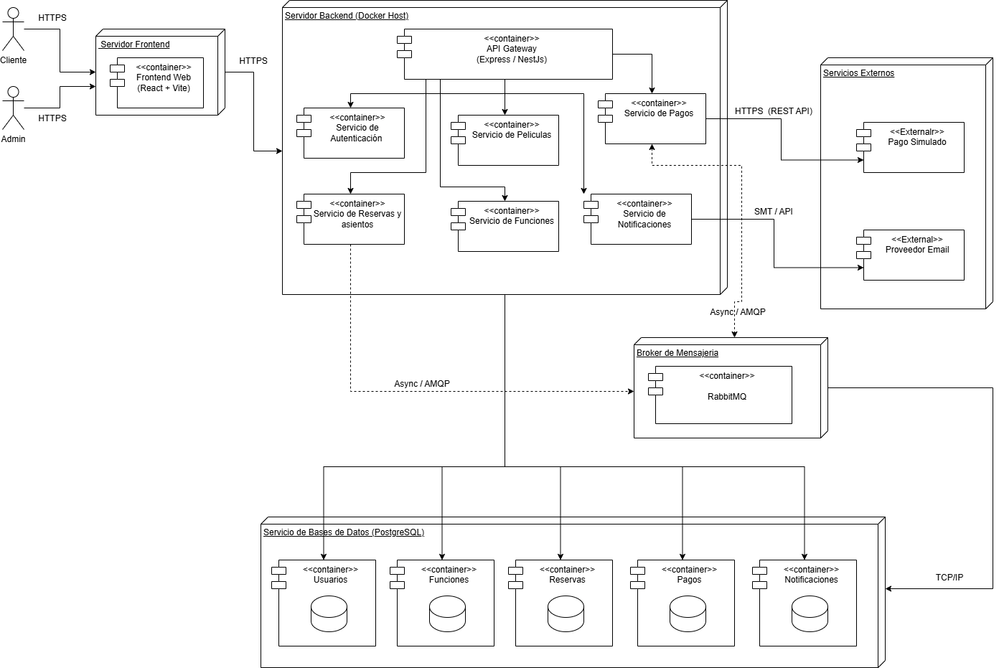

# 8. Vista Fisica / Vista de Despliegue

## Introduccion

La vista fisica describe la distribucion de los componentes de software de la plataforma FilmStars sobre la infraestructura donde seran ejecutados. Esta vista permite observar los nodos fisicos o virtuales, contenedores, servicios externos y conexiones de red utilizadas por el sistema.

El sistema se despliega en varios nodos: un servidor frontend, un servidor backend que actua como host de contenedores Docker, un broker de mensajeria RabbitMQ, un servicio de bases de datos PostgreSQL y un conjunto de servicios externos. La comunicacion entre cliente, frontend y backend se realiza mediante HTTPS, mientras que los procesos asincronos utilizan AMQP a traves de RabbitMQ.

---

# Nodos del Sistema

## 1. Nodo Cliente

Representa a los usuarios que interactuan con la plataforma FilmStars desde un navegador web. En el diagrama se distinguen dos perfiles de acceso: cliente y administrador.

### Componentes
- Cliente
- Admin

### Comunicacion
- HTTPS hacia el servidor frontend

---

## 2. Servidor Frontend

Contiene la aplicacion web desarrollada con React y Vite, encargada de presentar la interfaz del sistema y canalizar las solicitudes hacia el backend.

### Componentes
- Frontend Web (React + Vite)

### Comunicacion
- HTTPS desde cliente y admin
- HTTPS hacia API Gateway

---

## 3. Servidor Backend (Docker Host)

Contiene los servicios principales del sistema desplegados como contenedores dentro de un mismo host backend.

### Componentes
- API Gateway (Express / NestJS)
- Servicio de Autenticacion
- Servicio de Peliculas
- Servicio de Funciones
- Servicio de Reservas y Asientos
- Servicio de Pagos
- Servicio de Notificaciones

### Comunicacion
- REST interno entre API Gateway y servicios
- HTTPS / REST API hacia servicios externos
- Async / AMQP hacia RabbitMQ
- TCP/IP hacia PostgreSQL

---

## 4. Broker de Mensajeria

Contiene el broker RabbitMQ encargado de soportar la comunicacion asincrona entre los servicios internos.

### Componentes
- RabbitMQ

### Comunicacion
- Async / AMQP con Servicio de Reservas y Asientos
- Async / AMQP con Servicio de Pagos

---

## 5. Servicio de Bases de Datos (PostgreSQL)

Contiene la persistencia del sistema en PostgreSQL. Segun el diagrama, este nodo agrupa varias bases o contenedores de datos organizados por dominio funcional.

### Componentes
- Usuarios
- Funciones
- Reservas
- Pagos
- Notificaciones

### Comunicacion
- TCP/IP desde los servicios del backend

---

## 6. Servicios Externos

Agrupa las integraciones externas utilizadas por la plataforma para pagos y envio de correos.

### Componentes
- Pago Simulado
- Proveedor Email

### Comunicacion
- HTTPS (REST API) con Servicio de Pagos
- SMTP / API con Servicio de Notificaciones

---

# Diagrama de Vista Fisica

---

# Explicacion del Diagrama

El cliente y el administrador acceden a la plataforma mediante HTTPS a traves del servidor frontend, donde se encuentra desplegada la aplicacion web construida con React y Vite.

El frontend se comunica por HTTPS con el API Gateway alojado en el servidor backend. Desde este punto se enrutan las solicitudes hacia los servicios de autenticacion, peliculas, funciones, reservas, pagos y notificaciones.

El backend se encuentra desplegado sobre un Docker Host, donde cada servicio corre en su propio contenedor. Esto permite aislar responsabilidades y mantener una organizacion clara de los componentes de aplicacion.

Los procesos asincronos se apoyan en RabbitMQ mediante AMQP. En el diagrama se observa el intercambio asincrono principalmente entre el Servicio de Reservas y Asientos, el broker y el Servicio de Pagos.

Las integraciones externas se realizan desde el backend hacia un servicio de pago simulado mediante HTTPS y hacia un proveedor de correo mediante SMTP o API.

La persistencia se concentra en PostgreSQL, donde se representan contenedores o bases de datos organizadas por dominio: usuarios, funciones, reservas, pagos y notificaciones.
