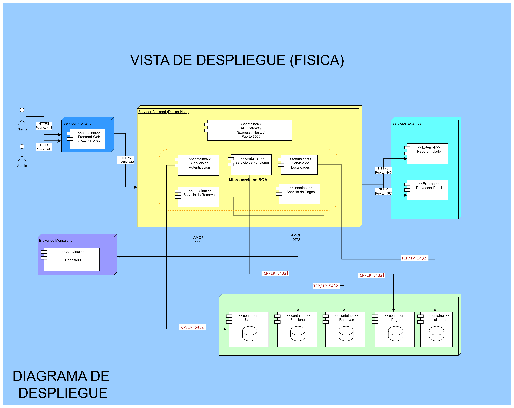

# 8. Vista Fisica / Vista de Despliegue

## Introduccion

La vista fisica describe como se distribuyen los componentes de software de FilmStars sobre la infraestructura de ejecucion. Esta vista permite identificar los nodos principales del sistema, los contenedores desplegados en cada uno, los servicios externos integrados y los protocolos de comunicacion utilizados entre ellos.

El diagrama muestra una arquitectura desplegada en varios nodos separados: clientes, servidor frontend, servidor backend con microservicios en contenedores, broker de mensajeria, servicio de bases de datos PostgreSQL y servicios externos. La solucion combina interacciones sincrona mediante HTTPS con integracion asincrona mediante AMQP.

---

## Nodos del Sistema

## 1. Nodo Cliente

Representa a los actores que interactuan con la plataforma desde un navegador web.

### Componentes

- Cliente
- Admin

### Comunicacion

- HTTPS hacia el servidor frontend por el puerto 443

---

## 2. Servidor Frontend

Contiene la aplicacion web encargada de presentar la interfaz del sistema y redirigir las solicitudes del usuario hacia el backend.

### Componentes

- Frontend Web (React + Vite)

### Comunicacion

- HTTPS desde Cliente y Admin por el puerto 443
- HTTPS hacia el servidor backend por el puerto 443

---

## 3. Servidor Backend (Docker Host)

Agrupa los servicios principales del sistema desplegados como contenedores dentro de un host de Docker.

### Componentes

- API Gateway (Express / NestJS) - Puerto 3000
- Servicio de Autenticacion
- Servicio de Funciones
- Servicio de Localidades
- Servicio de Reservas
- Servicio de Pagos

### Comunicacion

- HTTPS desde el servidor frontend
- REST interno entre API Gateway y microservicios
- HTTPS hacia servicios externos
- AMQP hacia RabbitMQ por el puerto 5672
- TCP/IP hacia PostgreSQL por el puerto 5432

---

## 4. Broker de Mensajeria

Representa el nodo dedicado a la comunicacion asincrona entre componentes internos.

### Componentes

- RabbitMQ

### Comunicacion

- AMQP con el servidor backend por el puerto 5672

---

## 5. Servicio de Bases de Datos (PostgreSQL)

Concentra la persistencia del sistema en bases de datos separadas por dominio funcional.

### Componentes

- Usuarios
- Funciones
- Localidades
- Reservas
- Pagos

### Comunicacion

- TCP/IP desde los servicios del backend por el puerto 5432

---

## 6. Servicios Externos

Agrupa las integraciones externas consumidas por la plataforma.

### Componentes

- Pago Simulado
- Proveedor Email

### Comunicacion

- HTTPS con el backend por el puerto 443
- SMTP con el backend por el puerto 587

---

## Diagrama de Vista Fisica

](imagenes/VISTADESPLIEGUE.png)

---

## Explicacion del Diagrama

El acceso al sistema inicia desde los actores Cliente y Admin, quienes se conectan por HTTPS al servidor frontend usando el puerto 443. En este nodo se encuentra desplegada la aplicacion Frontend Web desarrollada con React + Vite.

El frontend se comunica por HTTPS con el servidor backend, donde reside el API Gateway. Este componente funciona como punto central de entrada y distribuye las solicitudes hacia los microservicios internos de autenticacion, funciones, localidades, reservas y pagos.

Dentro del servidor backend, los microservicios se encuentran organizados bajo un esquema SOA y desplegados en contenedores. Esta separacion permite aislar responsabilidades, facilitar el mantenimiento y favorecer la escalabilidad de la solucion.

El Servicio de Localidades centraliza la informacion geografica del sistema, particularmente ciudades y cines. El Servicio de Reservas y el Servicio de Pagos interactuan con RabbitMQ para soportar procesos asincronos mediante AMQP en el puerto 5672. Este mecanismo desacopla operaciones internas y permite manejar mejor tareas que no requieren respuesta inmediata.

La persistencia se aloja en un servicio PostgreSQL, donde existen contenedores o bases de datos independientes para usuarios, funciones, localidades, reservas y pagos. El acceso se realiza mediante TCP/IP en el puerto 5432, manteniendo aislamiento por dominio.

Finalmente, el backend mantiene integraciones con servicios externos. La pasarela de pago simulada se consume mediante HTTPS por el puerto 443, mientras que el proveedor de correo se integra mediante SMTP por el puerto 587.

[Volver a Documentacion](../Documentación.md)
