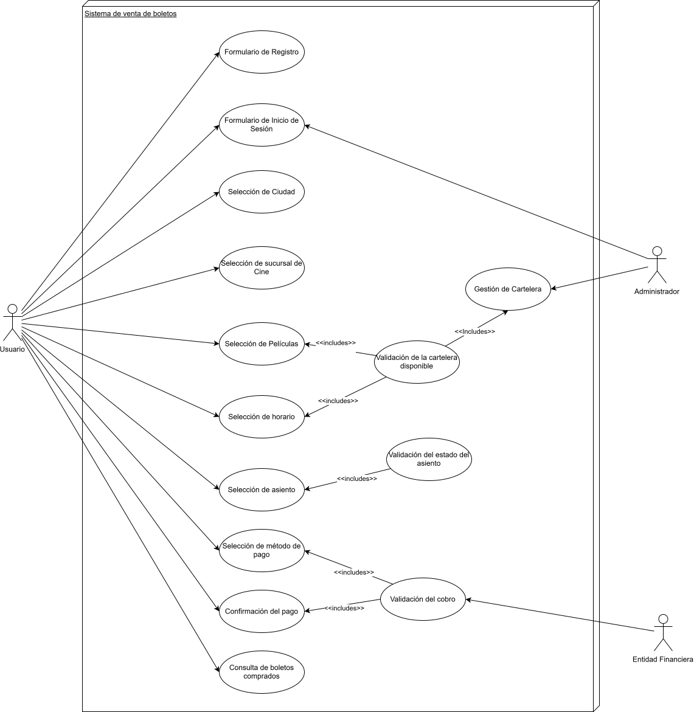

[ < Volver](../Documentación.md)

# Vista de Arquitectura: Modelo 4+1 vistas de Krutchten

## Vista de Escenarios

En esta vista se describen los escenarios de uso del sistema, es decir, las situaciones en las que el sistema será utilizado por los usuarios. Se identifican los casos de uso y se describen las interacciones entre los usuarios y el sistema.

El diagrama representa el caso de uso más importante del sistema, que es la gestión de la venta de boletos, donde se muestra cómo los usuarios interactúan con el sistema para realizar la compra de boletos, incluyendo la selección de películas, horarios y asientos, así como el proceso de pago.

## Vista Lógica

En esta vista se describen los componentes lógicos del sistema, es decir, objetos y sus relaciones para representar la estructura del sistema.

Se muestra como está acoplado el sistema, es decir, cómo se relacionan los diferentes componentes del sistema entre sí. Se pueden identificar los módulos o subsistemas del sistema y cómo se comunican entre ellos de forma independiente, ya que el acoplamiento es bajo, lo que permite una mayor flexibilidad y facilidad de mantenimiento del sistema. Además, se pueden identificar los puntos de integración entre los diferentes módulos o subsistemas, lo que facilita la integración y el desarrollo del sistema en general. En resumen, el diagrama muestra cómo se relacionan los diferentes componentes del sistema entre sí, lo que es fundamental para entender la arquitectura del sistema y su funcionamiento.

## Vista de Procesos

En esta vista se describen los procesos y subprocesos del sistema, es decir, las actividades que se realizan para llevar a cabo las funciones del sistema.

En este caso se muestra un diagrama de procesos que representa el flujo de actividades para la gestión de la venta de boletos, desde la selección de la película hasta el proceso de pago. El diagrama muestra cómo se relacionan los diferentes procesos entre sí y cómo se comunican para llevar a cabo la función principal del sistema, que es la venta de boletos. Además, se pueden identificar los puntos de decisión y las posibles rutas que pueden seguir los usuarios durante el proceso de compra.

