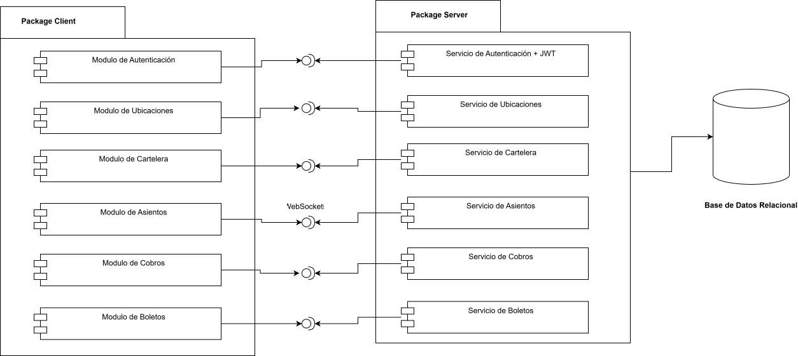
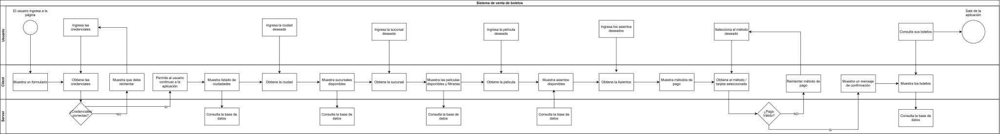

# Modelos de Vistas 4+1

En esta sección se presentan los modelos de vistas 4+1, que son una metodología de diseño de software que se utiliza para describir la arquitectura de un sistema desde diferentes perspectivas.

## Vista Lógica
La vista lógica se centra en la estructura del sistema y cómo se organizan los componentes. En esta vista, se describen los módulos, clases y objetos que componen el sistema, así como sus relaciones y dependencias.

## Vista de Procesos
La vista de procesos se enfoca en la dinámica del sistema, es decir, cómo los componentes interactúan entre sí para llevar a cabo las funcionalidades del sistema. En esta vista, se describen los procesos, flujos de datos y eventos que ocurren en el sistema.

## Vista de Escenarios
La vista de escenarios se centra en los casos de uso y las interacciones entre los usuarios y el sistema. En esta vista, se describen los escenarios de uso, las tareas que los usuarios pueden realizar y cómo el sistema responde a esas tareas.

.svg)
[Volver a Documentacion](../Documentación.md)
